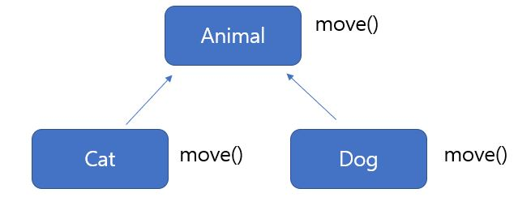
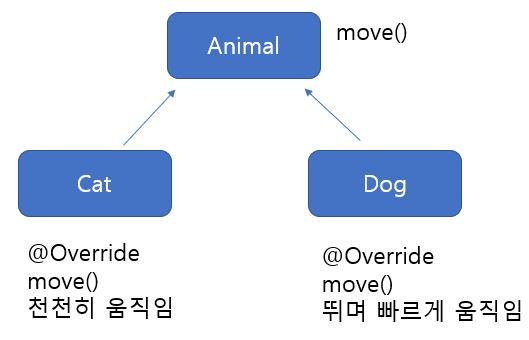
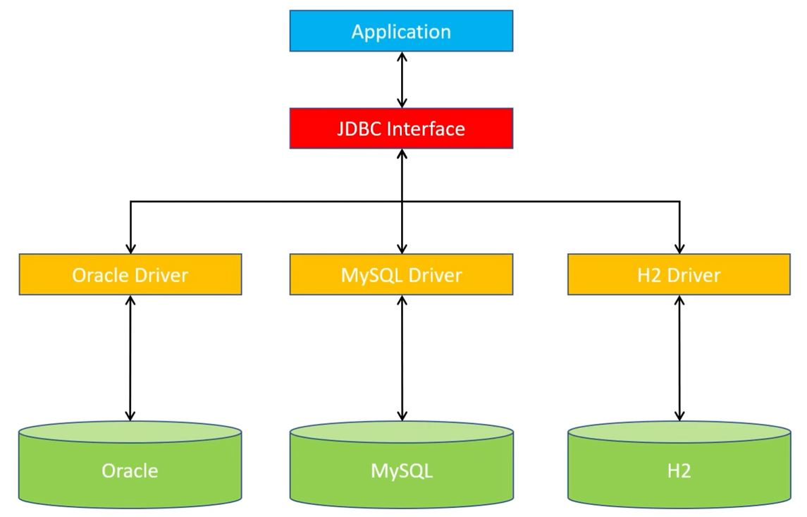

학교 수업을 통해 디자인 패턴에 대해 배우게 되었고 소프트웨어 설계의 중요성을 깨닫게 되습니다. 다시 복습하는 의미로 수업 내용과 여러 자료들을 토대로 정리 해보려고 합니다.

## 목차
- 객체지향이란?
- 객체지향 4대 특성
- 객체지향 설계 5원칙


## 객체지향이란?
- 객체지향이란 현실에 존재하는 사물을 있는 그대로 모델링하여, 이들의 행위와 속성을 정의하고, 객체가 중심이 되어 **실제 사물이 동작하는 방식**으로 설계하는 방법이다.
- 사물은 **객체**, 사물이 하는 행위는 Method로 정의, 사물이 가지는 속성을 변수 **Variable** 로 정의한다.
- ex) <br/>
    사물 : 자동차<br/>
    속성(Variable) : 자동차 이름, 자동차 번호, 모델명 ... <br/>
    행위(Method) : 주행거리, 번호교체, 연비계산 ... <br/>


## 객체지향 4대 특성
*캡슐화, 상속, 다형성, 추상화*
### 캡슐화
- 객체의 속성(Variable)을 보호하기 위해서 사용한다.
- 캡슐화로 인해 클래스 필드는 다른 클래스로부터 숨겨지며 오로지 해당 클래스의 메서드에 의한 접근만 허용된다.
- Variable을 접근 제한자 private으로 선언하여 클래스 내부에서의 접근만 허용하며 외부에서의 접근은 getter, setter 메소드를 통해서만 가능하다.

```java
public class Car {
    priavate String name;
    ...

    public String getName() {
        return name;
    }

    public void setName(String name) {
        this.name = name;
    }
}
```

### 상속
- 현실 세계의 상속과 유사하게 어떤 한 클래스에서 다른 클래스가 가지고 있는 자산을 그대로 증요받는 것이다.
- 상속하는 클래스를 부모 클래스 또는 상위 클래스, 상속받는 클래스는 자식 클래스 또는 하위클래스가 된다.
- 객체지향에서의 상속은, 속성의 상속이 아닌, **하위로 내려갈 수록 구체화** 되는 것이다.
- Animal 클래스를 상속받는 Cat, Dog 클래스<br/><br/>


### 다형성
- 하나의 개체가 여러 개의 형태로 변화 하는 것을 말하며, 이를 객체지향에서도 유사하게 사용하고 있다.
- 다형성을 하기 위해서는 오버라이딩을 통해 가능하다.
- Animal 클래스를 상속받느 Cat, Dog 클래스는 move 메소드를 오버라이딩 하여 재정의 한다.<br/><br/>

```java
Animal cat = new Cat();
Animal dog = new Dog();

animalMove(cat);
animalMove(dog);

private void animalMove(Animal animal) {
    //오버라이딩된 move() 메소드 호출
    animal.move();
}    
```

### 추상화
- 객체지향 프로그래밍에서 추상은 사용자들에게 작동되는 세부 사항은 감추고 기능만을 제공하려는 목적이다. 즉, 사용자들은 객체가 무엇을 하는지는 알 수 있지만, 어떻게 하는지는 알 수 없다는 의미이다.
- 추상 클래스의 용도로는 설계와 구현을 분리하는 데에도 있다.<br/> 
이를 책으로 비유하면, **추상 클래스는 책의 목차**가 되고, 이를 **상속받은 서브 클래스는 목차에 따라 작성된 책**으로 볼 수 있다. 동일한 목차를 여러 개발자들에게 주어 목차에 따라 컨텐츠를 채워 달라고 요청했을 때, **서로 다른 내용이 담긴 책**들이 완성될 것이다.
- 상속받은 서브 클래스에서 메소드를 새롭게 채울 때, 오버라이딩을 통해 재정의하게 된다. 
- 앞에서의 다형성, 상속 모두 추상화에 속한다.

## 객체지향 설계 5원칙(SOLID)
SOLID 원칙이란 객체지향 설계에서 지켜줘야 할 5개의 원칙(SRP,OCP,LSP,DIP,ISP)을 말한다. 설계원칙을 지켜야 하는 이유는 유연한 대처와 확장성 있는 시스템 구조를 설계하기 위해서 이다.
### SRP
- 단일 책임 원칙
    - 객체는 **단 하나의 책임만 가져야 한다**는 원칙이다.
- 좋은 소프트웨어 설계를 위해서는 **결합도는 낮추고 응집도는 높여**야 한다.      
    - 결합도
        - 모듈(클래스)간의 상호 의존 정도를 나타내는 지표
        - b 클래스가 a 클래스에 의존하고 있고 c 클래스가 b 클래스에 의존하고 있다.<br/> 만약 a 클래스에 변경이 일어나면 해당 클래스에 의존하고 있던 b 클래스의 수정이 발생, b 클래스의 수정으로 인해 해당 클래스에 의존하고 있던 c 클래스에 수정이 발생하게 된다.<br/>
        => 유지보수하기 어려워 진다. 즉, 결합도가 낮아야 한다.
    - 응집도
        - 하나의 모듈 내부에 존재하는 구성 요소들의 기능적 관련성
        - 즉, 한 클래스 내부의 메소드들의 관련성을 의미한다. 
        - 응집도가 높은 모듈은 하나의 책임에 집중하고 독립성이 높아져, 재사용 및 유지보수가 용이하다.<br/><br/>

SRP에 따른 설계를 하면 응집도는 높게, 결합도는 낮게 설계할 수 있다.<br/>
만약, Calculator 객체가 있을 때, 덧셈,뺄셈,곱셈,나눗셈만 할 수 있어야 한다. 또한 덧셈,뺄셈,곱셈,나눗셈이 각각의 함수로 정의되어 있어야 한다.<br/>
이후에 계산기에 알람 기능을 추가한다고 해서, Calculator 객체에 alarm() 함수를 추가하는 것은 SRP에 위배된다.<br/><br/>

또한, **한 객체에 책임이 많아질수록 클래스 내부에서 서로 다른 역할을 수행하는 코드끼리 강하게 결합될 가능성이 높아진다.** 따라서, 여러 객체들이 하나의 책임만 갖도록 잘 분배한다면, 시스템에 변화가 생기더라도 그 영향을 최소화 할 수 있기 때문에 SRP 원칙을 따르는 것이 좋다.

### OCP 
- 개방 폐쇄 원칙
    - **자신의 확장에는 열려 있고, 주변의 변화에 대해서는 닫혀 있어야 한다.**
    - 상위 클래스 또는 인터페이스를 중간에 둠으로써, 자신은 변화에 대해서는 폐쇄적이지만, 인터페이스는 외부의 변화에 대해서 확장을 개방해 줄 수 있다.
    - JDBC와 Mybatis, Hibernate 등에서 찾아볼 수 있다.<br/><br/>
    
    - 위의 사진을 보면, Application 입장에서 외부적으로 많은 db들이 존재할 때,직접 연결하지 않고 JDBC Interface를 중간에 두어 잦은 수정을 방지하고 있다. 
    - 즉 하나의 통로를 통하여 폐쇄적이고, 외부는 확장을 개방할 수 있는 구조임으로 개방 폐쇄 원칙이 지켜진 것을 볼 수 있다.

### LSP 
- 리스코프 치환 원칙
    - **서브 타입은 언제나 자신의 기 반 타입으로 교체할 수 있어야 한다.**
    - 즉, 자식 클래스는 언제나 부모 클래스의 역할을 대체할 수 있어야 한다는 것을 말하며, 부모 클래스와 자식 클래스의 행위가 일관됨을 의미한다.

### ISP
- 인터페이스 분리 원칙
    - 클라이언트는 자신이 사용하지 않는 메소드에 의존 관계를 맺으면 안된다.
    - SRP는 객체의 단일 책임을 뜻한다면, ISP는 인터페이스의 단일 책임을 의마한다.<br/><br/>

만약 휴대폰에 전화,문자,알람,계산기 기능이 있다면, ISP를 만족하려면 Phone 인터페이스에 call(),sms(),alarm(),calculator() 함수를 모두 정의하기 보다는 Call, Sms,Alarm,Calculator 인터페이스를 각각 정의하여 Phone 클래스에서 4개의 인터페이스를 구현하도록 설계되어야 한다.

### DIP
- 의존 역전 원칙
    - 자신보다 변하기 쉬운 것에 의존하지 말아야 한다.

예를 들어, 사람은 옷에 의존할 수 있다. 하지만 옷은 여름,봄,가을,겨울 옷이 존재하여 계절마다 옷은 변한다. 사람보다 변하기 쉬운 것에 의존하고 있다. 이것을 역전시켜 옷이 사람에 의존하도록 만든다.


## 참고
- [Java ☕ 객체지향 프로그래밍 4대 원칙과 특징](https://catsriding.dev/spring/oop/)
- [🙈[디자인패턴] SOLID 원칙🐵](https://victorydntmd.tistory.com/291?category=719467)
- [한번에 끝내는 Java/Spring 웹 개발 마스터 초격차 패키지](https://fastcampus.co.kr/courses/203525/clips/)