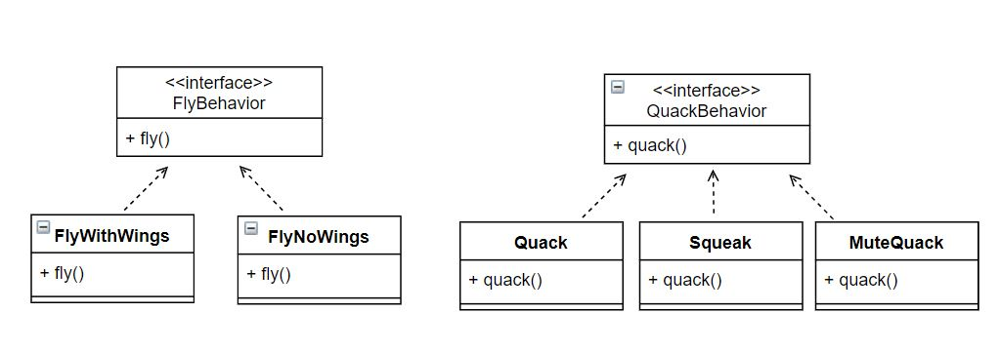

Head First Design Patterns 책을 참고하여 공부 및 정리하였습니다.

## 스트래티지 패턴
스트래티지 패턴이란, 알고리즘을 정의하고 각각을 캡슐화하여 이 알고리즘들을 **상호 교환**해서 사용할 수 있도록 만드는 것이다.<br/>
객체들이 할 수 있는 행위 각각에 대해 전략 클래스를 생성하고, 유사한 행위들을 캡슐화 하는 인터페이스를 정의하여, 객체의 행위를 동적으로 바꾸고 싶은 경우 직접 행위를 수정하지 않고 전략을 바꿔주기만 함으로써 행위를 유연하게 확장하는 방법을 말한다.<br/><br/>
즉, 객체가 할 수 있는 행위들 각각을 전략으로 만들어 놓고, 동적으로 행위의 수정이 필요한 경우 전략을 바꿔줄 수 있는 패턴이다.


## 스트래티지 패턴이 필요한 상황

- 헤엄치고 소리 내는 다양한 오리를 보여주는 오리 연못 시뮬레이션 게임이 존재한다.<br/>
Duck 추상클래스를 두고 다양한 오리를 추가할 수 있도록 Duck 추상클래스를 상속받는 식으로 구성되어 있다.<br/>

- 핵심 객체인 오리로 클래스 생성
- quack(), swim()은 이미 구현된 메소드로 그대로 상속 받는다.
- display()는 추상 메소드로 상속받은 클래스(MallardDuck, RedheadDuck)에서 구현을 정의해야 한다.


### 문제 상황 & 변경 요구 사항
1. 문제 상황
    - **모든 sub class가 super class의 메서드를 모두 상속받게 된다.** 즉, 원치 않는 상속이 발생할 수 있다.
        ```java
        //Duck class에 정의된 quack()
        public void quack() {
            System.out.println("Quack");
        }
        ```
        - 어떤 오리는 quack()에 정의된 Quack 이 아닌 다른 소리를 낼 수 있다.
        - 또한 날 수 없는 오리도 존재한다.

2. 변경 요구 사항
    - 현재 시스템에서 오리들이 날 수 있도록 변경한다.
        - **Duck 클래스에 fly() 메서드를 추가한다.**(super class에 추가)


위의 문제 상황인 원치 않는 상속을 피하면서 새로운 요구사항을 위해 메소드의 추가가 자유롭기 위해서는 **변하는 부분과 변하지 않는 부분을 분리**해야 한다. <br/><br/>

- 변하는 부분을 캡슐화 시킴으로써, 변경의 영향을 한정시킨다.
    - 위의 원칙을 SimUDuck 에 적용 시키면, **fly()와 quack()** 행위는 오리의 종류에 따라 **변화되는 부분**이므로 분리되어야 한다.
    

- 통합 디자인
    

    - Duck
        ```java
        public abstract class Duck {
            FlyBehavior flyBehavior;
            QuackBehavior quackBehavior;

            //공통 행동
            public void swim() { 
                System.out.println("All ducks float, even decoys!");
            }

            abstract public void display();

            public void performFly() {
                flyBehavior.fly();
            }
            public void performQuack() {
                quackBehavior.quack();
            }
        } 
        ```

    - 서브 Duck 중 MallardDuck 
        ```java
        public class MallardDuck extends Duck{
            public MallardDuck() {
                quackBehavior = new Quack(); // 실질 행동 주체 설정
                flyBehavior = new FlyWithWings(); // 실질 행동 주체 설정
            }
            public void display() {
                System.out.println(“I’m a real Mallard duck”);
            }
        }
        ```

    - 통합 디자인의 문제점은 소리내는 행위나 나는 행위에 대해 다른 스트래티지 객체로 변경을 할 때, 코드의 변경이 발생한다는 것이다.
    즉, 오리 행동의 동적 변경이 필요한 경우, 기존의 Duck 서브 클래스의 변경이 필요하게 된다.

- 최종 디자인 
    - 동적 변경이 필요할 때, Duck 서브 클래스의 변경이 일어나지 않도록 수정한다.
    - setXXX 메소드를 추가해 준다.<br/> 동적 변경이 필요한 경우, Client에서 duck.setXXX 메소드로 변경해줄 수 있게 된다.
    - Duck 
        ```java
        public abstract class Duck {
            private FlyBehavior flyBehavior;
            private QuackBehavior quackBehavior;

            public void performFly() {
                getFlyBehavior().fly();
            }

            public void performQuack() {
                getQuackBehavior().quack();
            }
            public QuackBehavior getQuackBehavior() {
                return quackBehavior;
            }
            public void setQuackBehavior(QuackBehavior quackBehavior) {
                this.quackBehavior = quackBehavior;
            }
            public FlyBehavior getFlyBehavior() {
                return flyBehavior;
            }
            public void setFlyBehavior(FlyBehavior flyBehavior) {
                this.flyBehavior = flyBehavior;
            }
            ...
        }
        ```
    - Duck 서브 클래스인 RubberDuck
        ```java
        public class RubberDuck extends Duck {
            public RubberDuck() {
                setFlyBehavior(new FlyNoWay());
                setQuackBehavior(new Squeak());
            }
            ...
        }
        ```
    
    
