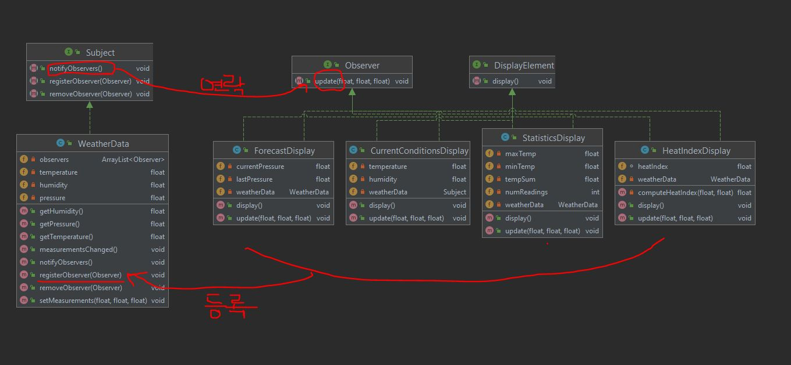

Head First Design Patterns 책을 참고하여 공부 및 정리하였습니다.

## 옵저버 패턴
- **한 객체의 상태가 바뀌면 그 객체에 의존하는 다른 객체들한테 연락이 가고, 자동으로 내용이 갱신되는 방식**으로 일대다 의존성을 정의한다.
- 즉, 객체의 상태가 변경되었을 때, **특정 객체에 의존하지 않으면서 상태의 변경을 관련된 객체들에게 통지**하는 것이 가능해진다.


## 옵저버 패턴이 필요한 상황
현재 기상 모니터링 애플리케이션이 존재한다. 
구성요소
1. 기상 스테이션(Weather Station) - 실제 기상 정보를 수집하는 장비
2. WeatherData 객체 - 기상 스테이션으로부터 수집된 데이터
3. 화면에 표시하는 디스플레이 장비 종류
    - 온도,습도,압력을 표시
    - 기상 통계를 표시
    - 기상 예보를 표시

### 간단한 구현 방법
기상 스테이션으로부터 수집된 데이터인 WeatherData 객체에서 측정값을 얻어와서 직접 디스플레이 갱신해주는 방법

```java
public class WeatherData {
    ...
    public void measurementsChanged() {
        //측정값을 얻어온다.
        float temp = getTemperature();
        float humidity = getHumidity();
        float pressure = getPressure();

        //디스플레이 갱신
        currentConditionDisplay.update(temp,humidity,pressure);
        statisticsDisplay.update(temp,humidity,pressure);
        forecastDisplay.update(temp,humidity,pressure);
    }
}
```

위와 같은 방식으로 구현할 경우, 만약 디스플레이의 추가 혹은 삭제가 발생할 경우 코드의 수정이 발생한다. (update(temp,humidity,pressure); 부분)<br/>
확장성을 고려하여 새로운 디스플레이 항목을 추가 혹은 제거할 수 있게 설계 해야 한다.<br/><br/>
즉, **서로 상호작용하는 객체 사이에는 느슨하게 결합**하는 디자인을 사용해야 한다. 상호작용하는 두 객체가 서로의 구체적인 실체 및 구현에 대해서는 모르고, 단지 서로의 추상화된 인터페이스만을 알고 있는 것을 의미한다.

- 문제점 해결 위한 변경 사항
    - WeatherData와 디스플레이 객체를 분리한다. 
    - WeatherData에서 수집한 데이터의 변경이 있을 경우 디스플레이(옵저버) 객체에게 변경을 알려준다. => 옵저버 패턴
    - WeatherData에서 옵저버 등록, 제거, 통지하는 기능을 한다.
    - 옵저버 인터페이스를 두고 디스플레이 클래스들이 이를 구현한다.


### 옵저버 패턴 적용
- 설계를 위해 등록,수정,통지 기능을 하는 Subject 인터페이스가 필요하다.
- 디스플레이 객체들은 통지를 받기 위해 Observer 인터페이스를 구현한다.
- WhetherData 객체에서 옵저버 객체 등록 및 제거, 통지를 한다.
    - Subject 인터페이스를 구현한다. 

```java
public interface Subject {

    public void registerObserver(Observer o);
    public void removeObserver(Observer o);
    public void notifyObservers();

}
```

```java
public interface Observer {

    public void update(float temp, float humidity, float pressure);

}
```

- WeatherData 클래스
    ```java
    public class WeatherData implements Subject {
        private ArrayList<Observer> observers;
        private float temperature;
        private float humidity;
        private float pressure;

        public WeatherData() {
            observers = new ArrayList<Observer>();
        }
        //옵저버 등록
        public void registerObserver(Observer o) {
            observers.add(o);
        }

        public void removeObserver(Observer o) {
            ...
        }

        public void notifyObservers() {
            for (Observer observer : observers) {
                observer.update(temperature, humidity, pressure);
            }
        }

        public void measurementsChanged() {
            notifyObservers();
        }

        //수집된 데이터가 변한 경우 (온도,습도,압력)
        public void setMeasurements(float temperature, float humidity, float pressure) {
            this.temperature = temperature;
            this.humidity = humidity;
            this.pressure = pressure;
            measurementsChanged();
        }
    }
    ```

- 디스플레이 
    ```java
    public class CurrentConditionsDisplay implements Observer, DisplayElement {

        private float temperature;
        private float humidity;
        private Subject weatherData;
        public CurrentConditionsDisplay(Subject weatherData) {
            this.weatherData = weatherData;
            //옵저버 등록
            weatherData.registerObserver(this);
        }
        //상태변화를 전달 받음
        public void update(float temperature, float humidity, float pressure) {
            this.temperature = temperature;
            this.humidity = humidity;
            display();
        }
        public void display() {
            System.out.println("Current conditions: " + temperature ...);
        }
    }
    ```

## 전체 다이어그램
