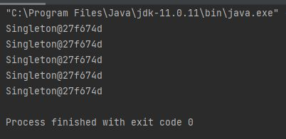

Head First Design Patterns 책을 참고하여 공부 및 정리하였습니다.

## 싱글턴 패턴
- 인스턴스가 하나뿐이어야 하는 객체
- 프로그램 어디에서든 이 인스턴스에 접근할 수 있는 객체
- 두 개 이상의 인스턴스는 프로그램을 이상하게 돌아가게 하던지 불필요한 자원을 잡아먹는다.

## 싱글턴 패턴 구현
```java
public class Singleton {
    private static Singleton uniqueInstance;

    private Singleton() {}

    public static Singleton getInstance() {
        if(uniqueInstance == null) {
            uniqueInstance = new Singleton();
        }
        return uniqueInstance;
    }

    //other useful methods here
    public String getDescription() {
        return "I'm a classic Singleton";
    }
}
```
- uniqueInstance 변수에 Singleton 의 유일무이한 인스턴스가 저장된다.
- 외부에서 uniqueInstance 변수에 직접 접근하지 않도록 private 으로 선언한다.
- getInstance() 메소드는 정적 메소드로서, 언제 어디서든 이 메소드를 호출할 수 있고, Lazy Creation을 활용할 수 있는 장점을 제공한다.
    - Lazy Creation : 호출 되었을 때(사용될 때), 인스턴스가 생성된다. 메모리를 차지 하지 않는다.


## 실제 동작 확인
```java
public class Client {
    public static void main(String[] args) {
        for( int i = 0; i < 5; i++ ){
            Singleton obj = Singleton.getInstance();
            System.out.println(obj.toString());
        }
    }
}
```


## 참고
[싱글톤 패턴 ( Singleton Pattern )](https://victorydntmd.tistory.com/293?category=719467)