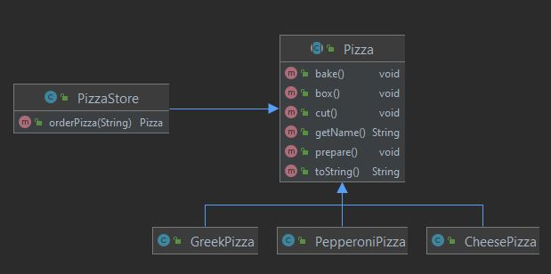
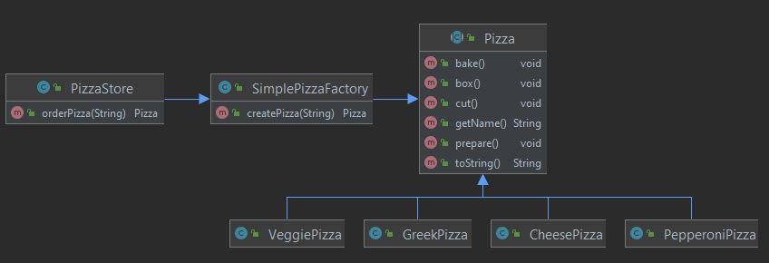

Head First Design Patterns 책을 참고하여 공부 및 정리하였습니다.

## 팩토리 패턴이란
- 조건에 따라 객체를 다르게 생성해야 할 때 사용하는 패턴이다.
- 예를 들어, 사용자의 입력값에 따라 하는 일이 달라져야 할 경우, 분기를 통해 특정 객체를 생성해야 한다.
- 객체를 생성하기 위한 인터페이스를 정의하는데, 어떤 클래스의 인스턴스를 만들지는 서브클래스에서 결정하게 만든다.
- 분기에 따른 객체의 생성을 new 연산자를 통해 직접하지 않고, 팩토리라는 클래스에 위임하여 팩토리 클래스가 객체를 생성하도록 하는 방식이다.

## 팩토리 패턴이 필요한 상황
피자 가게에서 피자를 만들고, 피자는 여러 종류가 존재한다. type에 따라 피자의 종류가 달라진다.
1. PizzaStore 클래스
2. Pizza 클래스
3. Pizza 클래스를 상속 받는 Pizza 종류<br/>
<br/><br/>

자유로운 새로운 피자의 추가와 기존 피자의 삭제를 원하고 있다. 하지만 위의 구조에서 피자를 추가하거나 제거하려면 PizzaStore 클래스의 변경이 발생하게 된다.<br/><br/>

**변하는 부분**인 객체 생성 부분의 캡슐화가 필요하다.<br/><br/>
<br/><br/>

- 실행
```java
public class PizzaTestDrive {

    public static void main(String[] args) {
        SimplePizzaFactory factory = new SimplePizzaFactory();
        PizzaStore store = new PizzaStore(factory);

        Pizza pizza = store.orderPizza("cheese");
        System.out.println("We ordered a " + pizza + "\n");
        //System.out.println(pizza);

        pizza = store.orderPizza("veggie");
        System.out.println("We ordered a " + pizza + "\n");
        //System.out.println(pizza);
    }
}
```
```
Baking Cheese Pizza
Cutting Cheese Pizza
Boxing Cheese Pizza
We ordered a ---- Cheese Pizza ----
	Regular Crust
	Marinara Pizza Sauce
	Fresh Mozzarella
	Parmesan


Baking Veggie Pizza
Cutting Veggie Pizza
Boxing Veggie Pizza
We ordered a ---- Veggie Pizza ----
	Crust
	Marinara sauce
	Shredded mozzarella
	Grated parmesan
	Diced onion
	Sliced mushrooms
	Sliced red pepper
	Sliced black olives
```
- 조건에 따른 객체 생성 부분을 자신이 직접하지 않고 팩토리 클래스에 위임하여 객체를 생성하도록 하는 방법이 팩토리 메서드 패턴이다.
- 따라서, 팩토리 메서드 패턴을 적용함으로써, 객체간의 결합도가 낮아지고 유지보수에 용이해진다. 