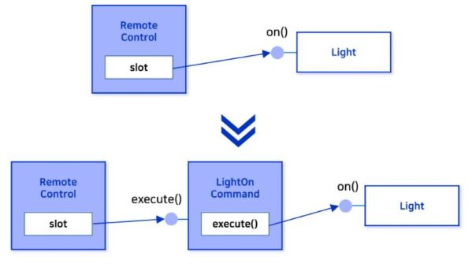
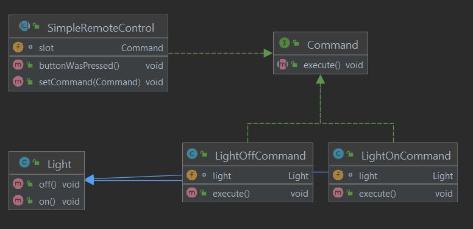

Head First Design Patterns 책을 참고하여 공부 및 정리하였습니다.

## 커맨드 패턴
- 실행될 기능을 캡슐화하여 재사용성 높은 클래스로 설계하는 패턴이다.
- 요청을 하는 객체와 그 요청을 수행하는 객체를 분리할 수 있다.
- 어떤 객체(A)에서 다른 객체(B)의 메서드를 실행하려면 그 객체(B)를 참조하고 있어야 하는 의존성이 발생한다.<br/>
이러한 의존성을 커맨드 패턴을 적용하여 제거할 수 있다.

## 커맨드 패턴이 필요한 상황
홈 오토메이션 리모컨이 존재한다. 여러 슬롯마다 각각 "ON"버튼과 "OFF" 버튼이 있다. 처음 1번 슬롯에는 TV를 연결, 2번 슬롯에는 조명을 연결 등 각 슬롯마다 가전제품이 연결되어 있다. .<br/>
- 고려사항
    - 제어해야 할 가전제품 클래스의 인터페이스가 제작사별로 상이할 수 있다.
    - 새로이 제어해야 할 가전제품 클래스가 추가될 수 있다.<br/><br/>

위와 같은 고려사항이 존재할 때, 리모컨의 특정한 슬롯에 다양한 제작사 혹은 다양한 종류의 가전제품 클래스를 연결하더라도 리모컨 클래스에 영향을 주지 않는 설계를 하려면 어떻게 해야 할까?<br/><br/>

특정 슬롯에서 조명을 켜거나 끄는 일을 한다면, 슬롯에서 바로 on(),off()를 하는 것 보단 중간에 객체를 두어 거쳐서 가도록 하면 슬롯과 조명 클래스와의 직접적인 의존 관계가 생기는 것을 막을 수 있다.<br/><br/>

<br/><br/>

- 직접 호출
```java
Light light = new Light();
SimpleRemoteControl remote = new SimpleRemoteControl(light);
remote.on();
```

- 사이에 커맨드객체를 두고 호출
```java
SimpleRemoteControl remote = new SimpleRemoteControl();
Light light = new Light();
LightOnCommand lightOn = new LightOnCommand(light);
LightOffCommand lightOff = new LightOffCommand(light);

remote.setCommand(lightOn);
remote.setCommand(lightOff);
```

## 구현
- SimpleRemoteControl 객체
    - 직접 Light와 같은 구체적인 클래스의 참조가 아닌 Commmand 인터페이스의 래퍼런스를 갖고 있다.
    ```java
    public class SimpleRemoteControl {

        Command slot;
        public SimpleRemoteControl() {}

        public void setCommand(Command command) {
            slot = command;
        }
        public void buttonWasPressed() {
            slot.execute();
        }
    }
    ```

- Command 인터페이스
```java
public interface Command {
    public void execute();
}
```

- LightOnCommand 클래스
    - Command 인터페이스를 구현하고 있다.
    - LightOnCommand 클래스의 경우, Light의 직접적인 참조를 통해 execute() 메소드에서 light.on() 을 호출해 준다.
    ```java
    public class LightOnCommand implements Command{
        Light light;

        public LightOnCommand(Light light) {
            this.light = light;
        }

        @Override
        public void execute() {
            light.on();
        }
    }
    ```
    