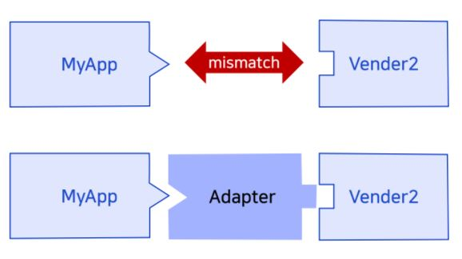
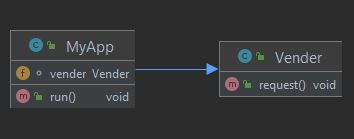
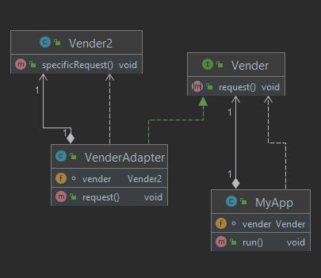

Head First Design Patterns 책을 참고하여 공부 및 정리하였습니다.

## 어댑터 패턴
- 클래스의 인터페이스를 사용자가 기대하는 다른 인터페이스로 변환하는 패턴
- **인터페이스 호환성 때문에 같이 쓸 수 없는 클래스들을 연결해서 사용 가능하게 해준다.**


## 어댑터 패턴이 필요한 상황
서로 호환되는 MyApp과 Vender 객체가 존재한다.<br/> 
MyApp 클래스에서 Vender 클래스를 직접 참조하고 있다.<br/><br/> 

<br/> 

- MyApp
```java
public class MyApp {
    Vender vender;

    public MyApp(Vender vender) {
        this.vender = vender;
    }
    public void run() {
        vender.request();
    }
}
```

- 만약, 기존의 Vender 클래스를 다른 클래스인 Vender2로 교체 해야 하는 상황이 발생한다면?
    - MyApp 클래스의 코드 수정이 발생하게 된다.
    - 코드 수정 없이 새로운 클래스로 교체 하는 방법은 **어댑터 패턴**을 이용하면 된다.



- Vender
```java
public interface Vender {
    public void request();
}
```

- VenderAdapter
```java
public class VenderAdapter implements Vender{
    Vender2 vender;

    public VenderAdapter(Vender2 vender) {
        this.vender = vender;
    }

    @Override
    public void request() {
        vender.specificRequest();
    }
}
```

- Vender2
```java
public class Vender2 {

    public void specificRequest() {
        System.out.println("A request is served by Vender2");
    }
}
```

