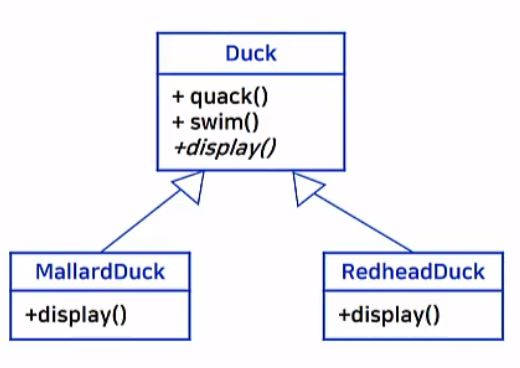
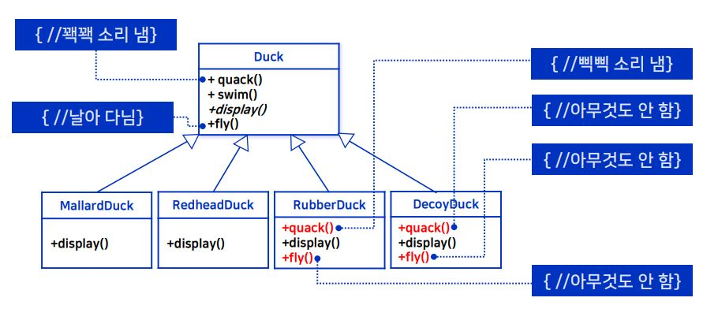
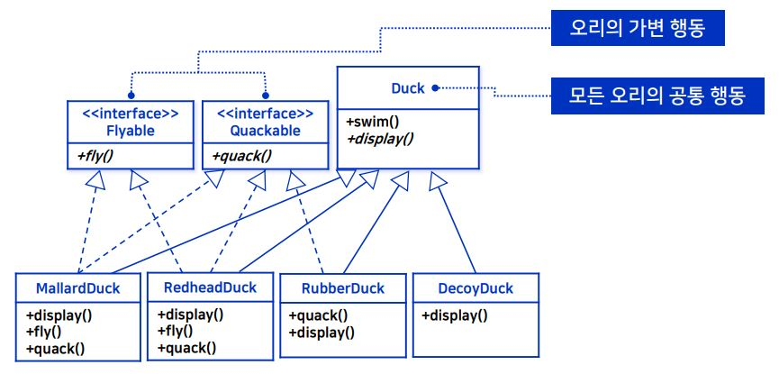
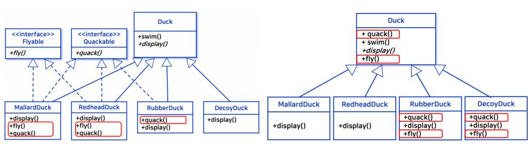
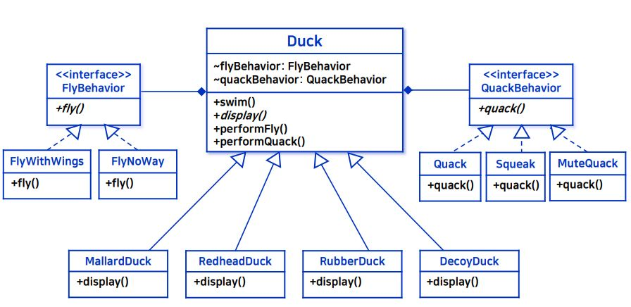
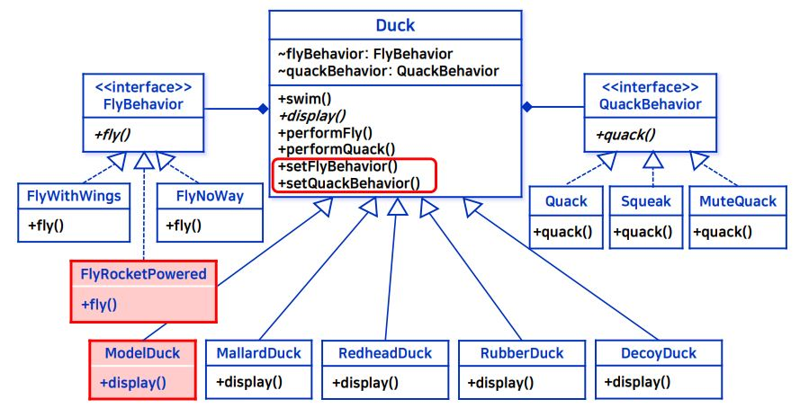

_학교 수업 소프트웨어 설계 패턴을 듣고 정리한 내용입니다._

## 학습목표
- 객체지향의 기본 개념 (상속, 인터페이스, 캡슐화, 다형성)을 이해한다.
- 객체지향 설계 문제를 분석한다.
- 객체지향 설계 원리를 이해한다.
- 디자인 패턴의 역할을 이해한다.

## SimUDuck 어플리케이션
- 오리 연못 시뮬레이션 게임으로 헤엄치고 소리 내는 다양한 오리를 보여준다.
- UML 다이어그램으로 나타난 SimUDuck 설계
    - 핵심 객체인 오리로 클래스 생성
    - quack(), swim()은 이미 구현된 메소드로 그대로 상속 받는다.
    - display()는 추상 메소드로 상속받은 클래스(MallardDuck, RedheadDuck)에서 구현을 정의해야 한다.<br/>
     <br/>
- [전체 코드](https://github.com/kwanulee/DesignPattern/tree/master/strategy/SimUDuckApp.v0/src/hansung/designpatterns/strategy)

### 문제 상황
- **모든 sub class가 super class의 메서드를 모두 상속받게 된다.** 즉, 원치 않는 상속이 발생할 수 있다.
    ```java
    //Duck class에 정의된 quack()
    public void quack() {
        System.out.println("Quack");
    }
    ```
    - 어떤 오리는 quack()에 정의된 Quack 이 아닌 다른 소리를 낼 수 있다.
    - 또한 날 수 없는 오리도 존재한다.

### 변경요구 사항
- 현재 시스템에서 오리들이 날 수 있도록 변경한다.
    - **Duck 클래스에 fly() 메서드를 추가한다.**(super class에 추가)
        
### 문제 해결 및 변경 요구 사항 적용
- 문제 해결 방안 1 -> **상속&오버라이딩** 사용
    - [전체코드](https://github.com/kwanulee/DesignPattern/tree/master/strategy/SimUDuckApp.Revision2/src/hansung/designpatterns/strategy)
    
    <br/>
            
    - 장점
        - 1) 모든 오리의 공통 행동의 재사용이 용이하다.
        - 2) 새로운 종류의 오리의 추가가 용이하다.
    - 단점
        - 1) 서브 클래스에서 코드가 중복될 수 있다.
        - 2) 서브 클래스의 정의만 보고는 오리들 사이의 행동 차이를 구분하기 힘든 경우가 있다. 재정의 시 구현을 직접 봐야 행동 차이를 알 수 있다.
        - 3) Duck 클래스의 변경이 Duck의 서브 클래스에 원치 않는 영향을 끼칠 수 있다.
                    
- 문제 해결 방안 2 -> **인터페이스 사용**
    - 인터페이스란?
        - 구현이 없는 추상메서드만을 정의한 타입
            ```java
            public interface Flyable {
                public void fly();
            }
            ```
            ```java
            public class MallardDuck extends Duck implements Flyable,Quackable {

                public void display() {
                    System.out.println("I'm a real Mallard duck");
                }
                
                public void fly() {
                    System.out.println("I'm flying");	
                }

                public void quack() {
                    System.out.println("Quack");	
                }

            }
            ```
     - [전체 코드](https://github.com/kwanulee/DesignPattern/tree/master/strategy/SimUDuckApp.Revision3)

    - 인터페이스를 사용하면 모든 오리의 **공통 행동**은 **상속** 받게 되고 오리의 가변 행동은 필요한 경우에만 해당 인터페이스를 구현하여 **의도치 않은 상속 문제를 해결**할 수 있게 된다.

    <br/>

    - 장점
        - 1) 모든 오리의 공통 행동의 재사용이 용이하다.
        - 2) 새로운 종류 오리의 추가가 용이하다.
        - 3) Duck 서브클래스의 정의만 보고 오리들 사이의 행동 차이를 구분하기 용이하다.
    - 단점
        - 1) 인터페이스는 구현 코드가 없으므로, 코드의 재사용을 할 수 없다. 동일한 행동을 하는 오리의 경우 재사용이 필요할 수 있다.
        - 2) Duck 서브클래스에서 코드가 중복된다.

### 정리
- 상속 & 오버라이딩 사용 방안 
    - Duck 클래스에 오리의 모든 행동을 정의하고(**상속**), Duck의 서브클래스에서 필요에 따라 가변적인 오리의 행동만을 **재정의(오버라이딩)** <br/>
    -> Duck 클래스의 변경이 여러 서브클래스의 변경으로 이어지는 문제점이 발생한다.
- 인터페이스 사용 방안
    - **가변**적인 오리의 행동을 **인터페이스**로 정의하고, 이를 Duck의 **서브 클래스에서 구현**<br/>
    -> 오리의 한 행동을 구현해야 할 경우에, Duck의 여러 서브클래스에서 중복적으로 구현해야 하는 문제점이 발생한다.

## 소프트웨어 변경
:::tip
디자인 원칙 : 변화하는 부분과 변하지 않는 부분을 분리하라
:::
- 바뀌는 부분은 **캡슐화** 시킴으로써, 변경의 영향을 한정시킨다.
- 위의 원칙을 SimUDuck 에 적용 시키면, fly()와 quack() 행위는 오리의 종류에 따라 **변화되는 부분**이므로 분리되어야 한다.
- 인터페이스(첫 UML)와 상속 & 오버라이딩(두번째 UML) 을 사용한 경우 UML 다이아그램은 아래와 같다.
    - 위의 원칙을 적용해서 분리되어야 할 부분은 빨강색 박스이다.<br/>
    <br/>

:::tip
디자인 원칙 : 구현이 아닌 인터페이스에 맞춰서 프로그래밍하라.
:::
- 빨강색 박스인 변경되는 부분을 Duck 및 Duck의 서브 클래스에서 분리 시키는 방법이다.
- 변경되는 부분을 기존 구현 클래스에서 프로그래밍 하지 말고, **독립적인 인터페이스**에 맞춰서 프로그래밍 한다.
    - 디자인 원칙에 의해 변경된 UML 다이어그램
    <br/>

    - [전체코드](https://github.com/kwanulee/DesignPattern/tree/master/strategy/SimUDuckApp.Revision4/src/hansung/designpatterns/strategy)
    - fly() 메서드를 Duck 에 위치시키는 것 대신, FlyBehavior 라는 인터페이스로 생성한다.<br/><br/>
        ```java
        public interface FlyBehavior {
            public void fly();
        }
        ```
        - FlyBehavior 인터페이스를 구현하는 **날 수 있는 행동**에 대한 정의를 한 FlyWithWings 클래스를 생성.
            ```java
            public class FlyWithWings implements FlyBehavior {
                public void fly() {
                    System.out.println("I'm flying!!");
                }
            }
            ```
         - FlyBehavior 인터페이스를 구현하는 **날 수 없는 행동**에 대한 정의를 한 FlyNoWay 클래스를 생성.
            ```java
            public class FlyNoWay implements FlyBehavior {
                public void fly() {
                    System.out.println("I can't fly");
                }
            }
            ```
    - quack() 메서드를 Duck 에 위치시키는 것 대신, QuackBehavior 라는 인터페이스로 생성한다. 
        - QuackBehavior 인터페이스를 구현하는 **소리를 낼 수 있는** 행동에 대한 정의를 한 Squeak 클래스를 생성.
        - QuackBehavior 인터페이스를 구현하는 **소리를 낼 수 없는 행동**에 대한 정의를 한 MuteQuack 클래스를 생성.
        - QuackBehavior 인터페이스를 구현하는 **Quack 소리를 낼 수 있는 행동**에 대한 정의를 한 Quack 클래스를 생성.
        
    - Duck 행동 통합하기
        ```java
        public abstract class Duck {
            FlyBehavior flyBehavior;
            QuackBehavior quackBehavior;

                //공통 행동
            public void swim() { 
                System.out.println("All ducks float, even decoys!");
            }

            abstract public void display();

            public void performFly() {
                flyBehavior.fly();
            }

            public void performQuack() {
                quackBehavior.quack();
            }
        }
        ```

    - 인터페이스에 맞춘 다양한 Duck 행동 구현
        - MallardDuck 은 quack 소리를 내며(Quack) 날 수 있다(FlyWithWings).
            ```java
            public class MallardDuck extends Duck{
                public MallardDuck() {
                    quackBehavior = new Quack(); // 실질 행동 주체 설정
                    flyBehavior = new FlyWithWings(); // 실질 행동 주체 설정
                }
                public void display() {
                    System.out.println(“I’m a real Mallard duck”);
                }
            }
            ```
    
- 장점
    - 나는 행동과 꽥꽥거리는 행동의 재사용이 가능하다.
        - 위의 인터페이스 단점이 재사용이 불가능 (해결)
    - 새로운 나는/꽥꽥거리는 행동의 추가가 용이하다.
- 단점
    - 오리 행동의 **동적 변경**이 필요한 경우, 기존의 Duck 서브 클래스의 변경이 필요하다.
        - 예를 들어, 그냥 나는 행동이였던 오리가 업그레이드 되어 로켓추진 비행으로 변경된 경우이다.
    
## 최종 디자인
- 위의 단점인 동적 변경이 불가능한 점을 보완하는 디자인이다. 최종 디자인에서는 동적 변경이 가능해 진다.
    - **setXXX** 메서드를 통해
- 전체 UML 다이어그램
    <br/> <br/><br/>
- 최종 디자인과 같은 설계를 **스트래터지 패턴**이라고 한다.

:::important
- 스트래터지 패턴은 알고리즘을 정의하고 각각을 캡슐화(정보은닉-인터페이스만 제공)하여 이 알고리즘들을 상호 교환해서 사용할 수 있도록 만든다.
:::
- 스트래티지 패턴을 활용하면 알고리즘을 사용하는 클라이언트와는 독립적으로 알고리즘을 변경시킬 수 있다. 
- [전체코드](https://github.com/kwanulee/DesignPattern/tree/master/strategy/SimUDuckApp.Revision5)

- 스트래터지 패턴 적용한 SimUDuck 
    - Duck 클래스
        - setter 와 getter 메소드를 두어 동적 변화를 가능하게 했다.
        - 실행 클래스(MiniDuckSimulator) 에서 performFly 메소드,  performQuack 메소드를 호출하여 각 Duck 의 sub 클래스에 설정된 FlyBehavior를 구현한 클래스의 fly() 메서드, QuackBehavior를 구현한 클래스의 quack() 메서드를 호출할 수 있다.

        ```java
        public abstract class Duck {
            private FlyBehavior flyBehavior;
            private QuackBehavior quackBehavior;

            public void performFly() {
                getFlyBehavior().fly();
            }

            public void performQuack() {
                getQuackBehavior().quack();
            }
            public QuackBehavior getQuackBehavior() {
                return quackBehavior;
            }
            public void setQuackBehavior(QuackBehavior quackBehavior) {
                this.quackBehavior = quackBehavior;
            }
            public FlyBehavior getFlyBehavior() {
                return flyBehavior;
            }
            public void setFlyBehavior(FlyBehavior flyBehavior) {
                this.flyBehavior = flyBehavior;
            }
            ...
        }
        ```
    - Duck 서브 클래스인 RubberDuck
        - RubberDuck 의 경우 flyBehavior로 FlyNoWay 클래스를, quackBehavior로 Squek 클래스를 set 하였다.
        ```java
        public class RubberDuck extends Duck {
            public RubberDuck() {
                setFlyBehavior(new FlyNoWay());
                setQuackBehavior(new Squeak());
            }
            ...
        }
        ```

    - Main 실행 클래스
        - ModelDuck 의 경우, 원래 나는 행동에서 로켓 추진으로 d.setFlyBehavior(new FlyRocketPowered()); 로 동적으로 변화가 가능해졌다. 
        ```java
        public static void main(String[] args) {
            
            ArrayList<Duck> ducks = new ArrayList<Duck>();
            ...

            for (Duck d: ducks) {
                d.display();
                d.swim();
                d.performQuack();
                if (d instanceof ModelDuck)
                    d.setFlyBehavior(new FlyRocketPowered());
                d.performFly();
                System.out.println();
            }
        }
        ```

## 참고
- [교수님 github](https://github.com/kwanulee/DesignPattern)
- [교재 Head First Design Patterns](https://www.aladin.co.kr/shop/wproduct.aspx?ItemId=582754)
- 강의자료