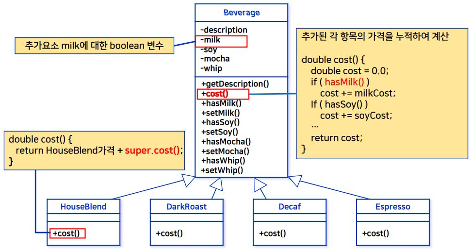
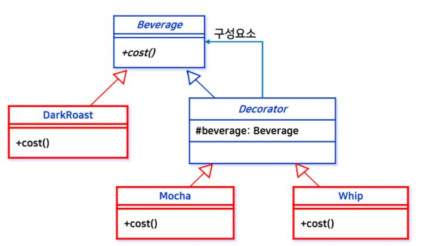
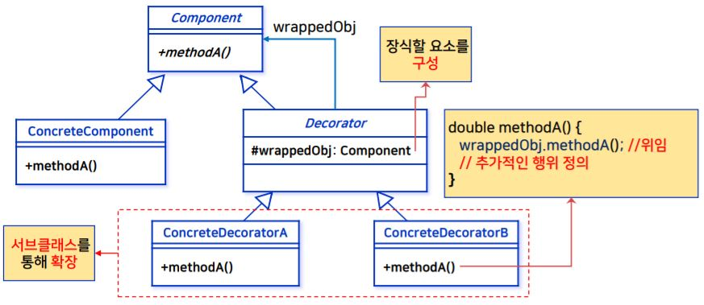
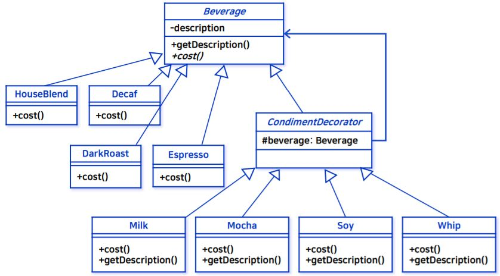
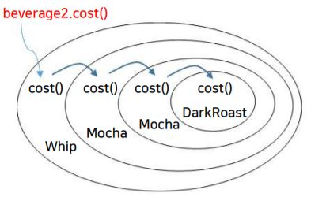
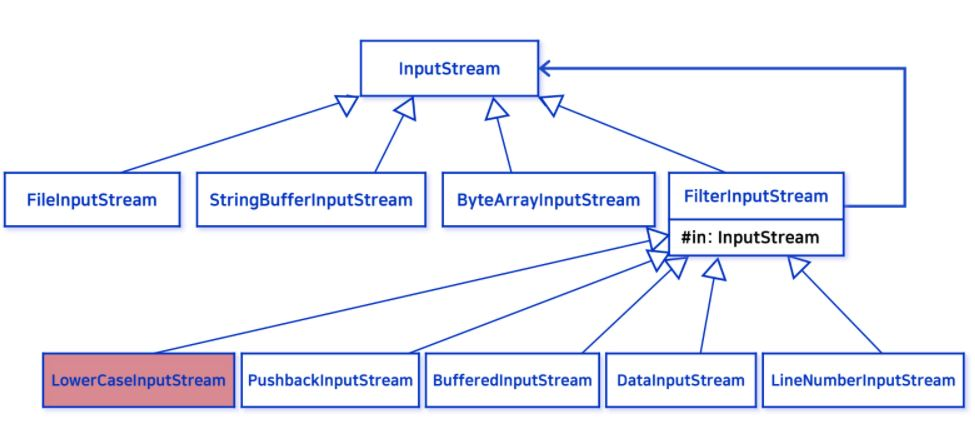
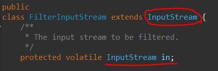

_학교 수업 소프트웨어 설계 패턴을 듣고 정리한 내용입니다._

## 학습 목표
- 데코레이터 패턴이 필요한 상황을 이해한다.
- 데코레이터 패턴의 작동 메커니즘을 이해한다.
- 데코레이터 패턴을 직접 구현해 본다.
- 데코레이터 패턴의 다양한 적용 예를 이해한다.

## 문제 상황
- 스타버즈 음료 주문 시스템
    - 다양한 음료들을 모두 포괄하는 주문 시스템
    

## 변경 사항들
- [전체코드](https://github.com/kwanulee/DesignPattern/tree/master/decorator/StarbuzzAlternative)
- 커피 주문 시, 스팀우유나 두유, 모카를 추가하기도, 휘핑크림을 얹기도 한다.
- 각각을 추가 주문할 때마다 커피 가격에 반영되어야 한다.
- 추가되는 항목에 따라 모두 클래스로 만들어 cost() 메서드를 재정의 한다면 클래스의 수가 매우 증가한다.
- 따라서, Beverage(부모) 클래스의 cost() 에서 각 항목(스팀우유, 두유 등)의 가격을 누적하여 계산하는 방법을 사용한다.
    ```java
    double cost() {
        double cost = 0.0;
        if ( hasMilk() )
        cost += milkCost;
        If ( hasSoy() ) 
        cost += soyCost;
        …
        return cost;
        }
    ```
    

## 문제점
1. 첨가물 가격이 바뀔 때마다 기존 코드(Beverage 클래스) 를 수정해야 한다.
2. 첨가물의 종류가 추가될 때마다 Beverage 클래스에서 새로운 메소드(setXXX, hasXXX) 추가, cost() 메소드를 수정해야 한다.
3. 새로운 음료가 특정 첨가물을 제한하는 경우에 문제가 발생한다.
4. 만약 손님이 더블 모카를 주문한다면 문제가 발생한다.

:::tip
디자인 원칙: 기존 코드를 건드리지 않고 확장을 통해 새로운 요구사항을 추가해야 한다. 
:::

## 해결방안: 데코레이터 패턴
- 정의
    - 정적 확장을 통해 새로운 요구사항을 추가한다.
        - 서브 클래스를 만드는 것을 통해 새로운 요구사항 (음료 및 첨가물) 추가
        
    - 객체의 구성과 위임을 통해 기존 객체의 행동을 동적으로 확장한다.
        - Decorator는 행동을 확장할 객체를 내부 요소로 구성
            - 해당 예제의 경우, Decorator에 Beverage 객체를 내부 요소로 구성한다.   
        - Decorator 객체가 감싸고 있는 객체에 일부 행동을 위임하고 추가적인 행동을 정의한다.
            - 해당 예제의 경우, cost() 를 재정의 하고 있다.

            

- 스타버즈 예제에 데코레이터 패턴 적용
    - [전체코드](https://github.com/kwanulee/DesignPattern/tree/master/decorator/starbuzz/src/hansung/designpatterns/decorator/starbuzz)<br/>
    

    - Beverage(부모) 클래스
        - cost() 를 abstract로 설정하여 재정의 하도록 한다.
        ```java
        public abstract class Beverage {
            String description = "Unknown Beverage";
        
            public String getDescription() {
                return description;
            }
        
            public abstract double cost();
        }
        ```
    
    - Beverage 클래스를 상속받은 Espresso 클래스
        - 음료의 종류가 Beverage 클래스를 상속받고 cost() 메서드에 해당 음료의 가격을 정의한다.
        - 음료의 종류로 HouseBlend, DarkRoast, Decaf 클래스가 있고 모두 Beverage 클래스를 상속받아 추상메소드를 구현한다.
        ```java
        public class Espresso extends Beverage {
            public Espresso() {
                description = "에스프레소";
            }
        
            public double cost() {
                return 1.99;
            }
        }
        ```

    - CondimentDecorator 클래스 (데코레이터)
        - Beverage 를 상속받고 내부 요소로 Beverage를 구성한다.
        ```java
        public abstract class CondimentDecorator extends Beverage {
            protected Beverage beverage;
            
            public CondimentDecorator(Beverage beverage) {
                this.beverage = beverage;
            }
        }
        ```

    - CondimentDecorator 클래스를 상속받는 Whip 클래스
        - Beverage의 추상 메소드 cost()를 여기서 재정의 한다.
        - 첨가물의 종류가 CondimentDecorator 클래스를 상속받아 cost()를 재정의 하여 각 첨가물의 가격과 음료의 가격을 더한 값으로 정의한다.
        ```java
        public class Whip extends CondimentDecorator {
            public Whip(Beverage beverage) {
                super(beverage);
            }
        
            public String getDescription() {
                return beverage.getDescription() + ",휘핑";
            }
        
            public double cost() {
                return .10 + beverage.cost();
            }
        }
        ```

    - 테스트 코드
        ```java
        Beverage beverage2 = new DarkRoast();
        beverage2 = new Mocha(beverage2);
        beverage2 = new Mocha(beverage2);
        beverage2 = new Whip(beverage2);
        System.out.println(beverage2.getDescription()
        + " $" + beverage2.cost());
        // 다크 로스트 커피, 모카, 모카,휘핑$1.49
        ```
        

- 데코레이터 패턴의 정리
    - 데코레이터의 수퍼클래스는 자신이 장식하고 있는 객체의 수퍼클래스와 같다.
    - 한 객체를 여러 개의 데코레이터로 감쌀 수 있다.
    - 데코레이터는 자신이 감싸고 있는 객체와 같은 수퍼클래스를 가지고 있기 때문에 원래 객체(싸여져 있는 객체)가 들어갈 자리에 데코레이터 객체를 집어 넣어도 상관없다.
    - 데코레이터는 자신이 장식하고 있는 객체에게 어떤 행동을 위임하는 것 외에 원하는 추가적인 작업을 수행할 수 있다.
    - 데코레이터는 그것을 감싸는 구성요소들 중에 무엇이 구체적으로 있는지 알 수 없다. 따라서, 그것이 감싸는 특정한 구성요소에 따라서 다른 행동을 할 수는 없다.
        - 예를 들면, "DarkRoast 커피에 추가된 휘핑크림은 50% 할인" 과 같은 행동은 구조적으로 힘들다. 

## 데코레이터가 적용된 자바 I/O

- Java.io 의 InputStream을 상속 받는 **FilterInputStream** 이 데코레이터 패턴이 적용되었다.
    
    - FilterInputStream 을 상속받는 LowerCaseInputStream 클래스를 구현해보자.
        - [전체코드](https://github.com/kwanulee/DesignPattern/tree/master/decorator/io/src/hansung/designpatterns/decorator/io)
        - LowerCaseInputStream 클래스는 파일의 text를 읽고 모든 문자를 소문자로 출력해주는 클래스이다.
        ```java
        public class LowerCaseInputStream extends FilterInputStream {
            public LowerCaseInputStream(InputStream in) {
                super(in);
            }
            public int read() throws IOException {
                int c = in.read();
                return (c == -1 ? c : Character.toLowerCase((char)c));
            }
            public int read(byte[] b, int offset, int len) throws IOException {
                int result = in.read(b, offset, len);
                for (int i = offset; i < offset+result; i++) {
                b[i] = (byte)Character.toLowerCase((char)b[i]);
            }
            return result;
            }
        }
        ```
## 핵심정리
- 상속을 통해 확장을 할 수도 있지만, 디자인의 유연성 면에서 보면
별로 좋지 않다.
- 구성과 위임을 통해서 실행 중에 새로운 행동을 추가할 수 있다.
- 데코레이터 패턴에서는 구성요소(Concrete Component)를 감싸주는 데코레이터들을 사용한다.
- 데코레이터 클래스의 형식은 그 클래스가 감싸고 있는 클래스의 형식을 반영한다.
- 데코레이터에서는 자기가 감싸고 있는 구성요소의 메소드를 호출한 결과에
새로운 기능을 더함으로써 행동을 확장한다.
- 구성요소를 감싸는 데코레이터의 개수에는 제한 없다.
- 구성요소의 클라이언트에서 구성요소의 구체적인 형식에 의존하게 되는
경우는 데코레이터 패턴을 사용할 수 없다.
- 데코레이터 패턴을 사용하면 자잘한 객체들이 매우 많이 추가될 수 있고,
데코레이터를 너무 많이 사용하면 코드가 필요 이상으로 복잡해질 수 있다.

## 참고
- [교수님 github](https://github.com/kwanulee/DesignPattern)
- [교재 Head First Design Patterns](https://www.aladin.co.kr/shop/wproduct.aspx?ItemId=582754)
- 강의자료