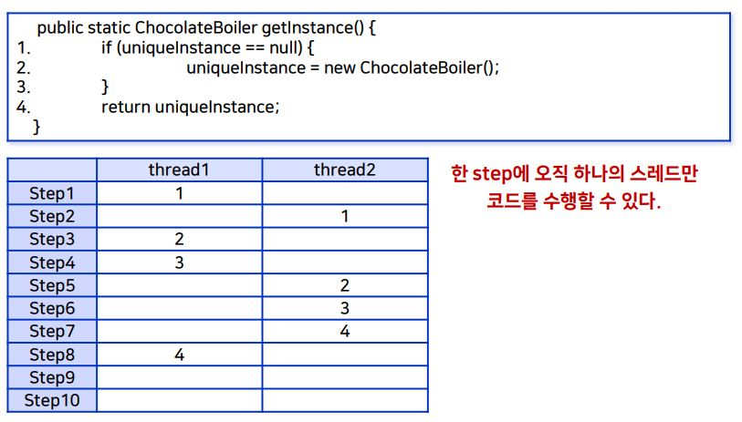

_학교 수업 소프트웨어 설계 패턴을 듣고 정리한 내용입니다._

## 학습 목표
- 인스턴스가 하나뿐인 객체가 필요한 상황을 이해한다.
- 싱글턴 패턴을 이해한다.
- 싱글턴 패턴의 멀티 스레딩 문제 해결 방안을 살펴본다.

## 문제상황
- 스레드 풀
    - 스레드란?
        - 어떤 프로그램 내에서 특히 프로세스 내에서 실행되는 흐름의 단위이다.
    - 멀티 스레딩?
        - 동시에 실행시킬 수 있는 코드 단위를 독립적으로 생성된 스레드에 할당하여 실행하는 기능이다.
    - 스레드 풀
        - 스레드를 제한된 개수만큼 정해놓고 작업 큐에 들어오는 작업들을 하나씩 스레드에 할당하는 모듈이다.
        - 전체 시스템에서 스레드 풀은 하나만 존재해야 한다. 자원의 제약이 있기 때문이다.
        - 인스턴스가 **단 하나만** 존재해야 한다.

- 캐시
    - 캐시란?
        - 데이터나 값을 미리 복사해 놓는 임시 장소이다.
    - 캐시 종류
        - 웹 캐시
        - CPU 캐시
        - 디스크 캐시
    - 웹 캐시의 경우, 캐시가 여러개 있다면 값이 여러개의 캐시 프록시에 저장되어 값이 변경되었을 때, 다른 캐시 프록시에 저장된 값과 충돌이 일어나게 된다. => 캐시는 **하나만** 존재해야 한다.


## 싱글턴 패턴
- 싱글턴 패턴은 해당 클래스의 인스턴스가 하나만 만들어지고 어디서든지 그 인스턴스에 접근할 수 있도록 하기 위한 패턴이다.
- 하나의 인스턴스만 만들어지도록 인스턴스가 이미 생성되었다면 해당 인스턴스를 리턴하고 인스턴스가 생성된 적이 없다면 새로 만들어준다. -> getInstance()
- uniqueInstance 와 getInstance() 가 **static** 으로 되어 있다. 
    - static 은 Static 영역에 할당되어 모든 객체가 공유하여 어디에서든 참조할 수 있어 객체를 생성하지 않고 바로 접근할 수 있다.
    - Singleton.getInstance() 로 접근할 수 있다.

    ```java
    public class Singleton {
        private static Singleton uniqueInstance;
        
        private Singleton() {}  //외부에선 해당 생성자를 호출 불가

        public static Singleton getInstance() {
            if(uniqueInstance == null)
                uniqueInstance = new Singleton();
            return uniqueInstance;
        }
    }
    ```
### 특징
- uniqueInstance 변수에 Singleton의 유일무의한 인스턴스가 저장된다.
- getInstance() 메서드는 정적 메서드로서, 언제 어디서든 이 메소드를 호출할 수 있고, 게으른 생성(Lazy Creation)을 활용할 수 있는 장점을 제공한다.
    - **Lazy Creation** : 인스턴스가 **필요한 시점**에 해당 인스턴스를 만든다. 메모리 효율적이다.
- 일반적인 클래스와 마찬가지로 다양한 데이터와 메소드를 사용할 수 있다.

## 멀티 스레드에서 실행
- [멀티 스레드 예제 프로젝트 링크](https://github.com/kwanulee/DesignPattern/tree/master/singleton/chocolate)
- 실행 결과
    - 두 개의 'Creating unique instance of chocolate Boiler' 문이 출력된다.
    - 즉, 두 개의 인스턴스가 생성되었다.
    - 위와 같은 문제가 발생하는 상황은?
        

### 해결방안1: Synchronized
- [전체코드](https://github.com/kwanulee/DesignPattern/tree/master/singleton/chocolate_threadsafe)
- 한 순간에는 하나의 스레드에 의해서만 실행될 수 있도록 고정해준다.
    - synchronized 키워드를 추가한다.
    ```java
    public class ChocolateBoiler {
        private boolean empty;
        private boolean boiled;
        private static ChocolateBoiler uniqueInstance;
        private ChocolateBoiler() {
            empty = true;
            boiled = false;
            System.out.println("Creating unique instance of Chocolate Boiler");
        }
        public static synchronized ChocolateBoiler getInstance() {
            if (uniqueInstance == null) {
                uniqueInstance = new ChocolateBoiler();
            }
            return uniqueInstance;
        }
    } 
    ```
    - 실행 결과
        - `Creating unique instance of chocolate Boiler`
        - 하나의 인스턴스가 생성된다.
- 단점
    - 동기화가 필요한 시점은 메소드가 시작되는 때일 뿐이다. (인스턴스가 하나만 만들어지기까지)
    - 그 외의 동기화는 불필요한 오버헤드 (성능 100배 저하)를 유발한다.

### 해결방안2: 클래스 로딩 시 생성
- [전체코드](https://github.com/kwanulee/DesignPattern/tree/master/singleton/chocolate_static)
- `private static ChocolateBoiler uniqueInstance = new ChocolateBoiler();`

    ```java
    public class ChocolateBoiler {
        private boolean empty;
        private boolean boiled;
        private static ChocolateBoiler uniqueInstance = new ChocolateBoiler();

        private ChocolateBoiler() {
            empty = true;
            boiled = false;
            System.out.println("Creating unique instance of Chocolate Boiler");
        }
        public static ChocolateBoiler getInstance() {
            System.out.println("Returning instance of Chocolate Boiler");
            return uniqueInstance;
        }
        ...
    }
    ```
    - 실행 결과
        - `Creating unique instance of chocolate Boiler`
        - 하나의 인스턴스가 생성된다.

- 단점
    - 인스턴스가 사용되기 전부터 리소스를 차지하게 된다.

### 해결방안3: Double-Checking Locking
- [전체코드](https://github.com/kwanulee/DesignPattern/tree/master/singleton/chocolate_dcl)
- uniqueInstance == null 을 두 번 check 한다.
- 인스턴스가 생성되기 전인 **처음에만 동기화**를 해서 동기화 오버헤드를 줄인다.
- uniqueInstance의 변경이 다중 스레드에게 올바르게 보이도록 보장하기 위해 volatile 을 사용한다.
    ```java
    public class ChocolateBoiler {
        ...
        private volatile static ChocolateBoiler uniqueInstance;
        private ChocolateBoiler() {
            ...
            System.out.println("Creating unique instance of Chocolate Boiler");
        }
        public static ChocolateBoiler getInstance() {
            if (uniqueInstance == null) {
                synchronized (ChocolateBoiler.class) {
                    if (uniqueInstance == null) {
                        uniqueInstance = new ChocolateBoiler();
                    }
                }
            }
            return uniqueInstance;
        }
    }
    ```
    - 실행 결과
        - `Creating unique instance of chocolate Boiler`
        - 하나의 인스턴스가 생성된다.

    - 왜 uniqueInstance == null 을 두 번 check 하는가?
        - Thread1과 Thread2 가 처음 if(uniqueInstance == null)에 접근하게 된다. 
        - Thread1만 synchronized 에 의해 두 번째 if(uniqueInstance == null)에 접근하게 되어 인스턴스를 생성한다. -> 인스턴스가 생성되었다.
        - Thread2는 이미 첫번째 if(uniqueInstance == null)을 지나 Thread1에 의해 인스턴스가 생성된 이후에 synchronized (ChocolateBoiler.class) 에 접근한다.
        - 이 때, if (uniqueInstance == null) 을 통해 uniqueInstance이 생성되었다는 것을 다시 체크하여 인스턴스를 생성하지 않게 된다.

    - volatile
        - 자바 변수를 **메인 메모리에 저장** 할 표식으로 사용한다.
        - volatile 변수를 읽어 들일 때 CPU 캐시가 아니라 컴퓨터의 메인 메모리로 부터 읽어들인다.
        - volatile 변수를 쓸 때에도 CPU 캐시가 아닌 메인 메모리에 기록한다.
        - 멀티 쓰래드의 문제점은 다른 쓰래드에서 메인 메모리로 아직 기록하지 않은 값을 보지 못했기 때문에 동기화가 깨지게 된다.
        - 멀티 쓰래드 어플리케이션에서 공유 변수에 volatile을 선언함으로써 JVM은 해당 변수에 대한 모든 읽기 연산을 항상 메인 메모리에서 부터 읽어가도록 보장해 주며, 변수에 대한 모든 write 역시 항상 메인 메모리에 기록되도록 해준다.
        - [참고 블로그](http://thswave.github.io/java/2015/03/08/java-volatile.html)

## 핵심 정리
- 어떤 클래스에 싱글턴 패턴을 적용하면 애플리케이션에 **그 클래스의 인스턴스가 최대 1개까지만** 있도록 할 수 있다.
- 싱글턴 패턴을 이용하면 **유일한 인스턴스를 어디서든지 접근**할 수 있도록 할 수 있다.
- 자바에서 싱글턴 패턴을 구현할 때는 **private 생성자와 정적 메소드, 정적 변수 static**를 사용한다.
- 다중 스레드를 사용하는 애플리케이션에서는 속도와 자원 문제를 파악해보고 적절한 구현법을 사용해야 한다.
    - 클래스 로딩시 생성 방법 사용시 메모리 소모가 크다.
- JMH 도구를 이용하여 성능 측정한 결과
    - 클래스 로딩시 생성, DCL, Synchronized 순서로 인스턴스 생성 성능이 좋다.
    - [측정 코드](https://github.com/kwanulee/DesignPattern/tree/master/singleton)

## 참고
- [교수님 github](https://github.com/kwanulee/DesignPattern)
- [교재 Head First Design Patterns](https://www.aladin.co.kr/shop/wproduct.aspx?ItemId=582754)
- 강의자료