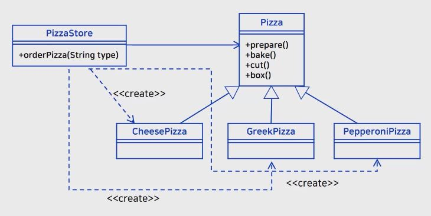
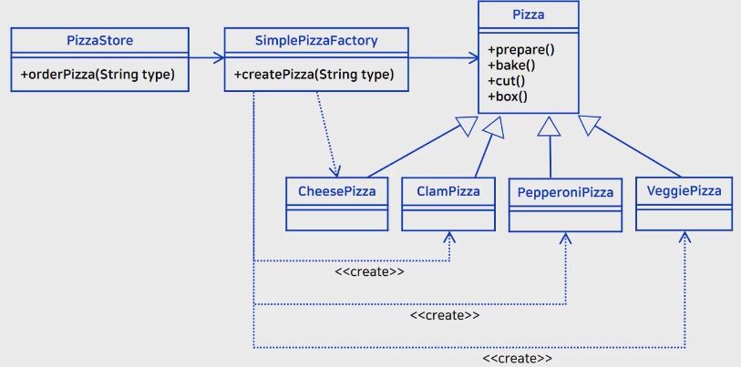
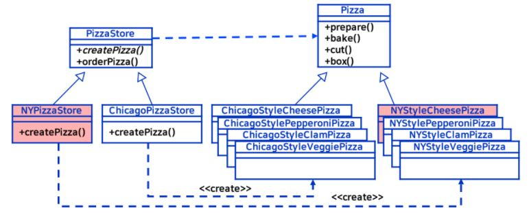
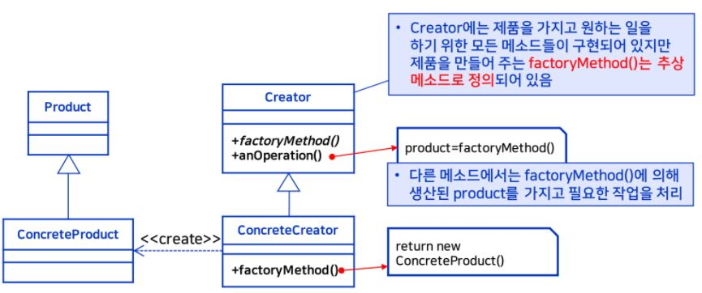
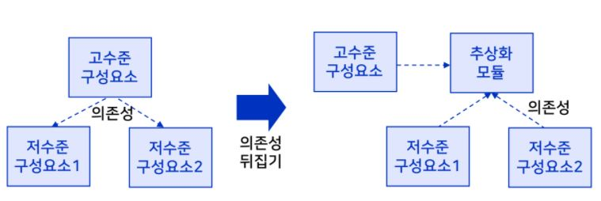
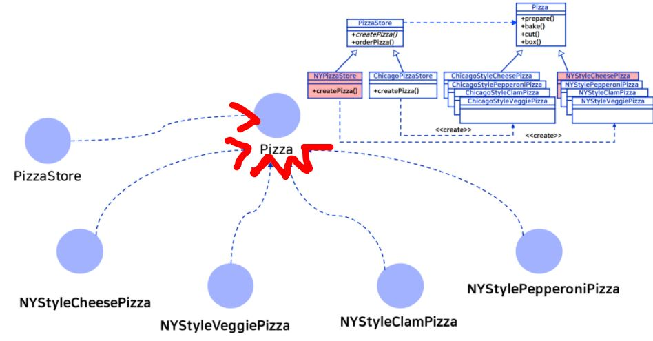
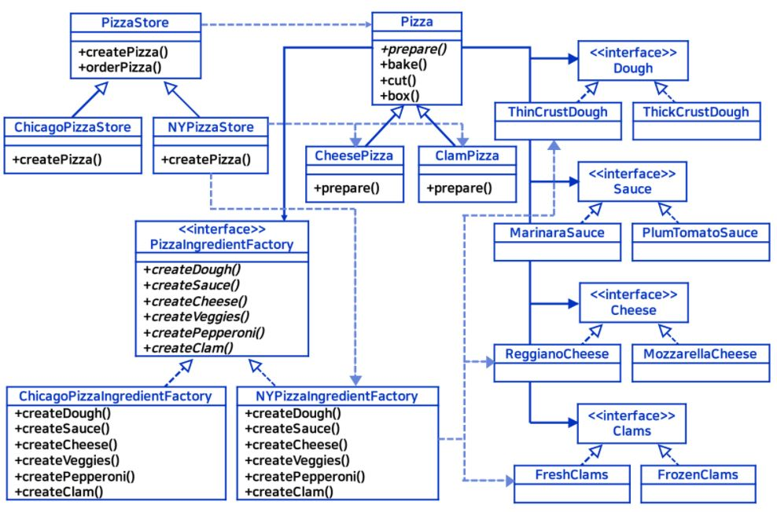

_학교 수업 소프트웨어 설계 패턴을 듣고 정리한 내용입니다._

## 학습목표
- 객체 생성과 관련된 문제를 이해한다.
- 간단한 팩토리를 이해한다.
- 팩토리 메소드 패턴을 이해한다.
- 추상 팩토리 패턴을 이해한다.
- 간단한 팩토리, 팩토리 메소드 패턴, 추상 팩토리 패턴의 차이를 이해한다.

## 문제 상황
- 피자 가게
    
    ```java
    Pizza orderPizza(String type) {
        Pizza pizza;

        if(type.equals("cheese")) {
            pizza = new CheesePizza();
        } else if(type.equals("greek")) {
            pizza= new GreekPizza();
        } else if(type.equals("pepperoni")) {
            pizza = new PepperoniPizza();
        }
        ...
    }
    ```
    - new CheesePizza(), new GreekPizza(), new PepperoniPizza() 와 같이 클래스를 직접 참고한다. 
    - 즉, 인터페이스가 아닌 구현에 맞춰서 프로그래밍 되고 있다.
    - 신제품이 출시되거나, 구제품이 더 이상 판매하지 않는 경우인 새로운 요구사항이 발생할 경우 계속 변경을 해야 한다.<br/>
    
    - **디자인 패턴 중 위 예제에서 지켜지지 않은 원칙들**  
        - 변하는 부분과 변하지 않는 부분을 분리해라
        - 클래스는 확장에 대해서는 열려 있어야 하지만 코드 변경에 대해서는 닫혀 있어야 한다.
    
## 간단한 팩토리
- [전체코드](https://github.com/kwanulee/DesignPattern/tree/master/factory/pizzas)
- **달라지는 부분과 달라지지 않는 부분을 명확히 구분한다.**
    - 달라지는 부분만 별도의 클래스로 분리하여 캡슐화 시킨다.
    
    - Pizza의 sub class 가 추가될 수 있다. 확장에 의한 추가는 허용이 된다.
    - SimplePizzaFactory 의 경우, 여전히 변경되는 부분(createPizza) 가 존재한다.
    - 하지만 **변경되는 부분**인 SimplePizzaFactory 와 **변하지 않는 부분**인 PizzaStore 가 명확히 구분되어 변경할 부분은 특정 클래스로 한정할 수 있다.
    - 변하는 부분을 정의한 클래스를 정적 메소드로 선언하는 경우가 많다.<br/><br/>

    - 변경된 코드
        - SimplePizzaFactory (변하는 부분)
            ```java
            public class SimplePizzaFactory {

                public static Pizza createPizza(String type) {
                    Pizza pizza = null;

                    if (type.equals("cheese")) {
                        pizza = new CheesePizza();
                    } else if (type.equals("pepperoni")) {
                        pizza = new PepperoniPizza();
                    } else if (type.equals("clam")) {
                        pizza = new ClamPizza();
                    } else if (type.equals("veggie")) {
                        pizza = new VeggiePizza();
                    }
                    return pizza;
                }
            }
            ```

        - Pizza store(변하지 않는 부분)
            - 구체적인 Pizza class에 대한 참조가 없다.
            ```java
            public class PizzaStore {
                SimplePizzaFactory factory;
            
                public PizzaStore(SimplePizzaFactory factory) { 
                    this.factory = factory;
                }
            
                public Pizza orderPizza(String type) {
                    Pizza pizza;
            
                    pizza = factory.createPizza(type);
            
                    pizza.prepare();
                    pizza.bake();
                    pizza.cut();
                    pizza.box();

                    return pizza;
                }

            }
            ```
      
## 팩토리 메소드 패턴
- 팩토리 메소드 패턴이 필요한 문제 상황
    - 지역별로 피자 프렌차이즈 지점의 확장한다.
    - 기존 코드를 다른 지점에서도 사용하길 희망한다.
    - **지역의 특성을 반영하여 피자가 달라진다.**
        - 뉴욕 스타일 : 빵은 얇고 소스로 주로 맛을 내고 치즈는 조금 적게 사용
        - 시카고 스타일 : 두꺼운 빵에 풍부한 소스와 많은 치즈 사용

    - **피자를 만드는 행동은 지점 간에 차이가 없지만, 지점별로 고유한 피자를 만들도록 하기 위해서는 어떻게 설계해야 할까?**


### 위의 상황에 대한 해결 방안 : 프레임워크
:::tip
프레임워크란?
- 유사한 여러 애플리케이션 개발에 쉽게 재사용될 수 있고, 쉽게 확장될 수 있도록 만든 소프트웨어 구조
:::
- 전체 구조
    
- **달라지지 않는 부분** : 피자를 만드는 활동은 동일하다. -> PizzaStore 클래스 (프레임워크)
    ```java
    public abstract class PizzaStore {
        ...
        public Pizza orderPizza(String type){
            Pizza pizza = createPizza(type);
            //pizza 클래스에 정의된 prepare(), bake(), cut(), box() 를 PizzaStore 클래스에서 호출
            pizza.prepare();
            pizza.bake();
            pizza.cut();
            pizza.box();
        }
    }
    ```
    - Pizza class
        ```java
        public abstract class Pizza {
            String name;
            String dough;
            String sauce;
            ArrayList<String> toppings = new ArrayList<String>();

            void prepare() {...}
            void bake() {...}
            void cut() {...}
            void box() {...}
            ...
        }
        ```

- **달라지는 부분** : 분점마다 고유한 스타일 -> PizzaStore 의 서브 클래스
    - PizzaStore 클래스에 createPizza 메소드를 **추상 메소드**로 정의하여 서브 클래스에서 재정의 하도록 한다.
    - 각 클래스에서 재정의된 createPizza를 통해 피자의 종류가 결정된다.
        ```java
        public abstract class PizzaStore {
            abstract Pizza createPizza(String item);
            ...
        }
        ```
    - 코드 살펴보기
        - [전체코드](https://github.com/kwanulee/DesignPattern/tree/master/factory/pizzafm/src/hansung/designpatterns/factory/pizzafm)

        - PizzaStore 클래스의 서브 클래스인 NYPizzaStore
            ```java
            public class NYPizzaStore extends PizzaStore {

                Pizza createPizza(String item) {
                    if (item.equals("cheese")) {
                        return new NYStyleCheesePizza();
                    } else if (item.equals("veggie")) {
                        return new NYStyleVeggiePizza();
                    } else if (item.equals("clam")) {
                        return new NYStyleClamPizza();
                    } else if (item.equals("pepperoni")) {
                        return new NYStylePepperoniPizza();
                    } else return null;
                }
            }
            ```
        - PizzaStore 클래스의 서브 클래스인 ChicagoPizzaStore   
            ```java
            public class ChicagoPizzaStore extends PizzaStore {

                Pizza createPizza(String item) {
                        if (item.equals("cheese")) {
                                return new ChicagoStyleCheesePizza();
                        } else if (item.equals("veggie")) {
                                return new ChicagoStyleVeggiePizza();
                        } else if (item.equals("clam")) {
                                return new ChicagoStyleClamPizza();
                        } else if (item.equals("pepperoni")) {
                                return new ChicagoStylePepperoniPizza();
                        } else return null;
                }
            }
            ```

            - Pizza class를 상속받는 피자 종류 중 NYStyleCheesePizza 의 코드
                - 생성자에 각 필요한 재료들에 대한 정의를 한다.
                    ```java
                    public class NYStyleCheesePizza extends Pizza {

                        public NYStyleCheesePizza() { 
                            name = "NY Style Sauce and Cheese Pizza";
                            dough = "Thin Crust Dough";
                            sauce = "Marinara Sauce";
                        
                            toppings.add("Grated Reggiano Cheese");
                        }
                    }
                    ```
    - 코드 별 역할 정리
        - **Pizza** class
            - name, dough, sauce, toppings 의 멤버 필드와 피자 만드는 순서 메서드(prepare, bake, cut, box)의 구현이 존재한다. 
        - **NYStyleCheesePizza 외 각 pizza 정의** class
            - Pizza class를 상속 받아 피자 만드는 순서 메서드 재정의가 가능하고 생성자에서 name, dough, sauce, toppings 를 정의한다.
        - **PizzaStore** class 
            - 각 지점 별로 달라지는 피자 스타일을 정의하기 위해 createPizza 메소드를 추상메소드로 생성한다. orderPizza 에서는 공통된 피자 만들기 활동이 정의된다.
        - **NYPizzaStore** class
            - PizzaStore class를 상속받아 createPizza 추상 메소드를 NYPizzaStore에 맞게 구현한다.
        - **ChicagoPizzaStore** class
            - PizzaStore class를 상속받아 createPizza 추상 메소드를 ChicagoPizzaStore에 맞게 구현한다.


### 팩토리 메소드 패턴 정리
- 정의
    - 팩토리 메소드 패턴에서는 객체를 생성하기 위한 인터페이스 (factoryMethod()) 를 정의하는데, **어떤 클래스의 인스턴스를 만들지는 서브클래스에서 결정**하게 만든다.
    
    - 위의 예제에서
        - Creator 
            - PizzaStore class
        - Product
            - Pizza class 
        - factoryMethod() 
            - createPizza() 로 객체를 생성하기 위한 메소드로 실질적인 구현은 sub class의 createPizza()에서 한다.
        - anOperation()
            - orderPizza() 로 생성된 객체를 가지고 필요한 작업을 처리한다.
        - ConcreteCreator
            - ChicacoPizzaStore class와 NYPizzaStore class 로 factoryMethod()인 createPizza() 에 대한 실질적인 구현이 이루어진다.
        - ConcreteProduct
            - Pizza의 sub class 들로 ChicacoPizzaStore class 또는 NYPizzaStore class 를 통해 생성된다.
            - ex) ChicagoStyleCheesePizza(), ChicagoStyleVeggiePizza() 

### 팩토리 메소드 패턴의 객체 간 의존성 살펴보기
- 위의 예제의 createPizza()에 작성된 코드와 아래의 orderPizza 메소드에 작성된 코드가 동일한 형식이다.
- orderPizza 메소드 안에서 직접 concrete 한 pizza 클래스를 생성하는 경우이다. 
- 따라서, 아래의 예제는 구현에 맞춘 경우이다.
    ```java
    public class DependentPizzaStore { 
        public Pizza orderPizza(String style, String type){ 
            Pizza pizza =null; 

            if (style.equals("NY")){ 
                if (type.equals("cheese")){ 
                    pizza =new NYStyleCheesePizza(); 
                }else if (type.equals("veggie")){ 
                    pizza =new NYStyleVeggiePizza(); 
                } else if(type.equals("clam")){ 
                    pizza =new NYStyleClamPizza(); 
                }else if(type.equals("pepperoni")){ 
                    pizza = new NYStylePepperoniPizza(); 
                } 
            }else if (style.equals("Chicago")){ 
                … 
            }else { 
                System.out.println("Error:invalid type of pizza"); 
                returnnull; 
            }

            pizza.prepare(); 
            pizza.bake(); 
            pizza.cut(); 
            pizza.box(); 
            return pizza; 
        }
    } 
    ```
    - 고수준의 구성요소 DependentPizzaStore class 가 저수준의 구성요소 NYStyleCheesePizza(), NYStyleVeggiePizza() 등 에 의존하는 관계이다.
    - 저수준의 구성요소에 변경이 일어나게 되면 고수정 구성요소에 영향을 받게 되는 것이 의존성이 관계이다. 
    - 즉, 만약 NYStylePepperoniPizza() 가 없어지면 DependentPizzaStore 가 영향을 받게 된다. 

    :::tip
    디자인 원칙: 의존성 뒤집기<br/>
    : 구체적인 클래스에 의존하지 말고 추상화 된 것에 의존하도록 만들어라.<br/>
    : 고수준 구성요소가 저수준 구성요소에 의존하면 안된다. 즉 영향을 받으면 안된다.
    :::
    
    
    - 고수준 구성요소가 저수준 구성요소에 의존하는 형태가 아닌 저수준 구성요소가 고수준의 구성요소에 의존하는 형태로 변경한다.
    - 이것을 의존성 뒤집기라 한다.

- 의존성 뒤집기 디자인 원칙에 의해 팩토리 메소드 패턴이 구현되어 있는 것을 알 수 있다.
    

    - Pizzastore
        - 코드를 보면 저수준 구성요소인 NYPizzaStore 나 ChicagoPizzaStore 에 대한 코드는 없고 **추상 클래스인 Pizza** 에 대한 코드만 존재한다.
        - PizzaStore는 추상 클래스인 Pizza에 의존적이다.

            ```java
            public abstract class PizzaStore {
        
                abstract Pizza createPizza(String item);
            
                public Pizza orderPizza(String type) {
                    Pizza pizza = createPizza(type);
                    System.out.println("--- Making a " + pizza.getName() + " ---");
                    pizza.prepare();
                    pizza.bake();
                    pizza.cut();
                    pizza.box();
                    return pizza;
                }
            }
            ```
- 토의
    - "구현이 아닌 인터페이스에 맞춰서 프로그래밍하라" 와 "의존성 뒤집기 원칙" 의 공통점과 차이점
        - 공통점 
            - **추상화된 것 (인터페이스)에 의존**하도록 하고, 구체적인 것(변경가능한 클래스)에 의존하지 말하야 한다는 점에서는 같다.        
        - 차이점
            - “고수준” 구성요소가 “저수준” 구성요소에 의존하지 않고, 모두 추상적인 것에만 의존하도록 해야 하는 점이 “의존성 뒤집기 원칙”에 특화된 부분이다.

    - **의존성 뒤집기 핵심**     
        - 고수준이든 저수준이든 추상적인 것에 의존하도록 만들고 구체적인 클래스에는 의존하도록 만들면 안된다.


## 추상 팩토리 패턴
- 문제 상황
    - 몇몇 분점에서 자잘한 재료를 더 싼 재료로 바꿔서 원가 절감을 원한다.
    - 따라서, 원재료의 품질 관리 방안이 필요하다.
    - 해결 방안으로 원재료를 생상하는 팩토리를 만들고 팩토리로부터 생산된 원재료를 분점에 배달하는 방식으로 구현한다.

- 원재료 패밀리
    - 분점마다 사용하는 **원재료 종류(예:소스, 치즈, 반죽 등)는 동일**하지만, 각 **원재료 종류별로 사용되는 원재료는 분점마다 상이**하다.
        - 뉴욕 분점은 MarinaraSauce 를, 시카고 분점은 PlumTomatoSauce 를 사용한다.
    - 원재료 패밀리는 특정 분점의 피자를 만드는 데 필요한 원재료들의 집합을 의미한다.
    

- 전체 구조
    
    
- 구현 코드 살펴보기
    - [전체코드](https://github.com/kwanulee/DesignPattern/tree/master/factory/pizzaf/src/hansung/designpatterns/factory/pizzaaf)
    - **PizzaIngredientFactory 인터페이스**
        - 각 역할 별 메소드를 정의한다.
            - ex) dough를 만드는 메소드, 소스를 만드는 메소드 등
        - 역할 별 메소드를 인터페이스로 정의한다.

            ```java
            public interface PizzaIngredientFactory {
                public Dough createDough();
                public Sauce createSauce();
                public Cheese createCheese();
                public Veggies[] createVeggies();
                public Pepperoni createPepperoni();
                public Clams createClam();
            }
            ```
            ---

    - 각 지점마다 PizzaIngredientFactory를 구현한다.<br/> -> **NYPizzaIngredientFactory**, **ChicagoPizzaIngredientFactory** class
        - NYPizzaIngredientFactory 의 코드
            - 각 지점 별로 사용하는 재료에 대한 정의를 각 IngredientFactory class 에 해둔다.
            - Dough 로 ThinCrustDough 를,<br/> Sauce 로 MarinaraSauce 를,<br/> Cheese 로 ReggianoCheese 를,<br/> Veggies 로 Garlic, Onion, Mushroom, RedPepper 를,<br/> Pepperoni 로 SlicedPepperoni 를,<br/> Clams 로 FreshClams 를<br/> 사용한다고 정해둔다.
           
                ```java
                public class NYPizzaIngredientFactory implements PizzaIngredientFactory {
                    public Dough createDough() {
                        return new ThinCrustDough();
                    }
                
                    public Sauce createSauce() {
                        return new MarinaraSauce();
                    }
                
                    public Cheese createCheese() {
                        return new ReggianoCheese();
                    }
                
                    public Veggies[] createVeggies() {
                        Veggies veggies[] = { new Garlic(), new Onion(), new Mushroom(), new RedPepper() };
                        return veggies;
                    }
                
                    public Pepperoni createPepperoni() {
                        return new SlicedPepperoni();
                    }

                    public Clams createClam() {
                        return new FreshClams();
                    }
                }

                ```
        - ChicagoPizzaIngredientFactory 코드
            - 위의 NYPizzaIngredientFactory class 코드와 동일하게 사용할 재료에 대한 정의를 해두었다.
    
            ---

    - **PizzaStore** class
        - createPizza() 추상 메소드가 존재하여 하위 클래스에서 정의하도록 하였다.
        - orderPizza() 메소드를 통해 하위 클래스에서 정의된 createPizza() 가 실행된다.
        - 그 후 피자를 만드는 공통 과정인 prepare - bake - cut - box 메소드가 호출된다.
        ```java
        public abstract class PizzaStore {
            protected abstract Pizza createPizza(String item);
        
            public Pizza orderPizza(String type) {
                Pizza pizza = createPizza(type);
                System.out.println("--- Making a " + pizza.getName() + " ---");
                pizza.prepare();
                pizza.bake();
                pizza.cut();
                pizza.box();
                return pizza;
            }
        }
        ```
        ---

    - PizzaStore를 상속받는 **NYPizzaStore** 와 **ChicagoPizzaStore** 
        - createPizza() 추상 메소드를 재정의한다. 
        - createPizza() 메소드에서 PizzaIngredientFactory 에 대한 인스턴스를 생성한다.
            - NYPizzaStore 의 경우 NYPizzaIngredientFactory 로 생성하고 ChicagoPizzaStore 의 경우 ChicagoPizzaIngredientFactory 로 생성한다.
        - createPizza 메소드로 들어온 파라미터에 의해 피자의 종류가 결정된다.
            - NYPizzaStore 의 `createPizza("cheese")` 일 경우, new CheesePizza(ingredientFactory); 로 인스턴스가 생성되며 name은 `New York Style Cheese Pizza` 가 된다.
        - Pizza 인스턴스가 생성될 때, 지정된 PizzaIngredientFactory를 함께 전달한다. 
    
            ```java
            public class NYPizzaStore extends PizzaStore {
    
                protected Pizza createPizza(String item) {
                    Pizza pizza = null;
                    PizzaIngredientFactory ingredientFactory = 
                        new NYPizzaIngredientFactory();
                
                    if (item.equals("cheese")) {
                
                        pizza = new CheesePizza(ingredientFactory);
                        pizza.setName("New York Style Cheese Pizza");
                    }
                    ...
                    return pizza;
                }
            }
            ```
            ---

    - **Pizza** class
        - 팩토리 메소드 패턴과 다르게 Pizza class 의 prepare() 메소드를 추상 메소드로 두고 Pizza를 상속받는 class에서 정의하도록 하였다.
        - PizzaIngredientFactory 를 멤버 변수로 갖는다.
        - 전달된 PizzaIngredientFactory 를 PizzaIngredientFactory로 설정한다.
            ```java
            public abstract class Pizza {
                ...
                public Pizza(PizzaIngredientFactory ingredientFactory) {
		            this.ingredientFactory = ingredientFactory;
	            }

	            abstract void prepare();
                ...  //bake(), cut(), box(), setName(), getName(), toString()
            }
            ```
            ---
    
    - Pizza class를 상속받은 pizza 들 중 **CheesePizza class**
        - 추상 메소드인 prepare() 메소드를 재료에 맞게 정의한다.
        - CheesePizza의 경우 재료가 dough, sauce, cheese만 들어가 아래와 같이 정의한다.
        - **PizzaIngredientFactory 에 의해 미리 정의된 재료로 결정이 된다.**
            - 만약, 해당 치즈 피자가 NYPizzaIngredientFactory 지점의 피자인 경우, NYPizzaIngredientFactory에 이미 구현되어 있는 ThinCrustDough 도우, MarinaraSauce 소스, ReggianoCheese 치즈가 각 dough, sauce, cheese 로 할당된다.<br/><br/>
                ```java
                void prepare() {
                    System.out.println("Preparing " + name);
                    dough = ingredientFactory.createDough();
                    sauce = ingredientFactory.createSauce();
                    cheese = ingredientFactory.createCheese();
                }
                ```
    
    - NYPizzaStore의 Cheese Pizza 실행 코드
        ```java
        public class PizzaTestDrive {

            public static void main(String[] args) {
                PizzaStore nyStore = new NYPizzaStore();

                Pizza pizza = nyStore.orderPizza("cheese");
		        System.out.println("Ethan ordered a " + pizza + "\n");
            }
        }   
        ```
        - 결과
            ```
            --- Making a New York Style Cheese Pizza ---
            Preparing New York Style Cheese Pizza
            Bake for 25 minutes at 350
            Cutting the pizza into diagonal slices
            Place pizza in official PizzaStore box
            Ethan ordered a ---- New York Style Cheese Pizza ----
                Thin Crust Dough
                Marinara Sauce
                Reggiano Cheese
            ```

### 추상 팩토리 패턴의 장단점
- 장점
    - 많은 수의 연관된 제품들의 생성을 상황 변화(ex. 지역변화, 운영체제 변화 등)에 따라 한번에 교체할 수 있도록 한다.
- 단점
    - 생성시킬 제품(product)이 추가되는 경우에는 AbstractFactory의 인터페이스가 추가되어야 하므로, 많은 ConcreteFactory 클래스에 영향을 준다.
    - ex) PizzaIngredientFactory에 createXXX() 가 추가되게 되면 이를 구현한 서브 클래스 ChicagoPizzaIngredientFactory,NYPizzaIngredientFactory 모두 영향이 간다.

## 팩토리 메소드 패턴 vs 추상 팩토리 패턴
- 둘 모두 객체 생성하는 부분을 다른 부분과 분리시켜서 별도로 정의한다.
- 팩토리 메소드 패턴 경우, 클래스 상속을 통해 객체 생성을 서브 클래스에 위임 시켰다. 
    - PizzaStore 의 createPizza() 메소드를 하위 클래스에 위임시켯다.
- 추상 팩토리 패턴 경우, 추상 factory class로 객체 생성부분을 위임시켰다.
생성하는 부분을 내부 객체 인스턴스로 구성하였다.

## 핵심정리
- 팩토리를 쓰면 객체 생성을 캡슐화할 수 있다.
- 팩토리 메소드 패턴은 상속을 활용한다. 객체 생성이 서브클래스에게 위임된다. 서브 클래스에서는 팩토리 메소드를 구현하여 객체를 생산한다.
- 추상 팩토리 패턴은 객체 구성을 활용한다. 객체 생성이 팩토리 인터페이스에서 선언한 메소들에서 구현된다.
- 모든 팩토리 패턴에서는 애플리케이션의 구상 클래스에 대한 의존성을 줄여줌으로써 느슨한 결합을 도와준다.
- 추상 팩토리 패턴은 구상 클래스에 직접 의존하지 않고도 서로 관련된 객체들로 이루어진 제품 패밀리를 만들기 위한 용도로 쓰인다.
- 의존성 뒤집기 원칙을 따르면 구상 형식에 대한 의존을 피하고 추상화를
지향할 수 있다.
- 팩토리는 구상 클래스가 아닌 추상 클래스/인터페이스에 맞춰서 코딩할 수
있게 해 주는 강력한 기법이다.
        


        
    
