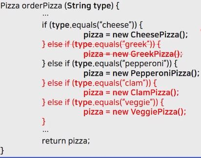

_학교 수업 소프트웨어 설계 패턴을 듣고 정리한 내용입니다._

## 문제 상황
- 피자 가게
    
    - 신제품이 출시되거나, 구제품이 더 이상 판매하지 않는 경우인 새로운 요구사항이 발생할 경우 계속 변경을 해야 한다.
    
    - 디자인 패턴 중 위 예제에서 지켜지지 않은 원칙들  
        - 변하는 부분과 변하지 않는 부분을 분리해라
        - 클래스는 확장에 대해서는 열려 있어야 하지만 코드 변경에 대해서는 닫혀 있어야 한다.
    
### 해결 방안1
- [전체코드](https://github.com/kwanulee/DesignPattern/tree/master/factory/pizzas)
- 달라지는 부분과 달라지지 않는 부분을 명확히 구분한다.
    
    - SimplePizzaFactory 의 경우, 여전히 변경되는 부분(createPizza) 가 존재한다.
    - 하지만 변경되는 부분인 SimplePizzaFactory 와 변하지 않는 부분인 PizzaStore 가 명확히 구분되어 변경할 부분은 특정 클래스로 한정할 수 있다.
        - 코드추가!!!!!!

    - 간단한 팩토리
      