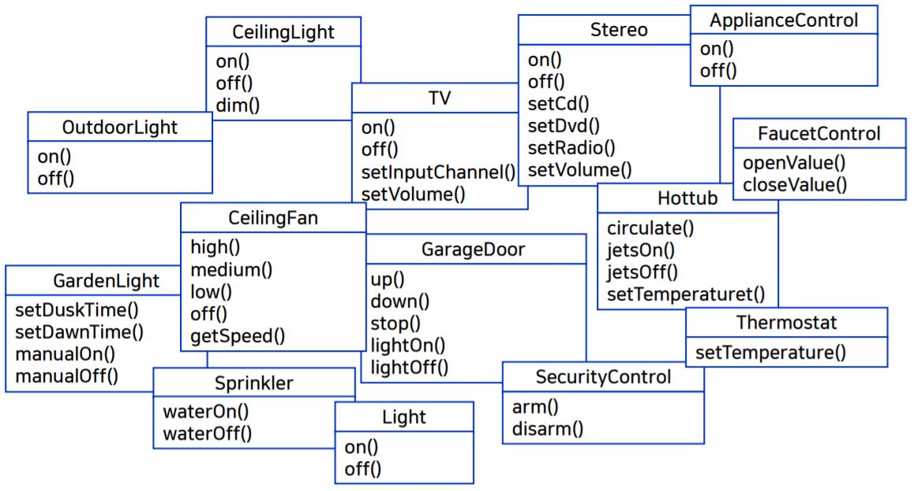
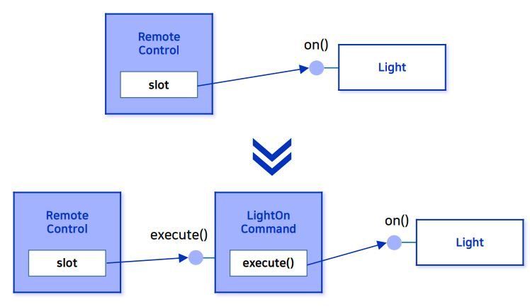
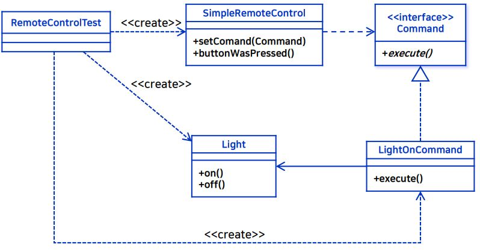

_학교 수업 소프트웨어 설계 패턴을 듣고 정리한 내용입니다._

## 학습 목표
- 메소드 호출의 캡슐화가 필요한 상황을 이해한다.
- 메소드 호출을 캡슐화하는 커맨드 패턴을 이해한다.
- 커맨드 패턴으로 취소 기능을 구현해 본다.
- 커맨드 패턴의 활용 예를 알아본다.

## 문제 상황
- 홈 오토메이션 리모컨
    - 각 슬롯마다 on/off 기능으로 제품 연결하여 제어가능한 리모컨 이다.
    - 가전제품 제작사로부터 공급된 클래스
        
- 디자인 고려사항
    - 제어해야 할 가전제품 클래스의 인터페이스가 제작사별로 상이할 수 있다.
        - 특정 slot에서 Light을 제어하는데 a 제작사는 on(), off() 메서드가 필요하고, b 제작사는 on(), off() 와 dim() 이라는 밝기제어 메서드를 가지고 있다.
   - 새로이 제어해야 할 가전제품 클래스가 추가될 수 있다. 

## 디자인 방향
- 인터페이스가 추가되거나 변경될 때, remote 클래스에 영향을 주지 않고 설계하는 방법이 필요하다.
- **호출의 캡슐화**가 필요하다.
    - 구체적인 클래스에 참조하지 않고 (구현에 의존) 호출하는 방법이다.
    - 메소드 호출의 캡슐화를 하는 것이 커맨드 패턴이다.
### 호출의 캡슐화
- Command 인터페이스
    - 각 가전제품의 **메소드 호출을 캡슐화**하는 공통 인터페이스
        ```java
        public interface Command {
            public void execute();
        }
        ```
- 전등을 켜기 위한 Command 인터페이스 구현
    
    ```java
    public class LightOnCommand implements Command {
        Light light;
        public LightOnCommand(Light light) {
            this.light = light;
        }
        public void execute() {
            light.on();
        }
    }
    ```
- Remote control 클래스인 SimpleRemoteControl
    ```java
    public class SimpleRemoteControl {
        Command slot;
    
        public SimpleRemoteControl() {}
    
        public void setCommand(Command command) {
            slot = command;
        }
    
        public void buttonWasPressed() {
            slot.execute();
        }
    }
    ```
    
- 처음 그림의 경우 Remote control 에서 직접 Light의 on()을 호출한다.
    - Remote control 코드의 변경이 일어나게 된다.
    - 위의 접근은 구현에 의존하는 방법이다.
- 아래의 그림의 경우 Remote control이 추상화된 Command 인터페이스를 구현한 클래스인 LightOn Command 의 execute()를 통해 Light의 on()을 호출한다.
    - 이것이 메소드 호출의 캡슐화이다. Remote control 코드에는 영향을 주지 않는다.


### 리모컨 사용을 위해 컨맨드 객체 사용하기
- [전체코드](https://github.com/kwanulee/DesignPattern/tree/master/command/simpleremote)
- 슬롯이 하나밖에 없는 리모콘이라 가정한다면

- 위와 같은 설계를 한다면 SimpleRemoteControl 클래스에는 코드의 변경이 발생하지 않는다.

- SimpleRemoteControl 클래스 
    - setCommand() 를 통해 슬롯에 커맨트 객체 설정 및 변경이 가능하다.
    - buttonWasPressed() 를 통해 슬롯에 연결된 커맨트 객체의 execute() 메소드가 호출된다.<br/><br/>
    ```java
    public class SimpleRemoteControl {
        Command slot;

        public SimpleRemoteControl() {}

        public void setCommand(Command command) {
            slot = command;
        }

        public void buttonWasPressed() {
            slot.execute();
        }
    }
    ```
- Command 인터페이스 
    ```java
    public interface Command {
        public void execute();
    }
    ```

- LightOnCommand 클래스 : Command 인터페이스를 구현
    - Command 인터페이스의 execute() 메소드를 구현한다.

    ```java
    public class LightOnCommand implements Command {
        Light light;
    
        public LightOnCommand(Light light) {
            this.light = light;
        }
    
        public void execute() {
            light.on();
        }
    }
    ```

- Light 클래스
    - on(), off() 기능구현이 되어 있다.
    ```java
    public class Light {

        public Light() {
        }

        public void on() {
            System.out.println("Light is on");
        }

        public void off() {
            System.out.println("Light is off");
        }
    }
    ```

- 실행
    - SimpleRemoteControl 클래스를 통해 LightOnCommand 로 Command 객체 설정한다.
        - `remote.setCommand(lightOn);`
    - SimpleRemoteControl 클래스를 통해 설정된 LightOnCommand 객체의 execute() 메소드를 호출하여 실행한다.
        - `remote.buttonWasPressed();`

        ```java
        public class RemoteControlTest {
            public static void main(String[] args) {
                SimpleRemoteControl remote = new SimpleRemoteControl();
                Light light = new Light();
                LightOnCommand lightOn = new LightOnCommand(light);

                remote.setCommand(lightOn);
                remote.buttonWasPressed();
            }
        }
        ```

## 커맨드 객체
- 메소드 호출을 커맨드 객체로 캡슐화할 수 있다.
- 매개변수를 써서 Invoker에 여러 가지 다른 커맨드 객체를 연결할 수도 있다.
    

## 여러개의 슬롯을 리모컨에 등록 예제
- [전체코드](https://github.com/kwanulee/DesignPattern/tree/master/command/remote)
- 행동 흐름
    - 각 슬롯마다 커맨드 객체가 할당된다.
    - 사용자가 버튼을 누르면 해당 커맨드 객체의 execute() 메소드가 호출된다.
    - execute() 메소드에서는 리시버로 하여금 특정 작업을 처리하도록 지시한다.

- 코드 살펴보기
    - invoker 역할의 **리모컨 코드**
        - onCommands 와 offCommands에 각각 setCommand() 메소드를 통해 Command 객체를 할당한다.
        - onButtonWasPushed(), offButtonWasPushed()에 slot 파라미터를 주어 파라미터 숫자에 할당된 Command 객체의 execute() 메소드가 실행된다.

        ```java
        public class RemoteControl {
            Command[] onCommands;
            Command[] offCommands;
        
            public RemoteControl() {
                onCommands = new Command[7];
                offCommands = new Command[7];
        
                Command noCommand = new NoCommand();
                for (int i = 0; i < 7; i++) {
                    onCommands[i] = noCommand;
                    offCommands[i] = noCommand;
                }
            }
        
            public void setCommand(int slot, Command onCommand, Command offCommand) {
                onCommands[slot] = onCommand;
                offCommands[slot] = offCommand;
            }
        
            public void onButtonWasPushed(int slot) {
                onCommands[slot].execute();
            }
        
            public void offButtonWasPushed(int slot) {
                offCommands[slot].execute();
            }
        
            public String toString() {
                StringBuffer stringBuff = new StringBuffer();
                stringBuff.append("\n------ Remote Control -------\n");
                for (int i = 0; i < onCommands.length; i++) {
                    stringBuff.append("[slot " + i + "] " + onCommands[i].getClass().getName()
                        + "    " + offCommands[i].getClass().getName() + "\n");
                }
                return stringBuff.toString();
            }
        }
        ```

    - Receiver 역할의 클래스 중 **Stereo 클래스**
        - Stereo 의 역할을 정의한다.
        ```java
        public class Stereo {
            String location;

            public Stereo(String location) {
                this.location = location;
            }

            public void on() {
                System.out.println(location + " stereo is on");
            }

            public void off() {
                System.out.println(location + " stereo is off");
            }

            public void setCD() {
                System.out.println(location + " stereo is set for CD input");
            }

            public void setDVD() {
                System.out.println(location + " stereo is set for DVD input");
            }

            public void setRadio() {
                System.out.println(location + " stereo is set for Radio");
            }

            public void setVolume(int volume) {
                System.out.println(location + " Stereo volume set to " + volume);
            }
        }
        ```

    - Command 객체를 구현한 **StereoOnWithCDCommand 클래스**
        - execute() 메소드에 cd로 stereo on 동작을 정의한다.
        ```java
        public class StereoOnWithCDCommand implements Command {
            Stereo stereo;
        
            public StereoOnWithCDCommand(Stereo stereo) {
                this.stereo = stereo;
            }
        
            public void execute() {
                stereo.on();
                stereo.setCD();
                stereo.setVolume(11);
            }
        }
        ```

    - Command 객체를 구현한 **StereoOffCommand 클래스**
        - execute() 메소드에 stereo off 동작을 정의한다.
        ```java
        public class StereoOffCommand implements Command {
            Stereo stereo;
        
            public StereoOffCommand(Stereo stereo) {
                this.stereo = stereo;
            }
        
            public void execute() {
                stereo.off();
            }
        }
        ```
    
    - 실행하기
        ```java
        public class RemoteLoader {
        
            public static void main(String[] args) {
                RemoteControl remoteControl = new RemoteControl();
                Stereo stereo = new Stereo("Living Room");

                StereoOnWithCDCommand stereoOnWithCD =
                        new StereoOnWithCDCommand(stereo);
                StereoOffCommand  stereoOff =
                        new StereoOffCommand(stereo);
        
                remoteControl.setCommand(0, stereoOnWithCD, stereoOff);
        
                System.out.println(remoteControl);
        
                remoteControl.onButtonWasPushed(0);
                remoteControl.offButtonWasPushed(0);
            }
        }
        ```
        
        - 결과
            - 0번 슬롯에만 stereoOnWithCD 와 stereoOff 인 Command 객체를 할당한다.
            - 1~6번 슬롯에는 초기화 해준 NoCommand로 존재하게 된다. 
            ```powershell
            ------ Remote Control -------
            [slot 0] hansung.designpatterns.command.remote.StereoOnWithCDCommand    hansung.designpatterns.command.remote.StereoOffCommand
            [slot 1] hansung.designpatterns.command.remote.NoCommand    hansung.designpatterns.command.remote.NoCommand
            [slot 2] hansung.designpatterns.command.remote.NoCommand    hansung.designpatterns.command.remote.NoCommand
            [slot 3] hansung.designpatterns.command.remote.NoCommand    hansung.designpatterns.command.remote.NoCommand
            [slot 4] hansung.designpatterns.command.remote.NoCommand    hansung.designpatterns.command.remote.NoCommand
            [slot 5] hansung.designpatterns.command.remote.NoCommand    hansung.designpatterns.command.remote.NoCommand
            [slot 6] hansung.designpatterns.command.remote.NoCommand    hansung.designpatterns.command.remote.NoCommand

            Living Room stereo is on
            Living Room stereo is set for CD input
            Living Room Stereo volume set to 11
            Living Room stereo is off
            ```
## Undo 기능
- [전체코드](https://github.com/kwanulee/DesignPattern/tree/master/command/undo)
- 작업 취소 기능 지원
    - Command 인터페이스에 undo() 메소드를 추가한다.
        ```java
        public interface Command {
            public void execute();
            public void undo();
        }
        ```
    - 따라서, Command 인터페이스를 구현한 클래스도 모두 undo() 메소드를 구현한다.
        ```java
        public class LightOnCommand implements Command {
            Light light;
            int level;

            ...
            public void undo() {
                light.dim(level);
            }
        }
        ```
    - Light 클래스 변화
        - LightOnCommand.execute()에 의해 light.on() 이 호출되면 level 값이 100으로 갱신된다.
            ```java
            //Light.class
            public void on() {
                level = 100;
                System.out.println("Light is on");
            }
            ```
        - LightOffCommand.execute()에 의해 light.off() 가 호출되면 level 값이 0으로 갱신된다.
            ```java
            //Light.class    
            public void off() {
                level = 0;
                System.out.println("Light is off");
            }
            ``` 
        - level의 값에 따라 off()를 호출 또는 level 값을 출력한다.
            ```java
            //Light.class        
            public void dim(int level) {
                this.level = level;
                if (level == 0) {
                    off();
                }
                else {
                    System.out.println("Light is dimmed to " + level + "%");
                }
            }
            ```
        
    - 마지막으로 실행된 명령을 취소하기 위해 명령을 저장한다.
        - `undoCommand = onCommands[slot];`
        ```java
        public class RemoteControlWithUndo {
            ...
            Command undoCommand;

            ...
            public void onButtonWasPushed(int slot) {
                onCommands[slot].execute();
                undoCommand = onCommands[slot];
            }
        
            public void offButtonWasPushed(int slot) {
                offCommands[slot].execute();
                undoCommand = offCommands[slot];
            }
        
            public void undoButtonWasPushed() {
                undoCommand.undo();
            }
            ...
        }
        ```
### 정리 및 흐름
```java
public class RemoteLoader {
 
	public static void main(String[] args) {
		RemoteControlWithUndo remoteControl = new RemoteControlWithUndo();
 
		Light livingRoomLight = new Light("Living Room");
 
		LightOnCommand livingRoomLightOn = 
				new LightOnCommand(livingRoomLight);
		LightOffCommand livingRoomLightOff = 
				new LightOffCommand(livingRoomLight);
 
		remoteControl.setCommand(0, livingRoomLightOn, livingRoomLightOff);
 
		remoteControl.onButtonWasPushed(0);
		remoteControl.offButtonWasPushed(0);
		remoteControl.undoButtonWasPushed();
    }
}
```
- 실행 결과
    ```
    Light is on
    Light is off
    Light is dimmed to 100%
    ```

- 실행 흐름
    


## MacroCommand 구현
- 버튼 한개만 누르면 전등이 어두워지면서 오디오, TV가 켜지고, DVD 모드로 변경되고, 욕조에 물이 채워지는 것까지 한꺼번에 처리할 수 있는 기능을 구현한다.
- MacroCommand
    - Command 클래스를 구현한 MacroCommand 클래스를 생성한다.
    - 여러 가지 커맨드를 한꺼번에 실행시킬 수 있는 클래스이다.
        ```Java
        public class MacroCommand implements Command {
            Command[] commands;
        
            public MacroCommand(Command[] commands) {
                this.commands = commands;
            }
        
            public void execute() {
                for (int i = 0; i < commands.length; i++) {
                    commands[i].execute();
                }
            }
            public void undo() {

            }
        }
        ```
- MacroCommand에 집어넣을 일련의 커맨드를 생성한다.
    ```Java
        Light light = new Light("Living Room");
		TV tv = new TV("Living Room");
		Stereo stereo = new Stereo("Living Room");
		Hottub hottub = new Hottub();

		//OnCommand
		LightOnCommand lightOn = new LightOnCommand(light);
		StereoOnCommand stereoOn = new StereoOnCommand(stereo);
		TVOnCommand tvOn = new TVOnCommand(tv);
		HottubOnCommand hottubOn = new HottubOnCommand(hottub);
		
		//OffCommand
		LightOffCommand lightOff = new LightOffCommand(light);
		StereoOffCommand stereoOff = new StereoOffCommand(stereo);
		TVOffCommand tvOff = new TVOffCommand(tv);
		HottubOffCommand hottubOff = new HottubOffCommand(hottub);
    ```

- ON 커맨드와 OFF 커맨드를 위한 배열을 준비하고, MacroCommand 객체를 생성한다.
        
    ```java
    Command[] partyOn = { lightOn, stereoOn, tvOn, hottubOn };
    Command[] partyOff = { lightOff, stereoOff, tvOff, hottubOff };

    MacroCommand partyOnMacro = new MacroCommand(partyOn);
    MacroCommand partyOffMacro = new MacroCommand(partyOff);
    ```

- MacroCommand 객체를 버튼에 할당한다.
    ```java
    remoteControl.setCommand(0, partyOnMacro, partyOffMacro);
    ```
- 테스트
    ```java
    remoteControl.onButtonWasPushed(0);
    remoteControl.offButtonWasPushed(0);
    ```

    - 결과
        ```powershell
        --- Pushing Macro On---
        Light is on
        Living Room stereo is on
        Living Room TV is on
        Living Room TV channel is set for DVD
        Hottub is on
        Hottub is heating to a steaming 104 degrees
        Hottub is bubbling!

        --- Pushing Macro Off---
        Light is off
        Living Room stereo is off
        Living Room TV is off
        Hottub is cooling to 98 degrees
        Hottub is off

        ```
    

## 커맨드 패턴의 활용
- 요청을 큐에 저장하기
    - 작업 큐에 객체가 들어가면 스레드에 하나씩 할당해 줘야 한다.
    - 작업 큐에 들어가는 객체를 커맨드 객체로 만들어주면 할당될 때, execute() 메소드로 어떠한 객체라도 스레도 할당이 가능해 진다.
    - 즉, 스레드에서는 큐로부터 커맨드를 하나씩 제거하면서 커맨드의 execute() 메소드를 호출하면 된다.

- 요청을 로그에 기록하기
    - 각 커맨드가 실행될 때마다 디스크에 그 내역을 저장한다.
    - 시스템이 다운된 후에, 객체를 다시 로딩하고 기록된 순서대로 작업을 다시 처리하면 복구가 가능하다.

## 핵심정리
- Command 패턴을 이용하면 **요청을 하는 객체**와 그 **요청을 수행하는 객체**를 **분리**할 수 있다.
- Command 객체는 Action을 수행하는 Receiver 를 캡슐화한다.
- Command 객체의 execute()는 Receiver의 Action을 호출한다.
- Macro Command는 여러 개의 Command를 한꺼번에 호출할 수 있게 해주는 간단한 방법이다.
- Command 패턴을 이용하면 작업 취소(Undo) 기능을 지원할 수 있고, 로그나 트랜잭션 시스템 구현에도 활용된다.