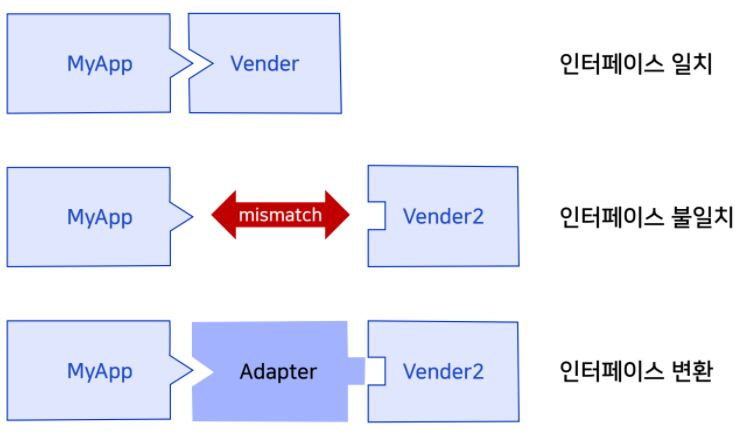
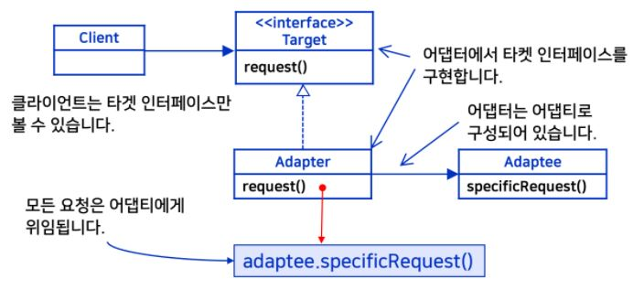
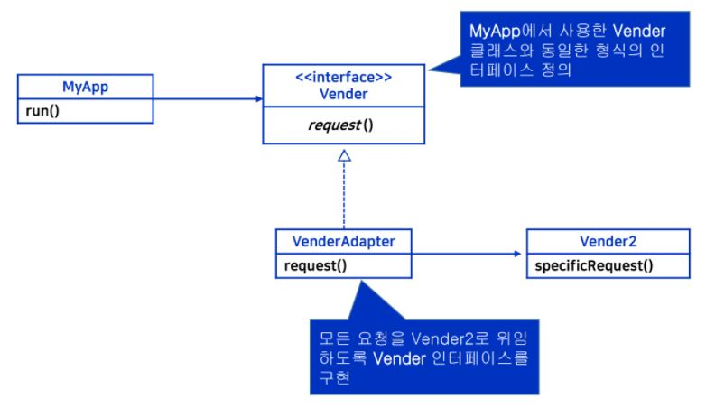
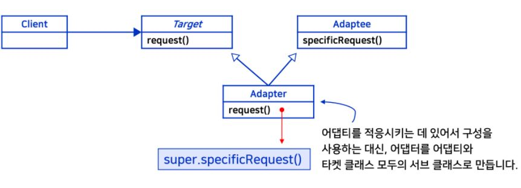
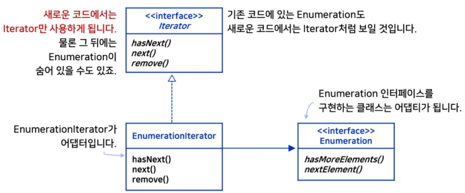

_학교 수업 소프트웨어 설계 패턴을 듣고 정리한 내용입니다._

## 학습 목표
- 인터페이스 변환이 필요한 상황을 이해한다.
- 객체 어댑터 패턴과 클래스 어댑터 패턴의 차이를 이해한다.
- 퍼사드 패턴이 필요한 상황을 이해한다.
- 퍼사드 패턴과 최소 지식 원칙의 관계를 이해한다.

## 인터페이스 변환 어댑터


## 문제상황
- MyApp 객체와 Vender 객체로 run
    - MyApp 클래스에 Vender 객체가 내부요소로 있는 형태
    - MyApp
        ```java
        public class MyApp {
            Vender vender;

            public MyApp(Vender vender) {
                this.vender = vender;
            }
            public void run() {
                vender.request();
            }
        }
        ```
    - Vender
        ```java
        public class Vender {
            public void request() {
                System.out.println("A request is served by Vender");
            }
        }
        ```
    - test 코드
        ```java
        public class Test {
            public static void main(String[] args) {
                Vender vender = new Vender();
                MyApp app = new MyApp(vender);
                app.run();
            }
        }
        ```
- 위와 같은 상황에서 Vender 대신 새로운 클래스인 Vender2를 사용할 수 있는 방법은 ?

## 어댑터 패턴
- 어댑터 패턴에서는 **한 클래스의 인터페이스를 클라이언트에서 사용하고자 하는 다른 인터페이스로 변환** 한다.
- 어댑터를 이용하면 **인터페이스 호환성 때문에 같이 쓸 수 없는 클래스들을 연결해서 사용 가능**하다.


## 문제 상황에 어댑터 패턴 적용

- Vender class -> Vender interface
    ```java
    public interface Vender {
        void request();
    }
    ```
- VenderAdapter 클래스는 Vender 인터페이스를 구현
    ```java
    public class VenderAdapter implements Vender {
        Vender2 vender;

        public VenderAdapter(Vender2 vender) {
            this.vender = vender;
        }

        public void request() {
            vender.specificRequest();
        }
    }
    ```
- Test 코드
    ```java
    public class Test {
        public static void main(String[] args) {
            Vender vender = new VenderAdapter(new Vender2());
            MyApp app = new MyApp(vender);
            app.run();
        }
    }
    ``` 

## Adapter 객체 생성 개선
- [전체코드](https://github.com/kwanulee/DesignPattern/tree/master/adapter/ObjectAdapterExample)
- 어댑터 패턴을 적용 전 코드, 후 코드의 Test 코드에서 Vender 인스턴스 생성 부분의 코드가 변경된다.
    - `Vender vender = new Vender();` -> `Vender vender = new VenderAdapter(new Vender2());`
    - 구체적인 Vender, VenderAdapter 를 사용하고 있다.
    - 구현에 맞춰서 프로그래밍 하지 말고 인터페이스에 맞춰서 프로그래밍 하라 의 디자인 패턴을 위배하고 있다.
- 인터페이스에 맞춰서 프로그래밍 하는 방법 -> 싱글턴 & 팩토리 패턴 적용
    - VenderFactory 클래스
        - getInstance() 메소드로 하나의 인스턴스만 생기도록 구현
        - createVender() 메소드로 원하는 vender객체 생성하도록 구현
        - 이렇게 구현하면 test 코드의 변경은 일어나지 않고 코드의 변경은 createVender() 로 한정시킬 수 있다.
        ```java
        public class VenderFactory {
            private static VenderFactory instance;
            
            private VenderFactory() {}
            
            public static VenderFactory getInstance() {
                if (instance == null) 
                    instance = new VenderFactory();
                return instance;
            }
            
            //이 부분의 코드는 생성을 원하는 vender객체에 따라 변경이 된다.
            public Vender createVender() {
                return new VenderAdapter(new Vender2());
            }
        }
        ```
    - Test 코드
        ```java
        public static void main(String[] args) {
            Vender vender = VenderFactory.getInstance().createVender();
            MyApp app = new MyApp(vender);
            app.run();
        }
        ```

## 클래스 어댑터
- [전체코드](https://github.com/kwanulee/DesignPattern/tree/master/adapter/ClassAdapterExample)

- VenderClassAdapter 클래스가 Vender2 상속, Vender 인터페이스 구현
    - specificRequest()는 Vender2 클래스의 메소드, request() 는 Vender 인터페이스의 메소드이다. 
    - Vender의 request() 메소드에서 Vender2의 specificRequest() 메소드를 내부 요소로 정의하고 있다.
    ```java
    public class VenderClassAdapter extends Vender2 implements Vender {
        public void request() {
            super.specificRequest();
        }
    }
    ```
- test 코드
    ```java
    public class Test {
        public static void main(String[] args) {
            Vender vender = VenderFactory.getInstance().crerateVender(); //VenderClassAdapter()
            MyApp app  = new MyApp(vender);
            app.run();
        }
    }   
    ```


## 객체 어댑터 vs 클래스 어댑터
- 객체 어댑터
    - 객체 구성 사용
    - 객체 어댑터는 어댑티 클래스 뿐만 아니라 그 서브 클래스에 대해서도 어댑터 역할을 수행한다.
        -  만약 위의 예에서 Vender2를 상속받는 Vender22 클래스가 있다면 어댑터 클래스는 Vender22의 어댑터 역할을 수행할 수 있다.
    -  서브 클래스의 레퍼런스만 가지고 있으면 어댑티의 행위가 오버라이드 되더라도 이를 쉽게 이용할 수 있음

- 클래스 어댑터
    - 상속 사용
    - 클래스 어댑터는 특정 어댑티 클래스에만 어댑터 역할을 수행하므로, 어댑티의 서브클래스에 대해서는 어댑터 역할을 수행할 수 없음
    - 클래스 어댑터는 필요한 경우에 어댑티의 행위의 일부를 직접 오버라이드 할 수 있음
    - 어댑티로의 추가적인 객체 레퍼런스 없이 어댑티로 접근 가능

- 어댑터 실전 예제
    - Enumeration   
        - 초기 컬렉션 (Vector, Stack, Hashtable 등)에서 사용
        - 컬렉션의 모든 항목에 접근하기 위한 인터페이스
        - hasMoreElement(), nextElement()
    - Iterator
        - 새로운 버전의 컬렉션 클래스에서 항목을 접근할 때 사용하는 인터페이스
        - hasNext(), next(), remove()
    - 지금은 새로 만드는 코드에서는 Iterator만 사용할 계획
    - 하지만 Enumeration 인터페이스를 사용하는 기존 코드를 사용해야 하는 경우는 그대로 사용하고 싶다. <br/>
    => 하나의 프로그램에서 다 같이 사용하기 위해서 어댑터가 필요하다.

- 어댑터 디자인

- 현재 어플리케이션에서는 iterator 인터페이스를 통해서 컬렉션을 탐색하려고 한다.
- 기존의 software 코드는 모두 Enumeration 코드로 구현되어 있다.
- 기존의 Enumeration 코드를 사용하려면 iterator 인터페이스 형식으로 변환해주는 어댑터가 필요하다. -> EnumerationIterator
- EnumerationIterator 
    - hasNexet() 는 Enumeration의 hasMoreElements() 호출
    - next() 는 nextElement() 를 호출
    - remove() 는 특별히 호출 되어질 Enumeration 인터페이스가 없다.
        - UnsupportedOperationException(); 를 발생시킨다.
        
- 코드
    ```java
    public class EnumerationIterator implements Iterator<Object> {
        Enumeration<?> enumeration;
        
        public EnumerationIterator(Enumeration<?> enumeration) {
            this.enumeration = enumeration;
        }
        
        public boolean hasNext() {
            return enumeration.hasMoreElements();
        }
        
        public Object next() {
            return enumeration.nextElement();
        }
        
        public void remove() {
            throw new UnsupportedOperationException();
        }
    }
    ```

## 퍼사드 패턴
- 복잡한 상황을 감싸서 간단하게 보이도록 하는 패턴
- 퍼사드 패턴을 쓰면 훨씬 쓰기 쉬운 인터페이스를 제공하는 퍼사드 클래스를 구현함으로써, 복잡한 시스템을 훨씬 쉽게 사용할 수 있다.


## 참고
- [교수님 github](https://github.com/kwanulee/DesignPattern)
- [교재 Head First Design Patterns](https://www.aladin.co.kr/shop/wproduct.aspx?ItemId=582754)
- 강의자료