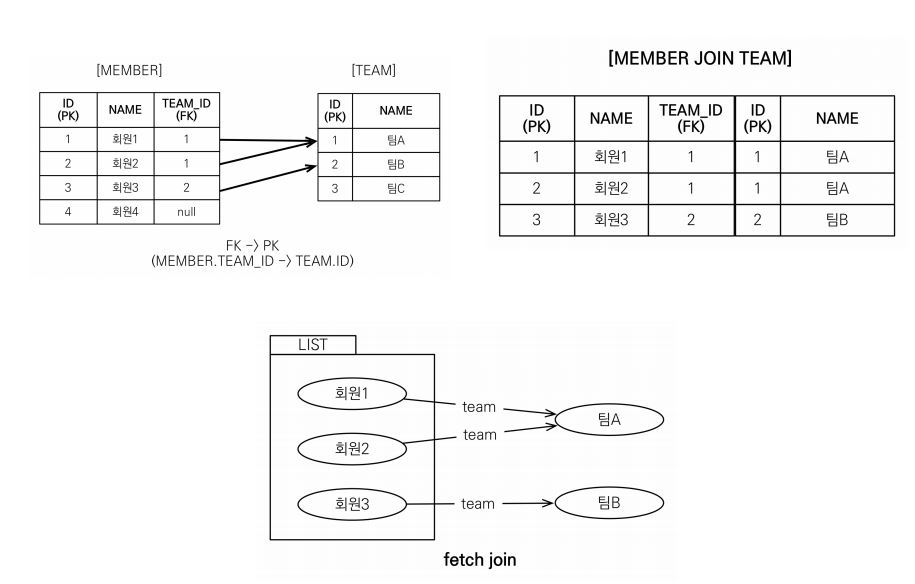

_[자바 ORM 표준 JPA 프로그래밍 - 기본편](https://www.inflearn.com/course/ORM-JPA-Basic)을 보고 학습한 내용을 정리한 것입니다._

## 경로 표현식
- .(점)을 찍어서 객체 그래프를 탐색하는 것이다.
```java
select m.username -> 상태 필드
    from Member m
    join m.team t -> 단일 값 연관 필드
    join m.orders o -> 컬렉션 값 연관 필드
where t.name = '팀A'
```
- 경로 표현식 용어 정리
    - 상태 필드 : 단순히 값을 저장하기 위한 필드
    - 연관 필드 : 연관관계를 위한 필드
        - 단일 값 연관 필드 
            - @ManyToOne. @OneToOne, 대상이 엔티티
        - 컬렉션 값 연관 필드
            - @OneToMany, @ManyToMany, 대상이 컬렉션

- 명시적 조인, 묵시적 조인
    - 명시적 조인 : join 키워드 직접 사용
    `select m from Member m join m.team t`
    - 묵시적 조인 : 경로 표현식에 의해 묵시적으로 SQL 조인 발생(inner join)
    `select m.team from Member m`

- 경로 표현식 특징
    - 상태 필드 : 경로 탐색의 끝, 더 이상 탐색x
    - 단일 값 연관 필드 : **묵시적 내부 조인**이 발생, 탐색이 가능
        - `m.team` 으로 인한 묵시적 내부 조인
        ```java
        Member member1 = new Member();
        member1.setUsername("관리자1");
        em.persist(member1);

        Member member2 = new Member();
        member2.setUsername("관리자2");
        em.persist(member2);

        em.flush();
        em.clear();

        String query = "select m.team FROM Member m";
        List<Team> result = em.createQuery(query, Team.class)
                .getResultList();
        for(Team s : result) {
            System.out.println("s = " + s);
        }

        tx.commit();
        ```
        ```sql
        Hibernate: 
            /* select
                m.team 
            FROM
                Member m */ select
                    team1_.TEAM_ID as team_id1_3_,
                    team1_.name as name2_3_ 
                from
                    Member member0_ 
                inner join
                    Team team1_ 
                        on member0_.TEAM_ID=team1_.TEAM_ID
        ```
    - 컬렉션 값 연관 경로 : 묵시적 내부 조인 발생, **탐색 불가능**
        - `String query = "select t.members From Team t ";`
        - t.members.name 이런게 불가능하다.
        - FROM 절에서 **명시적 조인을 통해 별칭**을 얻으면 별칭을 통해 탐색 가능하다.
        - `String query = "select m.name From Team t join t.members m";`
    - 무조건 **명시적 조인**을 사용해야 한다!

- 상태 필드 경로 탐색
    - JPQL : `select m.username, m.age from Member m`
    - SQL : `select m.username, m.age from Member m`
- 단일 값 연관 경로 탐색 - 매우 위험
    - JPQL : `select o.member from Order o`
    - SQL : `select m.* from Orders o inner join Member m on o.member_id = m.id`
- 경로 표현식 예제
    - select o.member.team from Order o
        - 단일 값 연관 경로 탐색으로 가능하다. join이 2번 일어나서 사용하면 안된다.
    - select t.members from Team 
        - 컬렉션 값 연관 경로 탐색으로 한 번 탐색은 가능하다.
    - select t.members.username from Team t 
        - 컬렉션 값 연관 경로 탐색으로 두 번의 탐색이 일어난 경우로 불가능하다.
    - select m.username from Team join t.members m
        - 컬렉션을 명시적 조인으로 멸칭을 통해 탐색이 일어나서 가능하다.

## 패치 조인 - 매우매우중요!
- SQL 조인 종류가 아니다.
- JPQL 에서 **성능 최적화**를 위해 제공하는 기능이다.
- 연관된 엔티티나 컬렉션을 SQL 한 번에 함께 조회하는 기능이다.
- `join fetch` 명령어
<br/><br/>
- 예시
    - 회원을 조회하면서 연관된 팀도 함께 조회 -> SQL 한번에!
    - JPQL : select m from Member m join fetch m.team
    - SQL : SELECT M.*, T.* FROM MEMBER M INNER JOIN TEAM T ON M.TEAM_ID = T.ID
    - 즉시로딩을 할 때와 동일한 SQL
- 직접 명시적으로 원하는 객체를 정해서 쿼리로 한번에 조회가 가능하다.

</img><br/>
- MEMBER의 TEAM_ID(fk) 와 TEAM의 ID(pk) 를 inner join
- Collection으로 조회 시 1차 캐시에 `회원1,회원2,회원3,팀A,팀B` 5개의 엔티티를 보관하고 반환해 준다.

- 패치 조인 사용 필요성
    - 위의 예시로 실행
    ```java
    try {
        Team teamA = new Team();
        teamA.setName("팀A");
        em.persist(teamA);

        Team teamB = new Team();
        teamB.setName("팀B");
        em.persist(teamB);

        Member member1 = new Member();
        member1.setUsername("회원1");
        member1.setTeam(teamA);
        em.persist(member1);

        Member member2 = new Member();
        member2.setUsername("회원2");
        member2.setTeam(teamA);
        em.persist(member2);

        Member member3 = new Member();
        member3.setUsername("회원3");
        member3.setTeam(teamB);
        em.persist(member3);

        em.flush();
        em.clear();

        //Team 객체의 List<Member>
        String query = "select m From Member m";

        List<Member> result = em.createQuery(query, Member.class)
                    .getResultList();

        for(Member member : result) {
            System.out.println("member = " + member.getUsername() + ", " + member.getTeam().getName());
        }

        tx.commit();

    }
    ```
    - Member의 Team이 지연로딩으로 설정되어 있어서 member.getTeam().getName() 할때 team 객체를 select 해온다.
    - 먼저 Member 객체 select 쿼리가 실행된다.
    - 회원1은 SQL로 쿼리를 실행하여 team의 이름을 얻어오고 1차 캐시에 존재한다.
    - 회원2는 1차 캐시에 있는 team의 이름을 얻어온다. 쿼리 실행 x
    - 회원3은 SQL로 쿼리를 실행하여 team의 이름을 얻어오고 1차 캐시에 존재한다.
    - 최악의 경우 회원 객체 쿼리 + 회원의 팀 이름이 모두 달라 회원의 팀 수 만큼 쿼리가 실행된다. -> N + 1 문제 발생

    - 해결책은 **패치조인**
        -  `String query = "select m From Member m join fetch m.team";` 로 변경
        - `List<Member> result = em.createQuery(query, Member.class)
                    .getResultList();`
            - Member 의 Team에 프록시가 아닌 실제 데이터가 담기게 된다.
        - 위의 코드를 패치 조인으로 변경 후 실행
        ```java
        Hibernate: 
            /* select
                m 
            From
                Member m 
            join
                fetch m.team */ select
                    member0_.id as id1_0_0_,
                    team1_.TEAM_ID as team_id1_3_1_,
                    member0_.age as age2_0_0_,
                    member0_.TEAM_ID as team_id5_0_0_,
                    member0_.type as type3_0_0_,
                    member0_.username as username4_0_0_,
                    team1_.name as name2_3_1_ 
                from
                    Member member0_ 
                inner join
                    Team team1_ 
                        on member0_.TEAM_ID=team1_.TEAM_ID
        member = 회원1, 팀A
        member = 회원2, 팀A
        member = 회원3, 팀B
        ```


    
