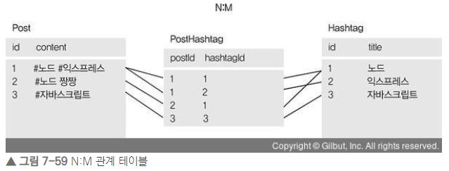

## Sequelize 
- 시퀄라이즈는 ORM으로 자바스크립트 객체와 데이터베이스의 릴레이션을 매핑해주는 도구이다.
- 자바스크립트 구문을 알아서 SQL로 바꿔준다.
- 이 글에서는 시퀄라이즈를 통해 Mysql 작업을 해본다.

### 패키지 설치
- `npm i express sequelize sequelize-cli mysql2`<br/>
`npm i -D nodemon`
- sequelize-cli : 시퀄라이즈 명령어를 실행하기 위한 패키지
- mysql2 : Mysql과 시퀄라이즈를 이어주는 드라이버
- 패키지 설치를 완료하면 config, models, migrations, seeders 폴더가 생성 된다.

- models 폴더 안에 index,js가 생성되는데, 이 파일은 models 폴더 내에 있는 파일들을 읽고, 그것들을 모델로 정의한다.


## 1.Mysql 연결하기
- app.js(main) 에 익스프레스와 시퀄라이즈 연결 코드를 작성한다.
    - db.sequelize 를 불러와서 sync 메서드를 사용해 서버 실행 시 MySQL과 연동되도록 한다.
    - 내부의 `force: false` 옵션은 true로 설정하면 서버 실행 시마다 테이블을 재생성한다.
    ```js
    ...
    const { sequelize } = require('./models');   // models/index.js
    ...
    sequelize.sync({ force: false })
    .then(() => {
        console.log('데이터베이스 연결 성공');
    })
    .catch((err) => {
        console.error(err);
    });
    ```

    - MySQL과 연동할 때는 config 폴더 안의 config.json 정보가 사용된다. 
        - development, test, production 는 각각 개발, 테스트, 배포 용도로 접속하기 위해 사용되며 목적에 맞게 사용하면 된다.
        ```js
        // config/config.json
        {
            "development": {
                "username": "root",
                "password": "1111",
                "database": "nodedatabase",
                "host": "127.0.0.1",
                "dialect": "mysql",
                "operatorAliases": false
            },
            "test": {
                "username": "root",
                "password": null,
                "database": "database_test",
                "host": "127.0.0.1",
                "dialect": "mysql"
            },
            "production": {
                "username": "root",
                "password": null,
                "database": "database_production",
                "host": "127.0.0.1",
                "dialect": "mysql"
            }
        }
        ```

## 2.모델 정의하기
- 모델은 크게 static init과 static associate 메서드로 나뉜다.
- **init** 메서드에서는 **테이블에 대한 설정**을 하고, **associate** 메서드에서는 **다른 모델과의 관계**를 적는다.

- MySQL 과 Sequelize 비교
    - init 메서드의 첫번째 인수로 각 필드에 설정해준다. 

    | MySQL         |   Sequelize   |
    | ------------- | :-----------: |
    | VARCHAR(100)  |   STRING(100) |
    |     INT       |   INTEGER     |
    |     TINYINT   |   BOOLEAN     |
    |    DATETIME   |      DATE     |
    |    NOT NULL   | allowNull: false |
    |    UNIQUE     |   unique: true  | 
    | DEFAULT now() | defaultValue: Sequelize.NOW  | 

- User 모델 정의하기
    ```js
    const Sequelize = require('sequelize');

    module.exports = class User extends Sequelize.Model {
        static init(sequelize) {
            return super.init({
                email: {
                    type: Sequelize.STRING(40),
                    allowNull: true,
                    unique: true,
                },
                nick: {
                    type: Sequelize.STRING(15),
                    allowNull: false,
                },
                password: {
                    type: Sequelize.STRING(100),
                    allowNull: true,
                },
                provider: {
                    type: Sequelize.STRING(10),
                    allowNull: false,
                    defaultValue: 'local',
                },
                snsId: {
                    type: Sequelize.STRING(30),
                    allowNull: true,
                },
            }, {
                sequelize,
                timestamps: true,
                underscored: false,
                modelName: 'User',
                tableName: 'users',
                paranoid: true,
                charset: 'utf8',
                collate: 'utf8_general_ci',
            });
        }

        //관계 정의
        static associate(db) {
         ...
        }
    };
    ```


## 3. 관계 정의하기
- 관계로는 **일대다, 일대일, 다대다** 관계가 있다.
    - 다대다 관계로는 게시글 테이블과 해시태그 테이블 관계.
    - 한 게시글에 해시태그가 여러 개 달릴 수 있고, 한 해시태그도 여러 게시글에 달릴 수 있다.

### 1:N(일대다)
- users(사용자) 테이블과 comments(댓글) 테이블 간의 관계 정의해 보기
- 사용자 한명은 댓글을 여러개 작성할 수 있다. 하지만 댓글 하나에 사용자가 여러 명일 수는 없다. -> 이러한 관계를 일대다 관계라고 한다. 사용자가 1, 댓글이 N
- users(1) 테이블의 로우 하나를 불러올 때 연결된 comments(N) 테이블의 로우들도 같이 불러올 수 있다. -> **hasMany** 라는 메서드로 표현한다.
    - users(1) -> comments(N) : hasMany
- comments(N) 테이블의 로우를 불러올 때 연결된 users 테이블의 로우를 가져올 수 있다. -> **belongsTo** 메서드로 표현한다.    
    - comments(N) -> users(1) : belongsTo    

- 각 모델의 static associate 메서드에 정의해준다.
    - models/user.js
        - sourceKey 로 user의 id가 들어간다.
        - foreignKey는 정해주지 않으면 UserId로 생성된다.
        ```js
        static associate(db) {
            db.User.hasMany(db.Comment, { foreignKey: 'commenter', sourceKey: 'id' });
        }
        ```
    - models/comment.js
        - targetKey 로 user의 id가 들어간다.
        - foreignKey는 정해주지 않으면 UserId로 생성된다.
        ```js
        static associate(db) {
            db.Comment.belongsTo(db.User, { foreignKey: 'commenter', targetKey: 'id' });
        }
        ```

### 1:1(일대일)
- 1:1 관계에서는 hasMany 메서드 대신 **hasOne** 메서드를 사용한다.
- users(사용자 1) 테이블와 info(사용자 정보담고 있는 1) 테이블이 있을 때
    - `db.User.hasOne(db.Info, { foreignKey: 'UserId', sourceKey: 'id' });`
    - `db.Info.belongsTo(db.User, { foreignKey: 'UserId', targetKey: 'id' });`
- Info 모델에 UserId 컬럼이 추가되기 때문에 belongsTo와 hasOne이 반대면 안된다.

### N:M(다대다)
- N:M 관계를 표현하기 위해 **belongsToMany** 메서드가 있다.
- Post(게시글 정보 N) 모델과 Hashtag(해시테그 정보 M) 모델이 있을 때,
    - `db.Post.belongsToMany(db.Hashtag, { through: 'PostHashtag' });`
    - `db.Hashtag.belongsToMany(db.Post, { through: 'PostHashtag' });`
- 양쪽 모두 belongsToMany 메서드를 사용한다.
- N:M 관계를 사용하면 **새로운 모델**이 생성된다. 위의 경우 through 속성의 PostHashtag 모델이 생성된다.
- PostHashtag 모델에는 **게시글과 해시태그의 아이디가 저장**된다.

- [그림 출처](https://thebook.io/080229/ch07/06/03/03-01/)

## 4.쿼리 알아보기
- 쿼리는 프로미스를 반환하므로 then을 붙여 결괏값을 받을 수 있다.
- SQL문과 쿼리 비교하기 - CRUD
    - **Create**
        - `INSERT INTO nodejs.users (name, age, married, comment) VALUES ('zero', 24, 0, '자기소개1');

        ```js
        const { User } = require('../models');
        User.create({
            name: 'zero',
            age: 24,
            married: false,
            comment: '자기소개'
        });
        ```            
    - **Read**
        - 모든 데이터 조회
            - `SELECT * FROM nodejs.users;` (SQL)
            - `User.findAll({});`  (쿼리)
        - 데이터 하나만 조회
            - `SELECT * FROM nodejs.users LIMIT 1;` (SQL)
            - `User.findOne({});`  (쿼리)
        - 원하는 데이터만 조회 -> **attributes**
            - `SELECT name, married FROM nodejs.users;`<br/><br/>
            ```js
            User.findAll({
                attributes: ['name', 'married'],
            });
            ```
        - where 문으로 조건 주고 조회 -> **where**
            - `SELECT name, age FROM nodejs.users WHERE married = 1 AND age > 30;`<br/><br/>
            ```js
            const { Op } = require('sequelilze');
            const { User } = require('../models');
            User.findAll({
                attributes: ['name', 'age'],
                where: {
                    married: true,
                    age: { [Op.gt]: 30 },
                },
            });
            ```
            - 특수한 연산자들 Op.gt(초과), Op.gte(이상), Op.lt(미만), Op.lte(이하), Op.ne(같지 않음), Op.or(또는), Op.in(배열 요소 중 하나), Op.notIn(배열 요소와 모두 다름) 등이 있다.
                - [Op.or]: [ { married: false }, { age: {[Op.gt]: 30 } }]
        
        - Order로 정렬 후 조회
            - `order: [[ '기준1', '기준2']]` 로 정의해준다.
        - 이외에도 Limit, OFFSET 등이 있다.

    - **Update**
        - SQL 문과 쿼리문
            - `UPDATE nodejs.users SET comment = '바꿀 내용' WHERE id = 2; `(SQL)<br/><br/>
            - 
            ```js
            User.update({
                comment: '바꿀 내용',
            }, {
                where: { id: 2 },
            });
            ``` 
            - 첫 번째 인수는 수정할 내용이고, 두 번째 인수는 어떤 로우를 수정할지에 대한 조건이다.
    
    - **Delete**
        - SQL 문과 쿼리문
            - `DELETE FROM nodejs.users WHERE id = 2;`
            - 
            ```js
            User.destroy({
                where: { id: 2 },
            });
            ```

## 참고
- [Node.js 교과서](http://www.yes24.com/Product/Goods/62597864)
- [예제 코드](https://github.com/ZeroCho/nodejs-book/tree/master/ch7/7.6/learn-sequelize)