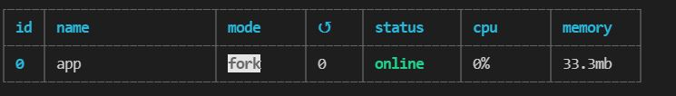

프로젝트를 진행하는 중에 원격 접속을 꺼도 서버가 계속 돌아가도록 하고 싶어서 알아보던 중 pm2 를 알게 되었다.
아래는 pm2의 내용에 대한 정리이다.

## pm2란?
- Node.js 의 프로세스를 관리해주는 Process Manager이다.
- pm2를 통해 애플리케이션을 실행하면 서버가 유지되고 서버가 죽었을 때 자동으로 재시작을 해준다.
- 클러스터 모드를 지원한다.
- 서버 인스턴스들에 대한 로드 밸런싱과 Node.js의 Scale Up 또는 Scale Down 에 도움을 준다.

## pm2 설치 및 실행하기
- 설치 : `npm install pm2 -g`
- 실행 : `pm2 start app.js` 

## 클러스터 모드
- Node.js 는 싱글 스레드로, 단일 CPU 코어에서 실행되기 때문에 CPU의 멀티코어 시스템을 사용할 수 없다.
- 클러스터 모듈는 단일 프로세스를 멀티 프로세스로 늘릴 수 있는 방법을 제공해 준다.
- 클러스터 모듈을 사용하여 마스터 프로세스에서 CPU 코어 수 만큼 워커 프로세스를 생성해서 모든 코어를 사용하게끔 개발하면 된다.
- 하지만, 멀티 스레딩은 아니므로 서버의 메모리 자원을 공유하는 것은 불가능하다고 한다.
- 클러스터 모드로 실행하기 위해서는 -i 옵션으로 실행하며 -i 뒤에는 실행할 인스턴스의 개수를 지정하면 된다.
    - `pm2 start app.js -i max`
        - max 는 pm2가 자동으로 CPU의 수를 탐지하여 가능한 많은 프로세스를 실행하라는 의미이다.

## 다른 기능들
- 프로세스 restart하기 : pm2 reload app_name
    - 프로세스를 kill 하고 restart 하는데 0-second-downtime 이 소요된다.
- 프로세스 목록 보기 : pm2 list
- 로그파일  확인하기 : pm2 logs
- 특정 프로세스 중단하기 : pm2 stop < process id>
- 특정 프로세스 삭제하기 : pm2 delete < process id>
- log, cpu 사용량 등 조회 : pm2 monit

## 참고
- [pm2 Document](https://pm2.keymetrics.io/docs/usage/pm2-doc-single-page/#yaml-format)
- [PM2를 활용한 Node.js 무중단 서비스하기](https://engineering.linecorp.com/ko/blog/pm2-nodejs/)
- [pm2 이용 및 로그 기록 살피기](https://darrengwon.tistory.com/712)