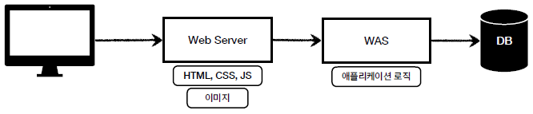

## 웹 서버와 웹 애플리케이션(WAS)
- **웹 서버(Web Server)**
    - Static pages : image, html, css, javascript 파일과 같은 컴퓨터에 저장되어 있는 정적인 파일을 말한다.
    - HTTP를 기반으로 동작하는 서버로써 Static pages와 기타 부가기능을 제공한다.
    - Nginx와 Apache가 대표적인 웹 서버이다.
- **웹 애플리케이션(WAS)**
    - Dynamic pages : 들어온 요청에 맞게 동적으로 만들어진 컨텐츠를 의미한다.
    - 웹 서버에서 제공하는 기능 대부분을 제공하며 동적인 HTML을 생성하거나 HTTP API도 WAS를 통해 제공된다.
    - 대표적으로 톰캣, Jetty, Undertow 같은 서비스가 있다.    
- 둘의 공통점 & 차이점
    - 공통점 
        - 모두 HTTP 요청을 받아 컨텐츠를 제공한다. 
    - 차이점
        - 웹 서버는 Static pages, WAS는 Dynamic pages 처리를 위한 애플리케이션 로직
        - WAS는 애플리케이션 코드를 실행하는데 더 특화되어 있다.
        - 자바에서 서블릿 컨테이너 기능을 제공하면 WAS이다.
- Web Server는 왜 사용?
    - WAS에서 Web Server의 기능 대부분을 제공하는데 왜 Web Server를 사용하는가의 의문이 생길 수 있다. 
    - *이유?*
        - **기능을 분리하여 서버의 부하를 방지한다.** 
            : WAS는 다양한 로직을 수행하느라 바쁘기 때문에 단순한 정적 컨텐츠는 Web Server에서 빠르게 클라이언트한테 제공하는 것이 좋다.
        - **물리적으로 분리하여 보안을 강화한다.** 
            : SSL 에 대한 암복호화 처리에 Web Server를 사용한다.
        - **여러 대의 WAS를 연결해 로드 밸런싱 용도로 사용할 수 있다.** 
            : 대용량의 웹 어플리케이션의 경우, Web Server와 WAS를 분리하여 오류가 발생한 WAS를 사용하지 않고, 다른 WAS를 사용하게 만듦으로써 무중단 운영이 가능하게 한다.
        - **여러 언어의 웹 어플리케이션 서비스가 가능하다.** 
            : 하나의 서버에서 PHP Application, Java Application 을 함께 사용하는 등과 같은 여러 웹 어플리케이션의 활용이 가능해 진다.
    
## 웹 시스템 구성
<**WEB, WAS, DB**> 

1. 정적 리소스는 웹 서버에서 처리한다.
2. 웹 서버는 동적인 처리가 필요하면 WAS에 요청을 위임한다.
3. 효율적인 리소스 관리가 가능해진다.
    - 정적 리소스 많다면 -> Web 서버 증설
    - 동적 리소스 많다면 -> WAS 증설

## 서블릿
- 서버에서 웹페이지 등을 동적으로 생성하거나 데이터 처리를 수행하기 위해 자바로 작성된 프로그램이다.
- HTML form 으로 데이터를 전송하면
    - 1) 서버에서 TCP/IP 연결을 대기하고 있다.
    - 2) 웹 브라우저에서 전송한 메시지 분석해서 파싱해준다.
    - 3) HTTP 메서드 분석해서 GET,POST,PATCH,PUT,DELETE 어떤 방식인지 파악한다.
    - 4) Content-Type 분석해 메시지 바디를 파싱해서 읽는다.
    - 5) 요청한 url 경로가 매핑된 프로세스를 실행한다.
    - 6) 데이터베이스에서 정보 요청한다.
    - 7) HTTP 응답 메시지 생성한다.
    - 8)) TCP/IP 응답 전달하고 소켓 종료한다. 
    => 매우 복잡하다.   
    :::tip
    서블릿을 지원하는 WAS에서 위의 과정을 모두 자동화해서 제공해준다.
    :::

- WAS 안에는 서블릿을 관리해주는 서블릿 컨테이너가 있고 해당 컨테이너가 선언한 서블릿 객체를 자동으로 생성해주고 호출도 해주고 WAS 종료시 서블릿 종료해주는 등 서블릿의 라이프사이클을 관리해 준다.
- 특징
    - 톰캣처럼 **서블릿을 지원하는 WAS를 서블릿 컨테이너**라고 한다.
    - 서블릿 컨테이너는 서블릿 생명주기를 관리한다.
    - 서블릿 객체는 싱클톤으로 관리한다.
    - 동시 요청을 위한 멀티쓰레드 처리가 지원된다.
        - WAS 내부에 일정 갯수의 쓰레드를 미리 생성해두고, 요청이 올 때마다 해당 쓰레드 풀에서 쓰레드를 꺼내서 사용하는 쓰레드 풀이 존재한다.

## 참고
- [웹 애플리케이션 이해](https://catsbi.oopy.io/defe6c4d-1d74-4a5e-8349-ff9077dda184)
- [웹서버(Web Server) 와 웹 어플리케이션 서버 (WAS)](https://binux.tistory.com/32#WAS%EA%B-%--%--Web%--Server%EC%-D%--%--%EB%AA%A-%EB%--%A-%--%EA%B-%B-%EB%-A%A-%EC%-D%--%--%EC%--%--%ED%--%--%ED%--%--%EB%A-%B-%--%EB%--%--%EB%-A%--%--%EA%B-%--%--%EC%--%--%EB%-B%-C%EA%B-%--%-F%--Web%--Server%EB%-A%--%--%EC%--%-C%--%EC%--%AC%EC%-A%A-%ED%--%--%EB%-A%--%EA%B-%--%-F)