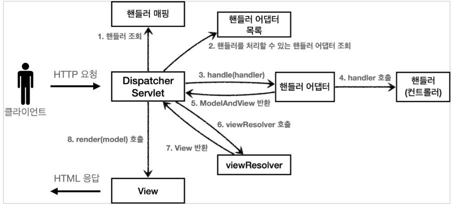
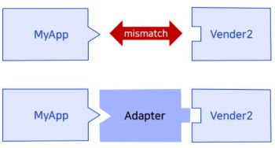

## MVC 패턴
MVC 패턴의 주 목적은 Bussiness login과 Presentation login(view)을 분리하기 위함으로 도메인 영역, 뷰 영역, 컨트롤러 영역 등 각각의 영역에서 자신의 역할만 담당하도록 분리하는 방법이다. <br/>
비즈니스 로직은 서블릿과 같은 부분에서 처리하고 jsp에서는 HTML로 화면단을 구현한다.<br/>

- 구조 
    - **Model** : 뷰에 출력할 **데이터**를 담아둔다.
    - **View** : 모델에 담겨있는 데이터를 사용해 **화면**을 그린다.
    - **Controller** : 모델과 뷰의 연결고리로서 HTTP 요청을 받아 파라미터를 검증하고 비즈니스 로직을 실행한다. 그리고 뷰에 전달할 결과 데이터를 조회해 모델에 담는다.
        - 비즈니스 로직은 Controller에 두는 게 아니라 서비스 계층을 따로 만들어 처리한다.

## 스프링 MVC 전체 구조 및 동작 순서

0. Client로부터 요청이 들어오면 DispatcherServlet이 호출된다.
1. **핸들러 조회**(HandlerMapping): URL에 매핑된 핸들러(컨트롤러) 조회
2. **핸들러 어댑터 조회**(HandlerAdapter): 핸들러를 실행할 수 있는 핸들러 어댑터 조회
    - 어댑터 : 인터페이스 호환성 때문에 같이 쓸 수 없는 클래스들을 연결해서 사용 가능하게 해준다.<br/>
    <br/><br/>
3. **핸들러 어댑터 실행**: 핸들러 어댑터 실행
4. **핸들러 실행**: 핸들러 어댑터가 실제 핸들러를 실행, 핸들러(컨트롤러)는 비즈니스 로직을 처리하고 해당 결과를 반환한다.
5. **ModelAndView 반환**: 핸들러 어댑터는 핸들러가 반환하는 정보를 ModelAndView로 변환해 반환
    - ModelAndView : 컨트롤러 처리 결과 후 응답할 view와 view에 전달할 값을 저장 및 전달하는 클래스 
6. **viewResolver 호출**: 뷰 리졸버를 찾아 실행한다.
    - viewResolver : View 이름으로부터 사용할 View Object를 매핑하는 역할
7. **View 반환**: 뷰 리졸버는 뷰의 논리 이름을 물리 이름으로 바꾸고 렌더링 역할을 담당하는 뷰 객체를 반환한다.
8. **뷰 렌더링**: 뷰를 통해서 뷰를 렌더링한다.

## DispatcherServlet
- HttpServlet을 상속받아 사용하며, 서블릿으로 동작한다.
- 스프링 부트 구동시 DispatcherServlet을 서블릿으로 자동등록하며 모든 경로(urlPatterns="/") 에 대해 매핑한다.
- **프론트 컨트롤러 패턴**은 **서블릿 하나로 클라이언트의 요청을 받아** 이 프론트 컨트롤러가 요청에 맞는 컨트롤러를 찾아서 호출해주는 역할을 함으로써 공통 영역을 한군데 몰아넣을 수 있다.  
- DispatcherServlet도 프론트 컨트롤러 패턴으로 구현되어 있다.
- DispatcherServlet.doDispatch()
    - 해당 메서드에서 적절한 컨트롤러를 찾아 매핑해주고 뷰까지 찾아 View를 반환해 렌더링까지 해주는 핵심 메서드이다.

## 핸들러 매핑과 핸들러 어댑터
- URL을 통해 올바른 컨트롤러를 찾기 위해 필요하다.
1. HandlerMapping
    - 스프링 부트에서 자동으로 **핸들러 매핑 등록**해주는 방법
    ```
    0 = RequestMappingHandlerMapping 
    : 애노테이션 기반의 컨트롤러인 @Requestmapping에서 사용한다. 
    1 = BeanNameUrlHandlerMapping    
    : 스프링 빈의 이름으로 핸들러를 찾는다.
    ```
    - 만약, @Component("/springmvc/old-controller") 로 되어 있다면<br/>
    "/springmvc/old-controller" 라는 이름의 스프링 빈이 등록되었다.
    - BeanNameUrlHandlerMapping 에 의해 스프링 빈의 이름으로 컨트롤러를 찾는다.
    - 요청한 url과 일치하는 스프링 빈이 핸들러가 된다.
         
2. HandlerAdapter
    - 스프링 부트에서 자동으로 **핸들러 어댑터를 등록**해주는 방법
    ```
    0 = RequestmappingHandlerAdapter  
    : 애노테이션 기반의 컨트롤러인 @Requestmapping에서 사용한다. 
    1 = HttpRequestHandlerAdapter     
    : HttpRequesthandler 처리
    2 = SimpleControllerHandlerAdapter
    : Controller 인터페이스(애노테이션 X) 처리 
    ```
    - HandlerMapping 을 통해 찾은 핸들러를 실행할 수 있는 HandlerAdapter를 찾아야 한다.
    - 만약, public class OldController implements Controller 로 Controller 인터페이스를 구현했다면 SimpleControllerHandlerAdapter 가 반환된다.

## 뷰 리졸버
- View의 논리 이름을 물리 이름으로 완성시켜주는 뷰 리졸버를 springMVC에서 만들어주는 방법은?
    ```java
    @Override
    public ModelAndView handleRequest(HttpServletRequest request, HttpServletResponse response) throws Exception {
        System.out.println("OldController.handleRequest");
        return new ModelAndView("new-form");
    }
    ```
    - ModelAndView를 반환하는데 view 이름을 함께 반환하고 있다.
    - new-form 를 물리이름으로 변환하기 위해서 어떤 경로인지 상위 경로 prefix와 확장자인 suffix를 지정해 줘야 한다.
        - application.properties 속성 파일에 아래의 코드를 추가해준다.
            ```
            spring.mvc.view.prefix=/WEB-INF/views/
            spring.mvc.view.suffix=.jsp
            ```
- InternalResourceViewResolver
    - 스프링 부트는 InternalResourceViewResolver 라는 뷰 리졸버를 자동 등록하는데, 이때 설정파일에서 작성한 spring.mvc.view.prefix, spring.mvc.view.suffix 설정정보를 사용한다.
-  뷰 리졸버 동작 방식
    - [스프링 MVC - 구조 이해](https://catsbi.oopy.io/f52511f3-1455-4a01-b8b7-f10875895d5b) 뷰 리졸버 동작 방식 참고

## 참고
- [스프링 MVC - 구조 이해](https://catsbi.oopy.io/f52511f3-1455-4a01-b8b7-f10875895d5b)