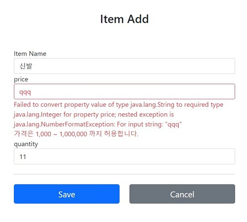

export const Highlight = ({children, color}) => ( <span style={{
      backgroundColor: color,
      borderRadius: '2px',
      color: '#000000',
      padding: '0.2rem',
    }}>{children}</span> );


- api로 BindingResult 사용방법?

## BindingResult
- 스프링이 제공하는 검증 오류를 보관하는 객체이다.
- BindingResult에 오류를 보관(add)할 때, FieldError 객체 또는 ObjectError 객체를 생성해서 담아준다.
    - FieldError 생성자
        - 오류가 발생한 필드 이름이 존재하는 경우 사용하면 된다.
        ```bindingResult.addError(new FieldError(String objectName, String field, String defaultMessage)```
        - objectName : @ModelAttribute 이름
        - field : 오류가 발생한 필드 이름
        - defaultMessage : 오류 기본 메시지
        
    - ObjectError 생성자
        - 오류가 발생한 특정 필드가 예외가 아닌 전체 예외인 경우 사용하면 된다.
            ```bindingResult.addError(new ObjectError(String objectName, String defaultMessage))```
    
```java
@PostMapping("/add")
public String addItemV1(@ModelAttribute Item item, BindingResult bindingResult, RedirectAttributes redirectAttributes) {
        
    //상품 이름이 없는 경우
    if (!StringUtils.hasText(item.getItemName())) {
        bindingResult.addError(new FieldError("item", "itemName", "상품 이름은필수입니다."));
    }

    //가격*수량 합이 10000원 이상이어야 하는 경우
    bindingResult.addError(new ObjectError("item", "가격*수량의 합은 10,000원 이상이어야 합니다."));

    if(bindingResult.hasErrors()) {
        //오류 존재시 다시 입력 폼으로 이동
        return "validation/addForm";
    }
}        
``` 

- BindingResult가 있으면 @ModelAttribute에 데이터 바인딩 시 오류가 발생해도 컨트롤러가 호출된다.
    - 예를 들어, 입력 폼에 가격란에 문자를 쓴다면 원래 가격의 자료형인 Integer와 달라 **바인딩 타입 오류**가 발생한다.
    - 바인딩 타입 오류가 발생 했을 때, BindingResult가 있으면 **오류 정보(FieldError)를 BindingResult에 담아서 컨트롤러를 정상 호출**한다.
    - 이러한 BindingResult의 내용이 자동으로 Model에 담겨지기 때문에 타임리프에서도 사용이 가능하다.
- **BindingResult는 검증할 대상 바로 다음에 와야한다.**
    - @ModelAttribute Item item, 바로 다음에 BindingResult 가 와야 한다.
- BindingResult만 사용할 때 오류가 발생하는 경우, **입력한 내용이 모두 사라진다.**
    - FieldError는 하나의 생성자를 더 제공한다.

## FiledError
- 두개의 생성자를 제공한다.
- 위의 BindingReuslt만 사용할 때 오류가 발생하는 경우 **입력한 내용이 사라지는 문제점**이 발생한다. 
- 해당 문제를 해결하기 위해 아래의 생성자를 사용하여 **사용자가 입력한 값을 파라미터**로 넣어줄 수 있다.
    ```java
    public FieldError(String objectName,           //오류가 발생한 객체 이름
                  String field,                    //오류 필드
                  @Nullable Object rejectedValue,  //사용자가 입력한 값(거절된 값)
                  boolean bindingFailure,          //타입 오류 같은 바인딩 실패인지, 검증 실패인지 구분 값 
                  @Nullable String[] codes,        //메세지 코드
                  @Nullable Object[] arguments,    //메세지에서 사용하는 인자
                  @Nullable String defaultMessage) //기본 오류 메세지.

    new FieldError("item", "itemName", item.getName(), false, null, null, "상품의 이름은 필수입니다.") 
    ```

- 다른 하나의 생성자는<br/>
    ```public FieldError(String objectName, String field, String defaultMessage)```<br/> <br/> 

- 만약, int로 설정되어 있는 price에 "qqq" 와 같은 문자를 입력하면?<br/>
    <br/> 

    - 오류가 발생하게 되고 이 값을 `FieldError`에서 저장하는 기능을 제공하여 화면에 다시 출력해준다.
    - 객체와 입력 값을 타입 비교할 때, 올바르지 않은 타입이 들어온다면 미리 Spring에서 `FieldError의 rejectedValue`에 사용자 입력값을 저장 후 `bindingResult`에 담고 Controller를 호출해준다.<br/>
    `new FieldError("item","price","qqq",true,null,null,"~")`
    - 따라서, qqq가 FieldError에 담겨있어 화면에 출력이 가능해진다.

## 오류 코드와 메세지 처리
- 오류 메세지를 한 군데에서 일관성 있게 관리해 보자
- FildError 생성자에서 `code`,`arguments`를 제공하는데, 이것은 오류 발생시 오류 코드로 메시지를 찾기 위해 사용된다.
### errors 메시지 설정
1. application.properties 에 설정 추가
    - spring.message.basename=errors
2. src/main/resources 아래 errors.properties 추가
    ```properties title="/src/main/resources/errors.properties"
    required.item.itemName=상품 이름은 필수입니다.
    range.item.price=가격은 {0} ~ {1} 까지 허용합니다.
    max.item.quantity=수량은 최대 {0} 까지 허용합니다.
    totalPriceMin=가격 * 수량의 합은 {0}원 이상이어야 합니다. 현재 값 = {1}
    ```
3. errors에 등록한 메시지를 사용하도록 코드 변경
    ```java
    @PostMapping("/add")
    public String addItemV3(@ModelAttribute Item item, BindingResult bindingResult, RedirectAttributes redirectAttributes) { 
        //글자가 없으면, 해당 글을 화면에 보여준다.
        if(!StringUtils.hasText(item.getItemName())) {
            bindingResult.addError(new FieldError("item", "itemName", item.getItemName(), false, new String[]{"required.item.itemName"}, null, null));
        }
        //요구사항: 가격이 1000원~100만원이 제한이다.
        if(item.getPrice() == null || item.getPrice() < 1000 || item.getPrice() > 1000000) {
            bindingResult.addError(new FieldError("item", "price", item.getPrice(), false, new String[]{"range.item.price"}, new Object[]{1000, 1000000}, null));
        }
        //요구사항: 수량은 1~9999까지 가능하다.
        if(item.getQuantity() == null || item.getQuantity() >= 9999) {
            bindingResult.addError(new FieldError("item", "quantity", item.getQuantity(), false, new String[] {"max.item.quantity"}, new Object[]{9999}, null));
        }
        //요구사항: 가격*수량의 합은 10,000원 이상
        if (item.getPrice() != null && item.getQuantity() != null) {
            int resultPrice = item.getPrice() * item.getQuantity();
            if (resultPrice < 10000) {
                bindingResult.addError(new ObjectError("item", new String[]{"totalPriceMin"}, new Object[]{10000, resultPrice},null));
            }
        }

        if (bindingResult.hasErrors()) {
            log.info("errors = {}", bindingResult);
            return "validation/v2/addForm";
        }
        ...
    }
    ```
4. 비교
    - range.item.price=가격은 {0} ~ {1} 까지 허용합니다.
    - `new FieldError("item", "price", item.getPrice(), false, new String[]{"range.item.price"}, new Object[]{1000, 1000000}, null)`
        - codes : `range.item.price`를 사용하여 메시지 코드를 지정한다.메세지 코드는 하나가 아니라 `배열`로 여러 값을 전달할 수 있는데, 순서대로 매칭해서 처음 매칭되는 메시지가 사용된다.
        - arguments : `Object[]{1000, 1000000}`를 사용해서 코드의 {0}, {1}로 치환할 값을 전달한다.

## BindingResult의 rejectValue(), reject()
- 위의 `bindingResult.addError(new FieldError("item", "itemName",item.getItemName(), false, new String[]{"required.item.itemName"}, null, null))` 너무 복잡하다.
- 컨트롤러에서 BindingResult 는 검증해야 할 객체인 target 바로 다음에 온다. 따라서, **BindingResult는 이미 본인이 검증해야 할 객체인 target을 알고 있다.**
- 이러한 복잡한 코드를 간단하게 rejectValue()와 reject() 메서드에 의해 아래와 같이 변경할 수 있다.
    - BindingResult는 어떤 객체를 대상으로 검증하는지 target(item)을 이미 알고 있으므로 target은 없어도 된다.
    ```java
    bindingResult.addError(new FieldError("item", "itemName",item.getItemName(), false, new String[]{"required.item.itemName"}, null, null))
    bindingResult.addError(new FieldError("item", "price", item.getPrice(),false, new String[]{"range.item.price"}, new Object[]{1000, 1000000}, null))

    //after
    bindingResult.rejectValue("itemName", "required");
    bindingResult.rejectValue("price", "range", new Object[]{1000, 1_000_000}, null);
    ```
- rejectValue

    `void rejectValue(@Nullable String field, String errorCode, @Nullable Object[] errorArgs, @Nullable String defaultMessage);`

    - field : 오류명
    - errorCode : 오류코드, messageResolver를 위한 오류코드
    - errorArgs : 오류메세지에서 {0}을 치환하기 위한 값
    - defaultMessage : 오류메세지를 찾을 수 없을 때 사용하는 기본 메시지

- <Highlight color="#ffff00">reject</Highlight>

- rejectValue를 통해 field와 errorCode 매개변수를 넣어주면 메세지가 어떻게 찾아지나?
    - MessageCodesResolver를 통해서 errors.properties에서 메세지를 찾아낸다.


## MessageCodesResolver
- <Highlight color="#ffff00">검증 오류 코드(errorCode)</Highlight>로 메시지 코드들을 생성한다.
- 만약, errors.properties에 아래와 같이 있다면, 범용성이 낮은 순서에서 높은 순서로 차례대로 찾으며 처음 매칭되는 결과를 가져온다.
    - bindingResult.rejectValue("itemName", "required") 이면, 우선순위가 높은 `required.item.itemName`가 매칭된다.
    - 필드 매개변수가 itemName이 아니라면 `required`가 매칭된다.
    ```properties title="/src/main/resources/errors.properties"
    required.item.itemName: 상품 이름은 필수입니다.

    required: 필수 값 입니다.
    ```

### 동작 방식
- `rejectValue()`,`reject()`는 내부에서 MessageCodesResolver 를 사용하여 메시지 코드들을 생성한다.
- 메시지 코드들은 총 4개가 만들어지는데, 이걸로 FieldError 생성한다.
    - `new FieldError("item","itemName",null,false,messageCode,null,null);`
    - **rejectValue("itemName", "required") 라면,**
    
        <p>
        required.item.itemValue    //에러코드.객체명.필드명<br/>
        required.itemName          //에러코드.필드명<br/>
        required.java.lang.String  //에러코드.type<br/>
        required                   //에러코드<br/>
        </p>

        - => 이렇게 총 4개가 만들어지며 맨처음부터 우선순위(구체적 -> 덜 구체적)를 갖게 된다.
        
    - new FieldError 의 messageCode 파라미터
        - new String[]{
                "required.item.itemName", 
                "required.itemName", 
                "required.java.lang.String", 
                "required"
                }
        
- MessageCodesResolver를 reject(), rejectValue() 메서드에서 사용하기 때문에<br/>
우리는 편하게 field와 errorCode 만 인수로 넘겨줌으로써 에러 내용을 담을 수 있게 되는 것이다.

### MessageCodesResolver 사용해보기
- `MessageCodesResolver`의 기본 구현체인 `DefaultMessageCodesResolver`를 이용해 코드를 작성한다.
    - 객체 오류 조회
        ```java
        @Test
        void messageCodesResolverObject() {
            DefaultMessageCodesResolver codesResolver = new DefaultMessageCodesResolver();
            String[] messageCodes = codesResolver.resolveMessageCodes("required", "item");
            for (String msg : messageCodes) {
                System.out.println(msg);
            }
        }
        ```
        - 결과 
            - required.item required

    - 필드 오류 조회
        ```java
        @Test
        void messageCodesResolverField() {
            DefaultMessageCodesResolver codesResolver = new DefaultMessageCodesResolver();
            String[] messageCodes = codesResolver.resolveMessageCodes("required", "item", "itemName", String.class);
            for (String msg : messageCodes) {
                System.out.println(msg);
            }
        }
        ```
        - 결과
            - required.item.itemName
            - required.itemName
            - required.java.lang.String
            - required

## 정리
- rejectValue(reject) 에 field와 errorCode 인수로 넘기면,<br/>
MessageCodesResolver에 의해 필드오류(객체오류)가 4개(2개)생성이 되고,<br/>내부적으로 String 배열을 통해 우선순위 기반으로 메세지를 찾는다.

## 참고
- [스프링 MVC 2편 - 백엔드 웹 개발 활용 기술](https://www.inflearn.com/course/%EC%8A%A4%ED%94%84%EB%A7%81-mvc-2/dashboard)
- [검증1](https://catsbi.oopy.io/f6bc86a1-d19d-4647-bd12-b2d1d7db1b4b)