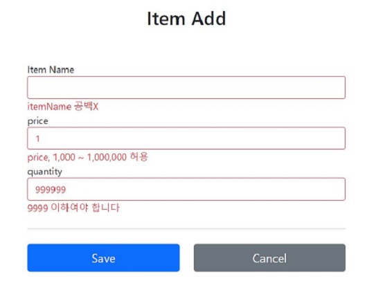

## Bean Validation
- 특정 필드에 대한 검증 로직은 대부분 빈 값인지 아닌지, 특정 크기를 넘는지 아닌지와 같은 매우 일반적인 로직이다.
- 이런 검증 로직을 표준화한 게 **Bean Validation**이다.
- Bean Validation이란, 특정한 구현체가 아닌 Bean Validation 2.0 이라는 기술 표준이다. 
- 인터페이스의 모음으로 일반적으로 하이버네이트 Validator 구현체를 많이 사용한다.
- Bean Validator 을 사용하려면 
    - `implementation 'org.springframework.boot:spring-boot-starter-validation'` 의존성을 추가해야 한다.

- 스프링 MVC에서 Bean Validator 사용 방법
    - `spring-boot-starter-validation` 라이브러리를 넣으면 자동으로 Bean Validation를 인지하고 스프링에 통합한다. 
    - LocalValidatorFactoryBean을 **글로벌 Validator**로 등록한다.
        - 글로벌 Validator 이므로 @Validate, @Validated만 적용하면 된다.
    - 검증 오류가 발생하면, FieldError, ObjectError를 생성해서 BindingResult에 담아준다.

### 검증 순서
1. @ModelAttribute 각각의 필드에 타입 변환을 시도한다.
- 성공하면 다음으로, 실패하면 `typeMismatch`로 `FieldError` 추가
2. Validator 적용


## 에러 코드
- 에러 코드가 애노테이션 이름으로 등록된다. 
- 만약, @NotBlank 를 붙여준 itemName 필드에서 에러가 나면 아래의 메시지 코드가 생성된다.
    <p>
    NotBlank.item.itemName<br/>
    NotBlank.itemName<br/>
    NotBlank.java.lang.String<br/>
    NotBlank
    </p>
    - 따라서, 에러 메시지를 변경하고 싶다면 해당 이름으로 메시지 등록을 하면 된다.

### 애노테이션 부여 및 메시지 등록
```java title="Item"
@Data
public class Item {

    private Long id;

    @NotBlank(message = "공백X")
    private String itemName;

    @NotNull
    @Range(min = 1000, max = 1000000)
    private Integer price;

    @NotNull
    @Max(9999)
    private Integer quantity;

    public Item() {
    }

    public Item(String itemName, Integer price, Integer quantity) {
        this.itemName = itemName;
        this.price = price;
        this.quantity = quantity;        
    }
}

```
```java {2} title="ValidatedController"
@PostMapping("/add")
public String addItem(@Validated @ModelAttribute Item item,BindingResult bindingResult, RedirectAttributes redirectAttributes) {
    if (item.getPrice() != null && item.getQuantity() != null) {
        int resultPrice = item.getPrice() * item.getQuantity();
        if (resultPrice < 10000) {
            bindingResult.reject("totalPriceMin", new Object[]{10000,resultPrice}, null);
        }
    }

    if (bindingResult.hasErrors()) {
        log.info("errors = {}", bindingResult);
        return "validation/v3/addForm";
    }

    //아래는 성공로직
    Item savedItem = itemRepository.save(item);
    redirectAttributes.addAttribute("itemId", savedItem.getId());
    redirectAttributes.addAttribute("status", true);
    return "redirect:/validation/v3/items/{itemId}";
}
```

```properties title="/src/main/resources/errors.properties"
#Bean Validation
NotBlank={0} 공백X
Range={0}, {2} ~ {1} 허용
MAX={0}, 최대 {1}
```


- tip) 오브젝트 오류(글로벌 오류)이 경우 `@ScriptAssert`을 억지로 사용하는 것 보다는 오브젝트 오류 관련 부분만 직접 자바 코드로 작성하는 것을 권장한다. 
    ```java title="ValidationController addItem() 중 오브젝트 오류 관련 부분"
    if (item.getPrice() != null && item.getQuantity() != null) {
        int resultPrice = item.getPrice() * item.getQuantity();
        if (resultPrice < 10000) {
            bindingResult.reject("totalPriceMin", new Object[]{10000,resultPrice}, null);
        }
    }
    ```

## Bean Validation 한계
- 데이터를 등록할 때와 수정할 때는 요구사항이 다를 수 있다.
- 이럴 경우, 검증 조건의 충돌이 발생할 수 있고 서로 같은 Bean Validation을 적용할 수 없다.
    - 예를 들어, 등록시에는 id값이 없어도 되지만, 수정시에는 id값이 필수이므로 id 필드에 @NotNull 애노테이션을 적용 시 등록이 안되는 현상이 발생한다.

### 해결1_groups
- Bean Validation의 **groups** 기능을 사용하면 위의 현상을 해결할 수 있다.
- 예를 들어, 등록시에 검증할 기능과 수정시에 검증할 기능을 각각 그룹을 나누어 적용할 수 있다.
- @Valid에는 group를 적용할 수 없다. 따라서, `@Validation`를 사용해야 한다.
- 복잡해서 실무에서 실제로 잘 사용되지 않는다.
- 적용 예시
    - Item class
        - id 값이 null이면 안되는 건 수정(UpdateCheck.class) 시에만 적용한다.
        - itemName이 빈 값이면 안되는 건 등록(SaveCheck.class), 수정(UpdateCheck.class) 모두에 적용된다.

        ```java title="저장용 groups"
        public interface SaveCheck {
        }
        ```
        ```java title="수정용 groups"
        public interface UpdateCheck {
        }
        ```
        ```java title="groups 적용"
        @Data
        public class Item {
            // highlight-next-line
            @NotNull(groups = UpdateCheck.class) //수정시에만 적용
            private Long id;
            // highlight-next-line
            @NotBlank(groups = {SaveCheck.class, UpdateCheck.class})
            private String itemName;
            ...
        }
        ```

        ```java title="저장 로직에 SaveCheck groups 적용"
        @PostMapping("/add")
        // highlight-next-line
        public String addItemV2(@Validated(SaveCheck.class) @ModelAttribute Item item,
                            BindingResult bindingResult, RedirectAttributes redirectAttributes) {
        //...
        }
        ```
        ```java title="수정 로직에 UpdateCheck groups 적용"
        @PostMapping("/{itemId}/edit")
        // highlight-next-line
        public String editV2(@PathVariable Long itemId, @Validated(UpdateCheck.class)
                            @ModelAttribute Item item, BindingResult bindingResult) {
        //...
        }
        ```

### 해결2_별도의 모델 객체 생성
- 회원 등록시 회원과 관련된 데이터만 전달받는 것이 아니라, 약관 정보도 추가로 받는 등 해당 객체와 관계없는 많은 부과 데이터가 넘어온다.
- 즉, 폼에서 전달하는 데이터와 도메인 객체가 딱 맞지 않는다.
- 따라서, 보통 `Item`을 전달받는 것이 아니라, 복잡한 폼의 데이터를 컨트롤러까지 전달할 **별도의 객체**를 만들어서 전달한다.
- Item 도메인을 이용한 예시
    - 저장용 폼
        - 저장을 위한 폼 생성 후, 검증 애너테이션을 붙여준다.
        ```java title="ItemSaveForm"
        @Data
        public class ItemSaveForm {
            @NotBlank
            private String itemName;

            @NotNull
            @Range(min = 1000, max = 1000000)
            private Integer price;
            
            @NotNull
            @Max(value = 9999)
            private Integer quantity;
        }
        ```
    - 수정용 폼
        - 수정을 위한 폼 생성 후, 검증 애너테이션을 붙여준다.
        ```java title="ItemUpdateForm"
        @Data
        public class ItemUpdateForm {
            @NotNull
            private Long id;

            @NotBlank
            private String itemName;
            
            @NotNull
            @Range(min = 1000, max = 1000000)
            private Integer price;

            //수정에서는 수량은 자유롭게 변경할 수 있다.
            private Integer quantity;
        }
        ```

    - Controller
        - 파라미터를 보면 ItemSaveForm으로 받고 있다.
        - 폼 객체의 데이터를 기반으로 Item 객체를 생성한다. 중간에 다른 객체가 추가되면변환하는 과정이 추가된다
        - 아래의 코드처럼 setter를 이용하기 보다는 생성자를 이용하는 것이 낫다. 
        ```java title="Controller의 등록 로직"
        @PostMapping("/add")
        // highlight-next-line
        public String addItem(@Validated @ModelAttribute("item") ItemSaveForm form,
                    BindingResult bindingResult, RedirectAttributes redirectAttributes) {

            //특정 필드 예외가 아닌 전체 예외
            if (form.getPrice() != null && form.getQuantity() != null) {
                int resultPrice = form.getPrice() * form.getQuantity();
                if (resultPrice < 10000) {
                    bindingResult.reject("totalPriceMin", new Object[]{10000,
                    resultPrice}, null);
                }
            }

            if (bindingResult.hasErrors()) {
                log.info("errors={}", bindingResult);
                return "validation/v4/addForm";
            }
            //성공 로직
            Item item = new Item();
            item.setItemName(form.getItemName());
            item.setPrice(form.getPrice());
            item.setQuantity(form.getQuantity());
            Item savedItem = itemRepository.save(item);
            redirectAttributes.addAttribute("itemId", savedItem.getId());
            redirectAttributes.addAttribute("status", true);

            return "redirect:/validation/v4/items/{itemId}";
        }
        ```
        - 수정 로직도 등록과 유사하게 변경해주면 된다. 
            - Item 대신에 ItemSaveform 을 전달 받고 @Validated 로 검증도 수행하고, BindingResult로 검증 결과도 받는다
    
- +) 검증 애노테이션 모음을 쭉 한번 보자!!
    - [검증 애노테이션 모음](https://docs.jboss.org/hibernate/validator/6.2/reference/en-US/html_single/#validator-defineconstraints-spec)


## HTTP 메시지 컨버터
- @Validated 는 HttpMessageConverter(@RequestBody)에도 적용할 수 있다.
- 테스트 예시
    ```java
    @Slf4j
    @RestController
    @RequestMapping("/validation/api/items")
    public class ValidationItempApiController {

        @PostMapping("/add")
        public Object addItem(@RequestBody @Validated ItemSaveForm form, BindingResult bindingResult) {
            log.info("API 컨트롤러 호출");
            if(bindingResult.hasErrors()) {
                log.info("검증 오류 발생 errors={}", bindingResult);
                return bindingResult.getAllErrors();
            }

            log.info("성공 로직 실행");
            return form;
        }
    }
    ```
    - 3가지 결과
        - 성공
        - 실패 : JSON 객체로 생성하는 것 실패 / 바인딩 오류
            - Controller 호출 자제가 안된다. 바인딩으로 객체 생성이 실패했기 때문에
        - 검증 오류 : JSON 객체로 생성하는 것은 성공, 검증은 실패
- @ModelAttribute 같은 경우에는 바인딩 오류가 있어도 그 오류를 BindingResult에 담아서 Controller를 호출해 주었다. HTTP 컨버터는 왜 안될까?
    - @RequestBody는 HttpMessageConverter 단계에서 JSON 데이터를 객체로 변경하지 못하면 이후 단계 자체가 진행이 안되고 예외가 발생한다. 따라서, 컨트롤러도 호출되지 않고, Validator도 적용할 수 없다.


## 참고
- [스프링 MVC 2편 - 백엔드 웹 개발 활용 기술](https://www.inflearn.com/course/%EC%8A%A4%ED%94%84%EB%A7%81-mvc-2/dashboard)
- [검증2](https://catsbi.oopy.io/c61342dd-26c5-4cd8-a462-957cd5787525)