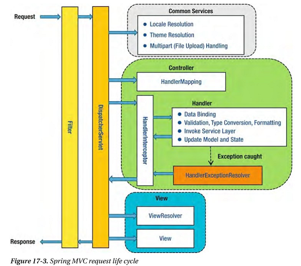
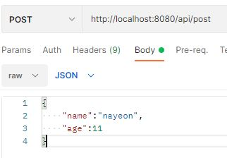
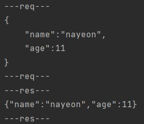
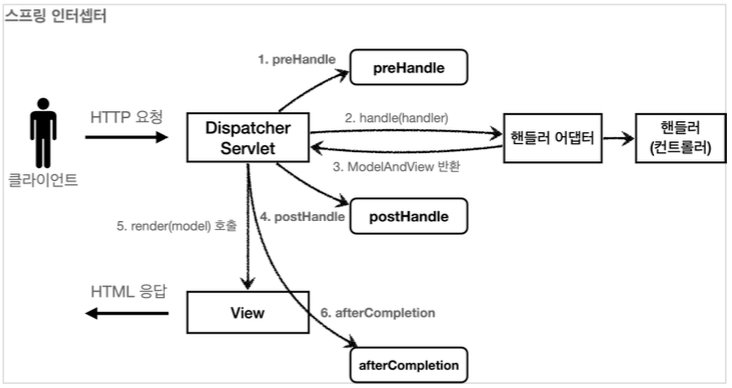

<p>
웹의 여러 로직에서 공통으로 관심 있는 공통 관심사를 처리하는 방법은 서블릿 필터와 스프링 인터셉터를 통해 처리할 수 있다. <br/>
예를 들어, 상품 관리 컨트롤러에서 로그인 여부를 체크하는 로직을 모든 로직에서 공통으로 구현해야 한다. 각 로직에서 일일이 작성하는 것 대신 서블릿 필터와 스프링 인터셉터를 이용하여 구현하면 된다.
</p>

- 전체적인 구조<br/>
<br/>
- [사진출처](https://elfinlas.github.io/2017/12/28/SpringBootInterceptor/)

## 필터
- **서블릿**이 제공
- 필터의 흐름
    - `HTTP 요청 -> WAS -> 필터 -> 서블릿 -> 컨트롤러`
    - 필터에서 적절하지 않은 요청이라고 판단하면 더 이상 서블릿이 호출되지 않고 끝나게 된다.
    - 필터를 적용하면 필터가 호출된 다음에 서블릿이 호출된다. 
- 필터는 체인으로 구성되는데, 중간에 필터를 자유롭게 추가할 수 있다.   
    - `HTTP 요청 -> WAS -> 필터1 -> 필터2 -> 필터3 -> 서블릿 -> 컨트롤러`
    - 로그 남기는 필터 -> 로그인 여부 체크하는 필터 를 만들 수 있다.
- 주로 최전방에서 들어오는 값을 **로그로 찍을 때 사용**한다.

### 필터 인터페이스
```java
public interface Filter {
    public default void init(FilterConfig filterConfig) throws ServletException{}
    public void doFilter(ServletRequest request, ServletResponse response, FilterChain chain) throws IOException, ServletException;
    public default void destroy() {}
}
```
- 필터 인터페이스를 구현한 뒤 등록하면 서블릿 컨테이너가 필터를 싱글톤 객체로 생성하고 관리한다.
    - init() : 필터 초기화 메서드로 서블릿 컨테이너가 생성될 때 호출된다.
    - doFilter() : **고객의 요청이 올 때마다 해당 메서드가 호출**된다.
    - destroy() : 필터 종료 메서드, 서블릿 컨테이너가 종료될 때 호출된다.

### 예시
- 로그 필터를 구현해 볼 것이다.
- http://localhost:8080/api/* 로 요청을 했을 때, 필터를 통해 로그를 찍도록 구현해보자!
    - controller
        ```java title="ApiController"
        @RestController
        @RequestMapping("/api")
        public class ApiController {

            @PostMapping("/post")
            public User post(@RequestBody User user) {
                return user;
            }
        }
        ```
    - dto
        ```java title="User"
        @Data
        public class User {

            private String name;
            private int age;
        }
        ```
    
    - **filter**
        ```java title="RequestFilter"
        @WebFilter(urlPatterns = "/api/*")
        public class RequestFilter implements Filter {

            @Override
            public void doFilter(ServletRequest request, ServletResponse response, FilterChain chain) throws IOException, ServletException {
                ContentCachingRequestWrapper wrappingRequest = new ContentCachingRequestWrapper((HttpServletRequest) request);
                ContentCachingResponseWrapper wrappingResponse = new ContentCachingResponseWrapper((HttpServletResponse) response);

                chain.doFilter(wrappingRequest, wrappingResponse);

                System.out.println("---req---");
                System.out.println(new String(wrappingRequest.getContentAsByteArray()));

                System.out.println("---req---");

                System.out.println("---res---");
                System.out.println(new String(wrappingResponse.getContentAsByteArray()));
                System.out.println("---res---");
                wrappingResponse.copyBodyToResponse();
            }
        }
        ```
        - `@WebFilter(urlPatterns = "/api/*")`
            - /api 하위로 들어오는 url 요청이 온 경우 해당 필터를 거친다.
            - 해당 애너테이션이 올바르게 동작하기 위해서는 application 클래스에 @ServletComponentScan 를 붙여줘야 한다.
                ```java title = "/src/main/java/package명/FilterAndInterceptorApplication"
                @SpringBootApplication
                // highlight-next-line
                @ServletComponentScan
                public class FilterAndInterceptorApplication {
                    public static void main(String[] args) {
                        SpringApplication.run(FilterAndInterceptorApplication.class, args);
                    }
                }
                ```

        - `chain.doFilter(wrappingRequest, wrappingResponse);`
            -  다음 필터가 있으면 다음 필터를 호출하고 필터가 없으면 서블릿을 호출한다.

        - `ContentCachingRequestWrapperfilter`, `ContentCachingResponseWrapper` 사용이유?
            - HttpServletResponse 로 들어온 값을 BufferedReader를 통해 값을 읽으면 커서 단위로 읽어지기 때문에 읽은 후의 위치에 커서가 위치하게 된다.
            - 그래서, Controller에서 body를 읽을 수 없게 된다.
            - 이 문제를 해결하기 위해, cache 기능을 제공하는 ContentCachingRequestWrapperfilter, ContentCachingResponseWrapper를 사용한 것이다.
            - ContentCachingRequestWrapper 의 생성자에서는 content의 길이만 지정해둔다.
            - 내용을 저장하는 `writeToCache` 메소드는 나중에 실행되어 저장하므로 request, response에 대한 로그 출력도 doFilter 메소드의 호출 이후에 해줘야 한다.
        
        - `wrappingResponse.copyBodyToResponse();`
            - new String(wrappingRequest.getContentAsByteArray() 로 출력하게 되면 getContentAsByteArray()는 원래의 array를 비우며 byte 배열로 리턴해준다.
            - 때문에, wrappingResponse.copyBodyToResponse() 로 읽은 만큼의 내용을 복사해주어 올바른 response 나갈 수 있도록 해야 한다.<br/><br/>
    
    - 실행 : POST http://localhost:8080/api/post<br/>
        <br/>
        
        - 필터에 찍은 로그가 잘 출력된다.

- 두개 이상의 필터를 사용할 경우, 순서, urlPattern 등록을 할 수 있다.
    - [참고](https://catsbi.oopy.io/9ed2ec2b-b8f3-43f7-99fa-32f69f059171)


## 인터셉터

<p>
스프링 인터셉터도 서블릿 필터와 같이 웹과 관련된 공통 관심 사항을 효과적으로 해결할 수 있는 기술이다. <br/>
스프링 인터셉터는 스프링 MVC가 제공하는 기술로 필터와는 적용되는 순서와 범위, 사용방법이 다르다.<br/>
주로 인증 단계를 처리한다. 선/후 처리를 함으로써, service 비즈니스 로직과 분리할 수 있다.<br/>
또한, 어떤 컨트롤러와 핸들러 매핑이 되었는지까지 알 수 있다.
</p>

- 인터셉터 흐름
    - `HTTP 요청 -> WAS -> 필터 -> 서블릿 -> 스프링 인터셉터 -> 컨트롤러`
    - 스프링 인터셉터는 dispatcherServlet 이후에 호출된다.

### 스프링 인터셉터 인터페이스
- 스프링 인터셉터를 사용하려면 `HandlerInterceptor` 인터페이스 구현해야 한다.
```java
public interface HandlerInterceptor {
	default boolean preHandle(HttpServletRequest request, HttpServletResponse response, Object handler)
			throws Exception {

		return true;
	}

	default void postHandle(HttpServletRequest request, HttpServletResponse response, Object handler,
			@Nullable ModelAndView modelAndView) throws Exception {
	}

	default void afterCompletion(HttpServletRequest request, HttpServletResponse response, Object handler,
			@Nullable Exception ex) throws Exception {
	}
}
```
- **preHandle, postHandle, afterCompletion** 으로 세분화 되어 있고 컨트롤러 **호출 전, 호출 후, 요청 완료** 이후에 각각 호출된다.<br/><br/>
    
    - [사진출처](https://catsbi.oopy.io/9ed2ec2b-b8f3-43f7-99fa-32f69f059171)
    - preHandle : 컨트롤러 호출 전에 호출
    - postHandle : 컨트롤러 예외 발생 시 호출되지 않음, modelAndView를 통해 데이터를 볼 수 있다.
    - afterCompletion : 항상 호출된다. 예외가 있을 경우, 파라미터로 받아서 어떤 예외가 발생했는지 확인할 수 있다.
    - 인터셉터 혹은 컨트롤러에서 예외가 발생하면 postHandler() 가 호출되지 않기 때문에 예외 처리가 필요하다면 afterCompletion()을 사용해야 한다.

- **인터셉터 생성**
    - 인증 체크 기능의 스프링 인터셉터를 개발해보자
    ```java
    @Slf4j
    public class LoginCheckInterceptor implements HandlerInterceptor {
        @Override
        public boolean preHandle(HttpServletRequest request, HttpServletResponse response, Object handler) throws Exception {
            String requestURI = request.getRequestURI();
            log.info("인증 체크 인터셉터 실행 {}", requestURI);
            HttpSession session = request.getSession(false);

            if (session == null || session.getAttribute(SessionConst.LOGIN_MEMBER) == null) {
                log.info("미인증 사용자 요청");
                return throw AuthException();
            }
            return true;
        }
    }
    ```
    - 인증의 경우, 컨트롤러 호출 전에 로직이 이루어져야 하므로 `preHandle()` 만 구현하면 된다.

- **인터셉터 등록**
    - HandlerInterceptor를 구현한 인터셉터를 생성한 후 등록을 해주어야 한다.
    ```java
    @Configuration
    public class WebConfig implements WebMvcConfigurer {
        
        @Override
        public void addInterceptors(InterceptorRegistry registry) {
        
            registry.addInterceptor(new LoginCheckInterceptor())
                    .order(1)
                    .addPathPatterns("/**")
                    .excludePathPatterns(
                        "/", "/members/add", "/login", "/logout",
                        "/css/**", "/*.ico", "/error"
                    );
        }
        //...
    }
    ```
    - Bean으로 등록하기 위해 @Configuration
    - `order`로 인터셉터 순서를 지정한다. 숫자가 작을수록 높은 우선순위를 갖게 된다.
    - `addPathPatterns`는 인터셉터를 적용할 경로를 지정한다. 위의 경우, 모든 경로에 해당 인터셉터를 적용한다.
    - `excludePathPatterns`는 인터셉터 적용을 제외할 경로를 지정한다. 위의 경우, 회원가입, 로그인 등을 제외한다.


## 참고
- [한번에 끝내는 java/spring 마스터](https://fastcampus.co.kr/dev_online_javaend)
- [로그인 처리 2](https://catsbi.oopy.io/9ed2ec2b-b8f3-43f7-99fa-32f69f059171)
- [스프링 MVC 2편 - 백엔드 웹 개발 활용 기술](https://www.inflearn.com/course/%EC%8A%A4%ED%94%84%EB%A7%81-mvc-2/dashboard)