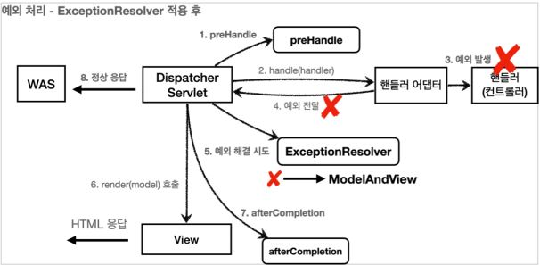

<p>
API는 각 오류 상황에 맞는 오류 응답 스펙을 정하고 json으로 데이터를 내려주어야 한다.
API의 경우 어떻게 예외 처리를 하면 좋을지 알아보자.
</p>

## HandlerExceptionResolver
- 예외가 발생해서 WAS까지 예외가 전달디면 HTTP 상태코드가 500으로 처리된다.
- 예를 들어, IllegalArgumentException을 처리하지 모해 WAS까지 전달되면 HTTP 코드가 500으로 처리되는 데, 이 코드를 400으로 처리하고 싶다.
- **컨트롤러 밖으로 던져진 예외를 해결하고, 동작 방식을 변경**하고 싶으면 `HandlerExceptionResolver` 를 사용하면 된다.
- Exception, response.sendError 사용한 경우, 예외가 발생하면 WAS까지 예외가 던져지고, WAS에서 오류 페이지 정보를 찾아 다시 /error를 호출해야 한다. **HandlerExceptionResolver를 사용하면 이러한 복잡한 과정 없이 여기에서 문제를 해결할 수 있다.**
- HandlerExceptionResolver 적용 후 <br/>
     <br/>
    - HandlerExceptionResolver 가 **예외를 해결하도록 시도**한다. 
    - 예외가 해결되면 **정상 응답**으로 나가게 된다.

- HandlerExceptionResolver 인터페이스
    ```java
    public interface HandlerExceptionResolver { 
        ModelAndView resolveException(HttpServletRequest request, HttpServletResponse response, Object handler, Exception ex);
    }
    ```
    - handler : 핸들러(컨트롤러) 정보
    - Exception ex : 핸들러(컨트롤러)에서 발생한 예외

- 예제) 사용자 정의 예외 추가
    - UserException
    ```java title = "UserException"
    public class UserException extends RuntimeException {
        public UserException() {
            super();
        }
        public UserException(String message) {
            super(message);
        }
        public UserException(String message, Throwable cause) {
            super(message, cause);
        }
        public UserException(Throwable cause) {
            super(cause);
        }
        protected UserException(String message, Throwable cause, boolean enableSuppression, boolean writableStackTrace) {
            super(message, cause, enableSuppression, writableStackTrace);
        }
    }
    ```

    - ApiExceptionController - 예외 추가
    ```java title = "ApiExceptionController"
    @Slf4j
    @RestController
    public class ApiExceptionController {
        @GetMapping("/api/members/{id}")
        public MemberDto getMember(@PathVariable("id") String id) {
    
            if (id.equals("user-ex")) {
                // highlight-next-line
                throw new UserException("사용자 오류");
            }
            
            return new MemberDto(id, "hello " + id);
        }
    
        @Data
        @AllArgsConstructor
        static class MemberDto {
            private String memberId;
            private String name;
        }
    }
    ```

    - 예외 처리하는 UserHandlerExceptionResolver (HandlerExceptionResolver 구현)
    ```java
    @Slf4j
    public class UserHandlerExceptionResolver implements HandlerExceptionResolver {

        private final ObjectMapper objectMapper = new ObjectMapper();

        @Override
        public ModelAndView resolveException(HttpServletRequest request, HttpServletResponse response, Object handler, Exception ex) {

            try{
                if(ex instanceof UserException) {
                    log.info("UserException resolver to 400");
                    String acceptHeader = request.getHeader("accept");
                    response.setStatus(HttpServletResponse.SC_BAD_REQUEST);

                    if("application/json".equals(acceptHeader)) {
                        Map<String, Object> errorResult = new HashMap<>();
                        errorResult.put("ex", ex.getClass());
                        errorResult.put("message", ex.getMessage());
                        //객체를 string으로 바꿔, json을 문자로 바꿔
                        String result = objectMapper.writeValueAsString(errorResult);

                        //response를 만든다. -> json 데이터가 들어간다.
                        response.setContentType("application/json");
                        response.setCharacterEncoding("utf-8");
                        response.getWriter().write(result);
                        //예외는 먹어버리지만 정상적으로 리턴이 되어 서블릿까지 response가 전달된다.
                        // highlight-next-line
                        return new ModelAndView();
                    } else {
                        //TEXT/HTML -> view 렌더링이 된다.
                        // highlight-next-line
                        return new ModelAndView("error/500");
                    }
                }
            }catch (IOException e) {
                log.error("resolver ex", e);
            }
            return null;
        }
    }
    ```
    - `ModelAndView` 를 반환하는데, 이는 Exception 을 처리해서 정상 흐름처럼 변경하는 것이 목적이다.
    - 위의 코드는 UserException 이 발생하면 header가 application/json 인 경우, 상태코드를 400으로 설정하고 Exception 클래스와 Exception message 를 response 설정과 함께 응답으로 보내준다. 
    - 빈 ModelAndView를 반환한다. -> 뷰 렌더링이 되지 않고 정상 흐름으로 서블릿 호출된다.
    - 위와 같이 구현 후, WebMvcConfigurer 를 구현한 클래스에 `extendHandlerExceptionResolvers` 메소드를 오버라이드 하여 등록을 해주어야 한다.

- **반환 값**에 따른 동작 방식
    1. **빈 ModelAndView** : 뷰 렌더링이 되지 않고 정상 흐름으로 서블릿이 리턴된다.
    2. **ModelAndView** : 정보를 지정해서 반환하면 뷰가 렌더링 된다.
    3. **null** : 다음 ExceptionResolver를 찾아서 실행하고 처리할 수 있는 ExceptionResolver가 없으면 예외처리가 안되고, 기존에 발생한 예외를 서블릿 밖으로 던진다.

- HandlerExceptionResolver 를 사용하면 **예외가 발생해도 서블릿 컨테이너까지 예외가 전달되지 않고**, 스프링 MVC에서 예외 처리는 끝이 난다. 즉, 예외를 여기서 모두 처리해 준다.
- 하지만, `resolveException` 메소드에서 위와 같은 설정 request, response 처리를 일일이 해줘야 하는 점이 번거롭다.


## Spring이 제공하는 ExceptionResolver
- 스프링이 기본으로 제공하는 ExceptionResolver느 아래 3가지 이며 작은 숫자가 우선순위를 갖는다.
1. ExceptionHandlerExceptionResovler : API 예외 처리는 대부분 이 기능으로 해결
2. ResponseStatusExceptionResovler : HTTP 상태 코드를 지정해준다.
3. DefaultHandlerExceptionResovler : 스프링 내부 기본 예외를 처리한다.

### ResponseStatusExceptionResolver
- 예외에 따라서 HTTP 상태 코드를 지정 해주는 역할을 한다.
- 아래의 두가지 경우를 처리
    - @ResponseStatus 달려있는 예외
    - ResponseStautsException 예외

- @ResponseStatus 애너테이션 적용
    ```java
    @ResponseStatus(code = HttpStatus.BAD_REQUEST, reason = "잘못된 요청 오류")
    public class BadRequestException extends RuntimeException {
    }
    ```
    - BadRequestException 예외가 컨트롤러 밖으로 넘어가면 ResponseStatusExceptionResovler가 해당 애노테이션을 확인해서 오류코드를 400으로 변경하고 메세지도 담는다.
    - ResponseStatusExceptionResovler 코드 확인을 해보면 결국 response.sendError(statusCode, resolvedReason)를 호출하는 것을 알 수 있다.
        - WAS까지 에러가 전달되고 다시 오류 페이지 /error를 내부 요청한다.
    
- ResponseStautsException 예외
    - 내가 코드 수정을 할 수 없는 라이브러리의 예외 코드 같은 곳에 예외처리를 할 수 있게 해준다.
    - 예시
        ```java
        @GetMapping("/api/response-status-ex2")
        public String responseStatusEx2() {
            throw new ResponseStatusException(HttpStatus.NOT_FOUND, "잘못된 요청 오류입니다. 메시지 사용", new IllegalArgumentException());
        }
        ```
        - IllegalArgumentException 은 라이브러리의 예외 코드이다. 해당 exception 발생 시, 400 에러와 '잘못된 요청 오류입니다. 메시지 사용' 메세지를 보내준다.

### DefaultHandlerExceptionResovler
- 스프링 내부에서 발생하는 스프링 예외를 해결한다.
- 예시
    ```java
    @GetMapping("/api/default-handler-ex")
    public String defaultException(@RequestParam Integer data) {
        return "ok";
    }
    ```
    - 위의 파라미터 data의 자료형이 Integer 인데, String 값을 넣는다면 TypeMismatchException 예외가 발생한다.
    - 이때, 실행 결과의 **상태코드를 자동으로 400**으로 변경해서 보내준다.
    - DefaultHandlerExceptionResolver.handleTypeMismatch 를 보면 response.sendError(HttpServletResponse.SC_BAD_REQUEST) 코드를 볼 수 있다..
        - WAS까지 에러가 전달되고 다시 오류 페이지 /error를 내부 요청한다.

### ExceptionHandlerExceptionResovler
- 스프링이 제공해주는 ExceptionResolver 중 가장 우선순위가 높다.
- API 응답의 경우, 예외에 따라 각각 다른 데이터를 출력 혹은 상황에 따라 다른 예외 응답을 내려주어야 할 수 있다.
- 예를 들어, 상품 API와 주문 API는 오류가 발생했을 때 응답의 모양이 완전히 다를 수 있다.
- 위의 HandlerExceptionResolver의 경우, ModelAndView를 반환했다. 이것은 API 응답으로 적절하지 않다.
    - API 응답을 위해서는 직접 데이터를 넣어주어야 한다.
- `ExceptionHandlerExceptionResovler` 를 사용하면 동일한 예외에 대해서 컨트롤러마다 다른 응답을 내려줄 수 도 있고 특정 컨트롤러에서만 발생하는 예외를 별도로 처리할 수 있다.
- `@ExceptionHandler` 를 사용하여 ExceptionHandlerExceptionResovler를 적용할 수 있다.
- `@ControllerAdvice` 애너테이션을 붙이면 컨트롤러의 예외처리를 모아서 처리해줄 수 있다.
    - @ControllerAdvice 는 @ExceptionHandler + @InitBinder 기능을 부여해주는 역할
    - @InitBinder :  Controller로 들어오는 요청에 대해 추가적인 설정(전처리)을 하고 싶을 때 사용한다.

- 예제)

    - ExControllerAdvice -> 컨트롤러 예외처리를 모아서 처리
    ```java
    @Slf4j
    @RestControllerAdvice
    public class ExControllerAdvice {

        @ResponseStatus(HttpStatus.BAD_REQUEST)
        @ExceptionHandler(IllegalArgumentException.class)
        public ErrorResult illegalExHandler(IllegalArgumentException e) {
            log.error("[exceptionHandler] ex", e);
            return new ErrorResult("BAD", e.getMessage());
        }

        //UserException이 동일한 경우, 생략해 주어도 된다.
        //@ExceptionHandler(UserException.class)
        @ExceptionHandler
        public ResponseEntity<ErrorResult> userExHandler(UserException e) {
            log.error("[exceptionHandler] ex", e);
            ErrorResult errorResult = new ErrorResult("USER-EX", e.getMessage());
            return new ResponseEntity(errorResult, HttpStatus.BAD_REQUEST);
        }

        @ResponseStatus(HttpStatus.INTERNAL_SERVER_ERROR)
        @ExceptionHandler
        public ErrorResult exHandler(Exception e) {
            //Exception 은 거의 최상위 클래스이므로 위의 두 익셉션에 해당하지 않는 익셉션은 모두 여기로 들어온다.
            //ex) RutimeException
            log.error("[exceptionHandler] ex", e);
            return new ErrorResult("EX", "내부 오류");
        }
    }
    ```
    - `@ExceptionHandler` 애너테이션을 선언하고, 해당 컨트롤러에서 처리하고 싶은 예외를 지정해주면 된다.
    - 위 코드 중 illegalExHandler 메서드의 경우, `@ExceptionHandler(IllegalArgumentException.class)` 를 선언하여 IllegalArgumentException.class 를 처리해 줄 수 있다.
    - 또한, 지정해 준 예외와 그 하위 자식 클래스를 모두 처리해 줄 수 있다. @ExceptionHandler(IllegalArgumentException.class) 는 IllegalArgumentException.class 의 하위 자식 클래스까지 예외 처리를 해줄 수 있다.
    - `@ResponseStatus(HttpStatus.BAD_REQUEST)` 로 HTTP 상태코드를 지정할 수 있다. BAD_REQUEST는 400 에러 임으로 400으로 status code가 설정된다.
    - **흐름**
        - IllegalArgumentException 예외가 컨트롤러 밖으로 던져지면 우선순위가 높은 ExceptionHandlerExceptionResolver가 실행되고 해당 컨트롤러에 IllegalArgumentException을 처리할 수 있는 @ExceptionHandler가 있는 지 확인한다.
        - @ExceptionHandler(IllegalArgumentException.class) 를 통해 illegalExHandler 메서드가 호출되고 @ResponseStatus(HttpStatus.BAD_REQUEST) 로 HTTP 상태 코드를 지정했으므로 400 코드가 응답된다.

- 대상 컨트롤러 지정
    - **@RestController 애너테이션의 Controller가 타겟** : @ControllerAdvice(annotations = RestController.class)
    - **특정 패키지가 타겟((org.example.controllers 패키지가 타겟)** : @ControllerAdvice(("org.example.controllers")
    - 자세한 내용은 [스프링 공식 문서](https://docs.spring.io/spring-framework/docs/current/reference/html/web.html#mvc-ann-controller-advice) 를 참고하자

## 참고
- [스프링 MVC 2편 - 백엔드 웹 개발 활용 기술](https://www.inflearn.com/course/%EC%8A%A4%ED%94%84%EB%A7%81-mvc-2/dashboard)