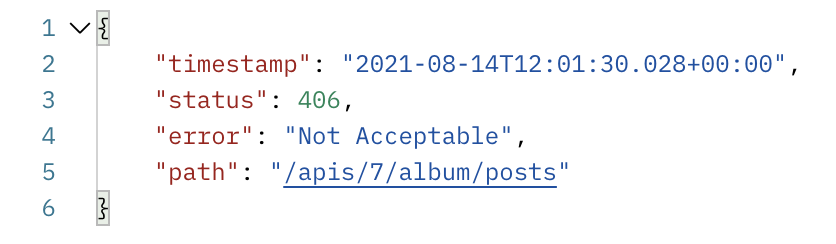

프로젝트를 진행하던 중 Postman 을 통해 api 요청을 했는데 아래와 같은 에러가 발생했다.

`DefaultHandlerExceptionResolver : Resolved [org.springframework.web.HttpMediaTypeNotAcceptableException: Could not find acceptable representation]` 의 에러도 떴다!   

**문제 해결을 위해 공부하던 중 에러의 원인이 response를 반환해준 dto에 @Getter 애너테이션이 없어서 였다.**  

- Response 할 떄, dto Object에서 json 으로 변환을 하는데, 이 때 `Jackson`이 사용된다.
- Jackson이 json으로 변환 시 내부적으로 ObjectMapping 을 하는데, Getter/Setter 메서드를 이용해서 매핑하는 게 기본 정책이라고 한다.
- 따라서, 매핑을 위한 Getter/Setter 메서드를 선언해 주지 않아 발생한 오류 였다.
- Getter/Setter 대신 @JsonProperty, @JsonAutoDetetct 를 사용해 멤버변수를 프로퍼티로 저장할 수 도 있다.
- @Getter 를 넣어주고 올바르게 json 으로 response 보내는 것을 볼 수 있었다.

- +) request 객체에 기본 생성자 필요, 엔티티 기본 생성자 필요